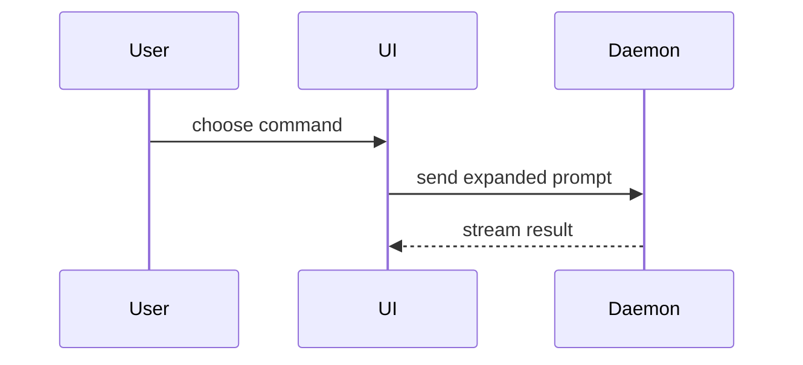

撰写 PR 正文时使用这个模板：

```markdown
## Summary

<diagram, diff-sketch, or tree>

## Evidence

- **Before:** <screenshot/output/failing test run>
  **After:** <screenshot/output/passing test run>

## Merge Danger

**Door:** <one-way or two-way>

<optional: description>

**Blast Radius:** <one-word description>

<optional: potential ramifications of merge>
```

## 各小节

跳过所有前导客套话，正文保持简短。使用 `GLOSSARY.md` 里的用户领域语言。

### Summary

选能讲清楚关键点的最小视图。

- 用伪代码展示逻辑或算法：

```text
on(save)
  if content is unchanged
    return cached result
  write new content
  return fresh result
```

- 用调用树展示运行时控制流：

```text
submitForm
  createSession
    persistPrompt
    launchAgent
  navigateToSession
```

- 用组件树展示 UI 结构，包括有影响的状态和模块边界：

```text
<SessionPage> (apps/example/src/routes/session.tsx)
  useSessionEvents()
  <SessionToolbar>
    <RunSkillButton> (packages/ui)
```

- 用浅层文件树展示文件职责或大范围重构：

```text
src/
├── commands/       # 解析用户动作
├── sessions/       # 持有会话状态
└── transport/      # 发送 API 请求
```

- 用 Mermaid 展示组件交互、控制流或数据流：



- 当重点是"改了什么"、周围结构已存在时用 `diff`。让 diff 的形状贴合主题。

组件变更：

```diff
 <SessionPage>
   useSessionEvents()
   <SessionToolbar>
+    <RunSkillButton />
   <SessionTimeline>
+    <SkillResultCard />
```

文件布局变更：

```diff
 src/
 ├── commands/
+│   └── show-me.ts       # 展开斜杠命令
 ├── sessions/
-└── transport.ts
+└── transport/
+    ├── client.ts
+    └── stream.ts
```

调用树 / 调用栈变更：

```diff
 submitForm
   createSession
     persistPrompt
+    expandSkillMention
     launchAgent
-  navigateToSession
+  navigateToSession
+    subscribeToEvents
```

状态或控制流变更：

```diff
 on(save)
-  write content
+  if content is unchanged
+    return cached result
+  write new content
+  invalidate cache
```

- 大部分都是新增时、被省略的上下文会掩盖归属或顺序时、或用户需要一个可直接复制的目标形状时，展示整块代码：

```ts
function expandSkill(command: string): string {
  const skillName = command.slice(1);
  return `use the ${skillName} skill`;
}
```

#### Guidance（放置指引）

把每个可视化内容放在它支撑的那句短文字旁边。只保留回答用户当前问题、或解决当前讨论点所需的调用、文件、props、状态和边界。

这些形式你可能用其中一种，也可能用几种，但不大会全都用上。凭判断取舍，别淹没用户。

### Evidence

证明这次改动确实生效的具体证据。给出改动前后的对照。

截图是 S 级——当环境已为此搭好、且改动是可视的时候。

基于执行的证据是 A 级。测试结果、控制台输出。展示现在会失败、之后会通过的那条确切测试，用伪代码写。

### Merge Danger

说明这次合入是一扇单向门还是双向门。你可以从双向门回头，但从单向门回不来。回滚成本低的 PR 风险较低。涉及破坏性动作或难以逆转的决策的改动，就是单向门。

爆炸半径（blast radius）是这个 PR 引入的改动可能造成的影响范围。把所有可能都考虑进去。例子包括布局偏移、破坏下游消费者的兼容、移动端响应式问题等。