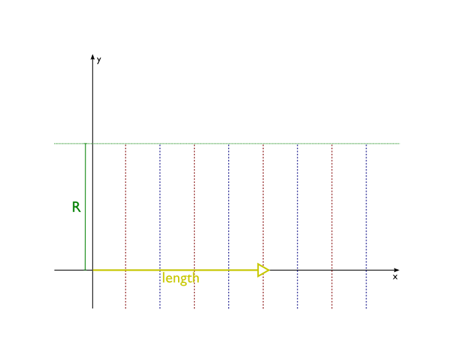
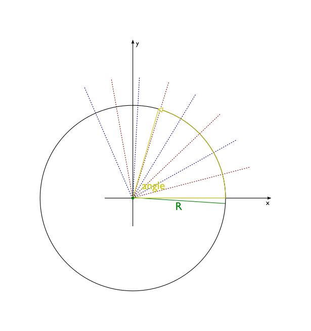

[Free trial](https://www.scm.com/free-trial/)

  * [Applications](https://www.scm.com/applications/ "Applications")
  * [Products](https://www.scm.com/amsterdam-modeling-suite/ "Products")
  * [Support](https://www.scm.com/support/ "Support")
  * [About us](https://www.scm.com/about-us/ "About us")

Search

  * 

Table of contents

  * [General](../general.html)
  * [Introduction](../intro.html)
  * [Getting started](../started.html)
  * [Components overview](components.html)
    * [Settings](settings.html)
    * [Jobs](jobs.html)
    * [Results](results.html)
    * [Job runners](runners.html)
    * [Job manager](jobmanager.html)
    * [Public functions](functions.html)
    * [Molecule](molecule.html)
      * Molecule
        * Atom labeling
      * [Atom](atombond.html)
      * [Bond](atombond.html#bond)
      * [RDKit interface](mol_rdkit.html)
      * [ASE interface](mol_ase.html)
      * [Packmol interface](mol_packmol.html)
    * [Utilities](utils.html)
    * [Trajectories](trajectories.html)
  * [Interfaces](../interfaces/interfaces.html)
  * [Examples](../examples/examples.html)
  * [Cookbook](../cookbook/cookbook.html)
  * [Citations](../citations.html)

  * [FAQ](../FAQ.html)

__[PLAMS](../index.html)

  * [Documentation](../PLAMS.html/../../Documentation/index.html)/
  * [PLAMS](../index.html)/
  * [Components overview](components.html)/
  * [Molecule](molecule.html)/
  * Molecule

# Molecule¶

_class _`Molecule`(_filename =None_, _inputformat =None_, _positions =None_, _numbers =None_, _lattice =None_, _** other_)[[source]](../_modules/scm/plams/mol/molecule.html#Molecule)¶
    
A class representing the molecule object.

An instance of this class has the following attributes:

  * `atoms` – list of [`Atom`](atombond.html#scm.plams.mol.atom.Atom "scm.plams.mol.atom.Atom") objects that belong to the molecule

  * `bonds` – list of [`Bond`](atombond.html#scm.plams.mol.bond.Bond "scm.plams.mol.bond.Bond") objects between atoms listed in `atoms`

  * `lattice` – list of lattice vectors in case of periodic structures

  * `properties` – [`Settings`](settings.html#scm.plams.core.settings.Settings "scm.plams.core.settings.Settings") instance storing all other information about the molecule

Note

Each [`Atom`](atombond.html#scm.plams.mol.atom.Atom "scm.plams.mol.atom.Atom") in `atoms` list and each [`Bond`](atombond.html#scm.plams.mol.bond.Bond "scm.plams.mol.bond.Bond") in `bonds` list has a reference to the parent molecule. Moreover, each atom stores the list of bonds it’s a part of and each bond stores references to atoms it bonds. That creates a complex net of references between objects that are part of a molecule. Consistency of this data is crucial for proper functioning of many methods. Because of that it is advised not to modify contents of `atoms` and `bonds` by hand. When you need to alter your molecule, methods `add_atom()`, `delete_atom()`, `add_bond()` and `delete_bond()` can be used to ensure that all these references are updated properly.

Creating a `Molecule` object for your calculation can be done in several ways. You can start with an empty molecule and manually add all atoms (and bonds, if needed):
[code] 
    mol = Molecule()
    mol.add_atom(Atom(atnum=1, coords=(0,0,0)))
    mol.add_atom(Atom(atnum=1, coords=(d,0,0)))
    
[/code]

This approach can be useful for building small molecules, especially if you wish to parametrize some of atomic coordinates (like in [Simple example](../intro.html#simple-example)), but in general it’s not very practical. If coordinates and atom numbers are available, instantiation can be done by passing a value to the positions, numbers and optionally the lattice arguments:
[code] 
    xyz     = np.random.randn(10,3) # 10 atoms, 3 coordinates per atom
    numbers = 10*[6] # 10 carbon atoms. If left None, will initialize to dummy atoms
    lattice = [[1,2,3], [1,2,3]] # lattice should have a shape of {1,2,3}x3
    mol     = Molecule(positions=xyz, numbers=numbers, lattice=lattice)
    
[/code]

Alternatively, one can import atomic coordinates from some external file:
[code] 
    mol = Molecule('xyz/Benzene.xyz')
    
[/code]

The constructor of a `Molecule` object accepts four arguments that can be used to supply this information from a file in your filesystem. _filename_ should be a string with a path (absolute or relative) to such a file. _inputformat_ describes the format of the file. Currently, the following formats are supported: `xyz`, `mol`, `mol2` and `pdb`. If _inputformat_ is `ase` the file reader engine of the ASE.io module is used, enabling you to read all input formats supported by [ASE interface](mol_ase.html#aseinterface). See `read()` for further details. If the _inputformat_ argument is not supplied, PLAMS will try to deduce it by examining the extension of the provided file, so in most of cases it is not needed to use _inputformat_ , if only the file has the proper extension. Some formats (`xyz` and `pdb`) allow to store more than one geometry of a particular molecule within a single file. See the respective `read()` function for details how to access them. All _other_ keyword arguments will be passed to the appropriate read function for the selected or determined file format.

If a `Molecule` is initialized from an external file, the path to this file (_filename_ argument) is stored in `properties.source`. The base name of the file (filename without the extension) is kept in `properties.name`.

It is also possible to write a molecule to a file in one of the formats mentioned above or using the ASE.io engine. See `write()` for details.

The `lattice` attribute is used to store information about lattice vectors in case of periodic structures. Some job types will automatically use that data while constructing input files. `lattice` should be a list of up to 3 vectors (for different types of periodicity: chain, slab or bulk), each of which needs to be a list or a tuple of 3 numbers.

Lattice vectors can be directly read from and written to `xyz` files using the following convention (please mind the fact that this is an unofficial extension to the XYZ format):
[code] 
    3
    
        H      0.000000      0.765440     -0.008360
        O      0.000000      0.000000      0.593720
        H      0.000000     -0.765440     -0.008360
    VEC1       3.000000      0.000000      0.000000
    VEC2       0.000000      3.000000      0.000000
    VEC3       0.000000      0.000000      3.000000
    
[/code]

For 1D (2D) periodicity please supply only `VEC1` (`VEC1` and `VEC2`). Writing lattice vectors to `xyz` files can be disabled by simply reseting the `lattice` attribute:
[code] 
    mol.lattice = []
    
[/code]

The detailed description of all available methods is presented below. Many of these methods require arguments that are atoms belonging to the current molecule. It can by done by using a reference to an [`Atom`](atombond.html#scm.plams.mol.atom.Atom "scm.plams.mol.atom.Atom") object present it the `atoms` list, but not by passing a number of an atom (its position within `atoms` list). Unlike some other tools, PLAMS does not use integer numbers as primary identifiers of atoms. It is done to prevent problems when atoms within a molecule are reordered or some atoms are deleted. References to [`Atom`](atombond.html#scm.plams.mol.atom.Atom "scm.plams.mol.atom.Atom") or [`Bond`](atombond.html#scm.plams.mol.bond.Bond "scm.plams.mol.bond.Bond") objects can be obtained directly from `atoms` or `bonds` lists, or with dictionary-like bracket notation:
[code] 
    >>> mol = Molecule('xyz/Ammonia.xyz')
    >>> mol.guess_bonds()
    >>> print(mol)
      Atoms:
        1         H      0.942179      0.000000     -0.017370
        2         H     -0.471089      0.815951     -0.017370
        3         N      0.000000      0.000000      0.383210
        4         H     -0.471089     -0.815951     -0.017370
      Bonds:
       (1)--1.0--(3)
       (2)--1.0--(3)
       (3)--1.0--(4)
    >>> at = mol[1]
    >>> print(at)
             H      0.942179      0.000000     -0.017370
    >>> b = mol[(1,3)]
    >>> print(b)
    (         H      0.942179      0.000000     -0.017370 )--1.0--(         N      0.000000      0.000000      0.383210 )
    >>> b = mol[(1,4)]
    >>> print(b)
    None
    
[/code]

Note

For the purpose of `mol[i]` notation, the numbering of atoms within a molecule starts with 1. Negative integers can be used to access atoms enumerated in the reversed order (`mol[-1]` for the last atom etc.)

However, if you feel more familiar with identifying atoms by natural numbers, you can use `set_atoms_id()` to equip each atom of the molecule with `id` attribute equal to atom’s position within `atoms` list. This method can also be helpful to track changes in your molecule during tasks that can reorder atoms.

`__init__`(_filename =None_, _inputformat =None_, _positions =None_, _numbers =None_, _lattice =None_, _** other_)[[source]](../_modules/scm/plams/mol/molecule.html#Molecule.__init__)¶
    
Initialize self. See help(type(self)) for accurate signature.

`copy`(_atoms =None_)[[source]](../_modules/scm/plams/mol/molecule.html#Molecule.copy)¶
    
Return a copy of the molecule. The copy has atoms, bonds and all other components distinct from the original molecule (it is so called “deep copy”).

By default the entire molecule is copied. It is also possible to copy only some part of the molecule, indicated by _atoms_ argument. It should be a list of atoms that belong to the molecule. If used, only these atoms, together with any bonds between them, are copied and included in the returned molecule.

`add_molecule`(_other_ , _copy =False_, _margin =- 1_)[[source]](../_modules/scm/plams/mol/molecule.html#Molecule.add_molecule)¶
    
Add some _other_ molecule to this one:
[code] 
    protein += water
    
[/code]

If _copy_ is `True`, _other_ molecule is copied and the copy is added to this molecule. Otherwise, _other_ molecule is directly merged with this one The `properties` of this molecule are [`soft_updated`](settings.html#scm.plams.core.settings.Settings.soft_update "scm.plams.core.settings.Settings.soft_update") with the `properties` of the _other_ molecules.

margin: float
    
If <0, keep the coordinates of `other`. If >=0, all atoms in the `other` molecule will have _at least_ this distance (in angstrom) to all atoms in `self`.

`add_atom`(_atom_ , _adjacent =None_)[[source]](../_modules/scm/plams/mol/molecule.html#Molecule.add_atom)¶
    
Add a new _atom_ to the molecule.

_atom_ should be an [`Atom`](atombond.html#scm.plams.mol.atom.Atom "scm.plams.mol.atom.Atom") instance that does not belong to any molecule. Bonds between the new atom and other atoms of the molecule can be automatically added based on _adjacent_ argument. It should be a list describing atoms of the molecule that the new atom is connected to. Each element of _adjacent_ list can either be a pair `(Atom, order)` to indicate new bond’s order (use `Bond.AR` for aromatic bonds) or an [`Atom`](atombond.html#scm.plams.mol.atom.Atom "scm.plams.mol.atom.Atom") instance (a single bond is created in this case).

Example:
[code] 
    mol = Molecule() #create an empty molecule
    h1 = Atom(symbol='H', coords=(1.0, 0.0, 0.0))
    h2 = Atom(symbol='H', coords=(-1.0, 0.0, 0.0))
    o = Atom(symbol='O', coords=(0.0, 1.0, 0.0))
    mol.add_atom(h1)
    mol.add_atom(h2)
    mol.add_atom(o)
    mol.add_atom(Atom(symbol='C', coords=(0.0, 0.0, 0.0)), adjacent=[h1, h2, (o,2)])
    
[/code]

`delete_atom`(_atom_)[[source]](../_modules/scm/plams/mol/molecule.html#Molecule.delete_atom)¶
    
Delete an _atom_ from the molecule.

_atom_ should be an [`Atom`](atombond.html#scm.plams.mol.atom.Atom "scm.plams.mol.atom.Atom") instance that belongs to the molecule. All bonds containing this atom are removed too.

Examples:
[code] 
    #delete all hydrogens
    mol = Molecule('protein.pdb')
    hydrogens = [atom for atom in mol if atom.atnum == 1]
    for i in hydrogens: mol.delete_atom(i)
    
[/code]
[code] 
    #delete first two atoms
    mol = Molecule('geom.xyz')
    mol.delete_atom(mol[1])
    mol.delete_atom(mol[1]) #since the second atom of original molecule is now the first
    
[/code]

`add_bond`(_arg1_ , _arg2 =None_, _order =1_)[[source]](../_modules/scm/plams/mol/molecule.html#Molecule.add_bond)¶
    
Add a new bond to the molecule.

This method can be used in two different ways. You can call it with just one argument being a [`Bond`](atombond.html#scm.plams.mol.bond.Bond "scm.plams.mol.bond.Bond") instance (other arguments are then ignored):
[code] 
    >>> b = Bond(mol[2], mol[4], order=Bond.AR) #create aromatic bond between 2nd and 4th atom
    >>> mol.add_bond(b)
    
[/code]

The other way is to pass two atoms (and possibly bond order) and new [`Bond`](atombond.html#scm.plams.mol.bond.Bond "scm.plams.mol.bond.Bond") object will be created automatically:
[code] 
    >>> mol.add_bond(mol[2], mol[4], order=Bond.AR)
    
[/code]

In both cases both atoms that are bonded have to belong to the molecule, otherwise an exception is raised.

`delete_bond`(_arg1_ , _arg2 =None_)[[source]](../_modules/scm/plams/mol/molecule.html#Molecule.delete_bond)¶
    
Delete a bond from the molecule.

Just like `add_bond()`, this method accepts either a single argument that is a [`Bond`](atombond.html#scm.plams.mol.bond.Bond "scm.plams.mol.bond.Bond") instance, or two arguments being instances of [`Atom`](atombond.html#scm.plams.mol.atom.Atom "scm.plams.mol.atom.Atom"). In both cases objects used as arguments have to belong to the molecule.

`delete_all_bonds`()[[source]](../_modules/scm/plams/mol/molecule.html#Molecule.delete_all_bonds)¶
    
Delete all bonds from the molecule.

`find_bond`(_atom1_ , _atom2_)[[source]](../_modules/scm/plams/mol/molecule.html#Molecule.find_bond)¶
    
Find and return a bond between _atom1_ and _atom2_. Both atoms have to belong to the molecule. If no bond between chosen atoms exists, the retured value is `None`.

`set_atoms_id`(_start =1_)[[source]](../_modules/scm/plams/mol/molecule.html#Molecule.set_atoms_id)¶
    
Equip each atom of the molecule with the `id` attribute equal to its position within `atoms` list.

The starting value of the numbering can be set with _start_ (starts at 1 by default).

`unset_atoms_id`()[[source]](../_modules/scm/plams/mol/molecule.html#Molecule.unset_atoms_id)¶
    
Delete `id` attributes of all atoms.

`neighbors`(_atom_)[[source]](../_modules/scm/plams/mol/molecule.html#Molecule.neighbors)¶
    
Return a list of neighbors of _atom_ within the molecule.

_atom_ has to belong to the molecule. Returned list follows the same order as the `bonds` attribute of _atom_.

`bond_matrix`()[[source]](../_modules/scm/plams/mol/molecule.html#Molecule.bond_matrix)¶
    
Return a square numpy array with bond orders. The size of the array is equal to the number of atoms.

`separate`()[[source]](../_modules/scm/plams/mol/molecule.html#Molecule.separate)¶
    
Separate the molecule into connected components.

Returned is a list of new `Molecule` objects (all atoms and bonds are disjoint with the original molecule). Each element of this list is identical to one connected component of the base molecule. A connected component is a subset of atoms such that there exists a path (along one or more bonds) between any two atoms. Usually these connected components are molecules.

Example:
[code] 
    >>> mol = Molecule('xyz_dimers/NH3-H2O.xyz')
    >>> mol.guess_bonds()
    >>> print(mol)
      Atoms:
        1         N     -1.395591     -0.021564      0.000037
        2         H     -1.629811      0.961096     -0.106224
        3         H     -1.862767     -0.512544     -0.755974
        4         H     -1.833547     -0.330770      0.862307
        5         O      1.568501      0.105892      0.000005
        6         H      0.606736     -0.033962     -0.000628
        7         H      1.940519     -0.780005      0.000222
      Bonds:
       (5)--1.0--(7)
       (5)--1.0--(6)
       (1)--1.0--(3)
       (1)--1.0--(4)
       (1)--1.0--(2)
    >>> x = mol.separate()
    >>> for i in x: print(i)
      Atoms:
        1         N     -1.395591     -0.021564      0.000037
        2         H     -1.629811      0.961096     -0.106224
        3         H     -1.862767     -0.512544     -0.755974
        4         H     -1.833547     -0.330770      0.862307
      Bonds:
       (1)--1.0--(3)
       (1)--1.0--(4)
       (1)--1.0--(2)
    
      Atoms:
        1         O      1.568501      0.105892      0.000005
        2         H      0.606736     -0.033962     -0.000628
        3         H      1.940519     -0.780005      0.000222
      Bonds:
       (1)--1.0--(3)
       (1)--1.0--(2)
    
[/code]

`guess_bonds`(_atom_subset =None_, _dmax =1.28_, _metal_atoms =True_)[[source]](../_modules/scm/plams/mol/molecule.html#Molecule.guess_bonds)¶
    
Try to guess bonds in the molecule based on types and positions of atoms.

All previously existing bonds are removed. New bonds are generated based on interatomic distances and information about maximal number of bonds for each atom type (`connectors` property, taken from [`PeriodicTable`](utils.html#scm.plams.tools.periodic_table.PeriodicTable "scm.plams.tools.periodic_table.PeriodicTable")).

The problem of finding molecular bonds for a given set of atoms in space does not have a general solution, especially considering the fact the chemical bond in itself is not a precisely defined concept. For every method, no matter how sophisticated, there will always be corner cases for which the method produces disputable results. Moreover, depending on the context (area of application) the desired solution for a particular geometry may vary. Please do not treat this method as an oracle always providing a proper solution. The algorithm used here gives very good results for geometries that are not very far from the optimal geometry, especially consisting of lighter atoms. All kinds of organic molecules, including aromatic ones, usually work very well. Problematic results can emerge for transition metal complexes, transition states, incomplete molecules etc.

The algorithm used scales as _n log n_ where _n_ is the number of atoms.

The _atom_subset_ argument can be used to limit the bond guessing to a subset of atoms, it should be an iterable container with atoms belonging to this molecule.

The _dmax_ argument gives the maximum value for ratio of the bond length to the sum of atomic radii for the two atoms in the bond.

metal_atomsbool
    
If True, bonds to metal atoms will be guessed. They are often useful for visualization. The bond order for any bond to a metal atom will be set to 1.

Warning

This method works reliably only for geometries representing complete molecules. If some atoms are missing (for example, a protein without hydrogens) the resulting set of bonds would usually contain more bonds or bonds with higher order than expected.

`guess_system_charge`()[[source]](../_modules/scm/plams/mol/molecule.html#Molecule.guess_system_charge)¶
    
Attempt to guess the charge of the full system based on connectivity

`guess_atomic_charges`(_adjust_to_systemcharge =True_, _keep_hydrogen_charged =False_, _depth =1_, _electronegativities =None_)[[source]](../_modules/scm/plams/mol/molecule.html#Molecule.guess_atomic_charges)¶
    
Return a list of guessed charges, one for each atom, based on connectivity

  * `depth` – The electronegativity of an atom is determined all its neighbors up to depth

  * `electronegativities` – A dictionary containing electronegativity values for the electronegative elements

Note: Fairly basic implementation that will not always yield reliable results

`in_ring`(_arg_)[[source]](../_modules/scm/plams/mol/molecule.html#Molecule.in_ring)¶
    
Check if an atom or a bond belonging to this `Molecule` forms a ring. _arg_ should be an instance of [`Atom`](atombond.html#scm.plams.mol.atom.Atom "scm.plams.mol.atom.Atom") or [`Bond`](atombond.html#scm.plams.mol.bond.Bond "scm.plams.mol.bond.Bond") belonging to this `Molecule`.

`supercell`(_* args_)[[source]](../_modules/scm/plams/mol/molecule.html#Molecule.supercell)¶
    
Return a new `Molecule` instance representing a supercell build by replicating this `Molecule` along its lattice vectors.

One should provide in input an integer matrix \\(T_{i,j}\\) representing the supercell transformation (\\(\vec{a}_i' = \sum_j T_{i,j}\vec{a}_j\\)). The size of the matrix should match the number of lattice vectors, i.e. 3x3 for 3D periodic systems, 2x2 for 2D periodic systems and one number for 1D periodic systems. The matrix can be provided in input as either a nested list or as a numpy matrix.

For a diagonal supercell expansion (i.e. \\(T_{i \neq j}=0\\)) one can provide in input n positive integers instead of a matrix, where n is number of lattice vectors in the molecule. e.g. This `mol.supercell([[2,0],[0,2]])` is equivalent to `mol.supercell(2,2)`.

The returned `Molecule` is fully distinct from the current one, in a sense that it contains a different set of [`Atom`](atombond.html#scm.plams.mol.atom.Atom "scm.plams.mol.atom.Atom") and [`Bond`](atombond.html#scm.plams.mol.bond.Bond "scm.plams.mol.bond.Bond") instances. However, each atom of the returned `Molecule` carries an additional information about its origin within the supercell. If `atom` is an [`Atom`](atombond.html#scm.plams.mol.atom.Atom "scm.plams.mol.atom.Atom") instance in the supercell, `atom.properties.supercell.origin` points to the [`Atom`](atombond.html#scm.plams.mol.atom.Atom "scm.plams.mol.atom.Atom") instance of the original molecule that was copied to create `atom`, while `atom.properties.supercell.index` stores the tuple (with length equal to the number of lattice vectors) with cell index. For example, `atom.properties.supercell.index == (2,1,0)` means that `atom` is a copy of `atom.properties.supercell.origin` that was translated twice along the first lattice vector, once along the second vector, and not translated along the third vector.

Example usage:
[code] 
    >>> graphene = Molecule('graphene.xyz')
    >>> print(graphene)
      Atoms:
        1         C      0.000000      0.000000      0.000000
        2         C      1.230000      0.710000      0.000000
      Lattice:
            2.4600000000     0.0000000000     0.0000000000
            1.2300000000     2.1304224933     0.0000000000
    
    >>> graphene_supercell = graphene.supercell(2,2) # diagonal supercell expansion
    >>> print(graphene_supercell)
      Atoms:
        1         C      0.000000      0.000000      0.000000
        2         C      1.230000      0.710000      0.000000
        3         C      1.230000      2.130422      0.000000
        4         C      2.460000      2.840422      0.000000
        5         C      2.460000      0.000000      0.000000
        6         C      3.690000      0.710000      0.000000
        7         C      3.690000      2.130422      0.000000
        8         C      4.920000      2.840422      0.000000
      Lattice:
            4.9200000000     0.0000000000     0.0000000000
            2.4600000000     4.2608449866     0.0000000000
    
    >>> diamond = Molecule('diamond.xyz')
    >>> print(diamond)
      Atoms:
        1         C     -0.446100     -0.446200     -0.446300
        2         C      0.446400      0.446500      0.446600
      Lattice:
            0.0000000000     1.7850000000     1.7850000000
            1.7850000000     0.0000000000     1.7850000000
            1.7850000000     1.7850000000     0.0000000000
    
    >>> diamond_supercell = diamond.supercell([[-1,1,1],[1,-1,1],[1,1,-1]])
    >>> print(diamond_supercell)
      Atoms:
        1         C     -0.446100     -0.446200     -0.446300
        2         C      0.446400      0.446500      0.446600
        3         C      1.338900      1.338800     -0.446300
        4         C      2.231400      2.231500      0.446600
        5         C      1.338900     -0.446200      1.338700
        6         C      2.231400      0.446500      2.231600
        7         C     -0.446100      1.338800      1.338700
        8         C      0.446400      2.231500      2.231600
      Lattice:
            3.5700000000     0.0000000000     0.0000000000
            0.0000000000     3.5700000000     0.0000000000
            0.0000000000     0.0000000000     3.5700000000
    
[/code]

`unit_cell_volume`(_unit ='angstrom'_)[[source]](../_modules/scm/plams/mol/molecule.html#Molecule.unit_cell_volume)¶
    
Return the volume of the unit cell of a 3D system.

_unit_ is the unit of length, the cube of which will be used as the unit of volume.

`cell_lengths`(_unit ='angstrom'_)[[source]](../_modules/scm/plams/mol/molecule.html#Molecule.cell_lengths)¶
    
Return the lengths of the lattice vector. Returns a list with the same length as self.lattice

`cell_angles`(_unit ='degree'_)[[source]](../_modules/scm/plams/mol/molecule.html#Molecule.cell_angles)¶
    
Return the angles between lattice vectors.

unitstr
    
output unit

For 2D systems, returns a list [gamma]

For 3D systems, returns a list [alpha, beta, gamma]

`set_integer_bonds`(_action ='warn'_, _tolerance =0.0001_)[[source]](../_modules/scm/plams/mol/molecule.html#Molecule.set_integer_bonds)¶
    
Convert non-integer bond orders into integers.

For example, bond orders of aromatic systems are no longer set to the non-integer value of `1.5`, instead adopting bond orders of `1` and `2`.

The implemented function walks a set of graphs constructed from all non-integer bonds, converting the orders of aforementioned bonds to integers by alternating calls to [`math.ceil()`](https://docs.python.org/3.8/library/math.html#math.ceil "\(in Python v3.8\)") and [`math.floor()`](https://docs.python.org/3.8/library/math.html#math.floor "\(in Python v3.8\)"). The implication herein is that both \\(i\\) and \\(i+1\\) are considered valid (integer) values for any bond order within the \\((i, i+1)\\) interval. Floats which can be represented exactly as an integer, _e.g._ \\(1.0\\), are herein treated as integers.

Can be used for sanitizaing any Molecules passed to the [`rdkit`](mol_rdkit.html#module-scm.plams.interfaces.molecule.rdkit "scm.plams.interfaces.molecule.rdkit") module, as its functions are generally unable to handle Molecules with non-integer bond orders.

By default this function will issue a warning if the total (summed) bond orders before and after are not equal to each other within a given _tolerance_. Accepted values are for _action_ are `"ignore"`, `"warn"` and `"raise"`, which respectivelly ignore such cases, issue a warning or raise a `MoleculeError`.
[code] 
    >>> from scm.plams import Molecule
    
    >>> benzene = Molecule(...)
    >>> print(benzene)
      Atoms:
        1         C      1.193860     -0.689276      0.000000
        2         C      1.193860      0.689276      0.000000
        3         C      0.000000      1.378551      0.000000
        4         C     -1.193860      0.689276      0.000000
        5         C     -1.193860     -0.689276      0.000000
        6         C     -0.000000     -1.378551      0.000000
        7         H      2.132911     -1.231437     -0.000000
        8         H      2.132911      1.231437     -0.000000
        9         H      0.000000      2.462874     -0.000000
       10         H     -2.132911      1.231437     -0.000000
       11         H     -2.132911     -1.231437     -0.000000
       12         H     -0.000000     -2.462874     -0.000000
      Bonds:
       (3)--1.5--(4)
       (5)--1.5--(6)
       (1)--1.5--(6)
       (2)--1.5--(3)
       (4)--1.5--(5)
       (1)--1.5--(2)
       (3)--1.0--(9)
       (6)--1.0--(12)
       (5)--1.0--(11)
       (4)--1.0--(10)
       (2)--1.0--(8)
       (1)--1.0--(7)
    
    >>> benzene.set_integer_bonds()
    >>> print(benzene)
      Atoms:
        1         C      1.193860     -0.689276      0.000000
        2         C      1.193860      0.689276      0.000000
        3         C      0.000000      1.378551      0.000000
        4         C     -1.193860      0.689276      0.000000
        5         C     -1.193860     -0.689276      0.000000
        6         C     -0.000000     -1.378551      0.000000
        7         H      2.132911     -1.231437     -0.000000
        8         H      2.132911      1.231437     -0.000000
        9         H      0.000000      2.462874     -0.000000
       10         H     -2.132911      1.231437     -0.000000
       11         H     -2.132911     -1.231437     -0.000000
       12         H     -0.000000     -2.462874     -0.000000
      Bonds:
       (3)--1.0--(4)
       (5)--1.0--(6)
       (1)--2.0--(6)
       (2)--2.0--(3)
       (4)--2.0--(5)
       (1)--1.0--(2)
       (3)--1.0--(9)
       (6)--1.0--(12)
       (5)--1.0--(11)
       (4)--1.0--(10)
       (2)--1.0--(8)
       (1)--1.0--(7)
    
[/code]

`index`(_value_ , _start =1_, _stop =None_)[[source]](../_modules/scm/plams/mol/molecule.html#Molecule.index)¶
    
Return the first index of the specified Atom or Bond.

Providing an [`Atom`](atombond.html#scm.plams.mol.atom.Atom "scm.plams.mol.atom.Atom") will return its 1-based index, while a [`Bond`](atombond.html#scm.plams.mol.bond.Bond "scm.plams.mol.bond.Bond") returns a 2-tuple with the 1-based indices of its atoms.

Raises a `MoleculeError` if the provided is not an Atom/Bond or if the Atom/bond is not part of the molecule.
[code] 
    >>> from scm.plams import Molecule, Bond, Atom
    
    >>> mol = Molecule(...)
    >>> atom: Atom = Molecule[1]
    >>> bond: Bond = Molecule[1, 2]
    
    >>> print(mol.index(atom))
    1
    
    >>> print(mol.index(bond))
    (1, 2)
    
[/code]

`round_coords`(_decimals =0_, _inplace =True_)[[source]](../_modules/scm/plams/mol/molecule.html#Molecule.round_coords)¶
    
Round the Cartesian coordinates of this instance to _decimals_.

By default, with `inplace=True`, the coordinates of this instance are updated inplace. If `inplace=False` then a new copy of this Molecule is returned with its coordinates rounded.
[code] 
    >>> from scm.plams import Molecule
    
    >>> mol = Molecule(...)
      Atoms:
        1         H      1.234567      0.000000      0.000000
        2         H      0.000000      0.000000      0.000000
    
    >>> mol_rounded = round_coords(mol)
    >>> print(mol_rounded)
      Atoms:
        1         H      1.000000      0.000000      0.000000
        2         H      0.000000      0.000000      0.000000
    
    >>> mol.round_coords(decimals=3)
    >>> print(mol)
      Atoms:
        1         H      1.234000      0.000000      0.000000
        2         H      0.000000      0.000000      0.000000
    
[/code]

`get_connection_table`()[[source]](../_modules/scm/plams/mol/molecule.html#Molecule.get_connection_table)¶
    
Get a connection table with atom indices (starting at 0)

`get_molecule_indices`()[[source]](../_modules/scm/plams/mol/molecule.html#Molecule.get_molecule_indices)¶
    
Use the bond information to identify submolecules

Returns a list of lists of indices (e.g. for two methane molecules: [[0,1,2,3,4],[5,6,7,8,9]])

`get_fragment`(_indices_)[[source]](../_modules/scm/plams/mol/molecule.html#Molecule.get_fragment)¶
    
Return a submolecule from self

`get_complete_molecules_within_threshold`(_atom_indices_ , _threshold_)[[source]](../_modules/scm/plams/mol/molecule.html#Molecule.get_complete_molecules_within_threshold)¶
    
Returns a new molecule containing complete submolecules for any molecules that are closer than `threshold` to any of the atoms in `atom_indices`.

Note: This only works for nonperiodic systems.

atom_indices: list of int
    
One-based indices of the atoms

thresholdfloat
    
Distance threshold for whether to include molecules

`locate_rings`()[[source]](../_modules/scm/plams/mol/molecule.html#Molecule.locate_rings)¶
    
Find the rings in the structure

`locate_rings_acm`()[[source]](../_modules/scm/plams/mol/molecule.html#Molecule.locate_rings_acm)¶
    
Use the ACM algorithm to find rings

`order_ring`(_ring_indices_)[[source]](../_modules/scm/plams/mol/molecule.html#Molecule.order_ring)¶
    
Order the ring indices so that they are sequential along the ring

`locate_rings_networkx`()[[source]](../_modules/scm/plams/mol/molecule.html#Molecule.locate_rings_networkx)¶
    
Obtain a list of ring indices using RDKit (same as locate_rings, but much faster)

`shortest_path_dijkstra`(_source_ , _target_ , _conect =None_)[[source]](../_modules/scm/plams/mol/molecule.html#Molecule.shortest_path_dijkstra)¶
    
Find the shortest paths (can be more than 1) between a source atom and a target atom in a connection table

  * `source` – Index of the source atom

  * `target` – Index of the target atom

`translate`(_vector_ , _unit ='angstrom'_)[[source]](../_modules/scm/plams/mol/molecule.html#Molecule.translate)¶
    
Move the molecule in space by _vector_ , expressed in _unit_.

_vector_ should be an iterable container of length 3 (usually tuple, list or numpy array). _unit_ describes unit of values stored in _vector_.

`rotate_lattice`(_matrix_)[[source]](../_modules/scm/plams/mol/molecule.html#Molecule.rotate_lattice)¶
    
Rotate **only** lattice vectors of the molecule with given rotation _matrix_.

_matrix_ should be a container with 9 numerical values. It can be a list (tuple, numpy array etc.) listing matrix elements row-wise, either flat (`[1,2,3,4,5,6,7,8,9]`) or in two-level fashion (`[[1,2,3],[4,5,6],[7,8,9]]`).

Note

This method does not check if _matrix_ is a proper rotation matrix.

`rotate`(_matrix_ , _lattice =False_)[[source]](../_modules/scm/plams/mol/molecule.html#Molecule.rotate)¶
    
Rotate the molecule with given rotation _matrix_. If _lattice_ is `True`, rotate lattice vectors too.

_matrix_ should be a container with 9 numerical values. It can be a list (tuple, numpy array etc.) listing matrix elements row-wise, either flat (`[1,2,3,4,5,6,7,8,9]`) or in two-level fashion (`[[1,2,3],[4,5,6],[7,8,9]]`).

Note

This method does not check if _matrix_ is a proper rotation matrix.

`align_lattice`(_convention ='AMS'_, _zero =1e-10_)[[source]](../_modules/scm/plams/mol/molecule.html#Molecule.align_lattice)¶
    
Rotate the molecule in such a way that lattice vectors are aligned with the coordinate system.

This method is meant to be used with periodic systems only. Using it on a `Molecule` instance with an empty `lattice` attribute has no effect.

Possible values of the _convention_ argument are:

  * `AMS` (default) – for 1D systems the lattice vector aligned with X axis. For 2D systems both lattice vectors aligned with XY plane. No constraints for 3D systems

  * `reax` (convention used by [ReaxFF](https://www.scm.com/product/reaxff)) – second lattice vector (if present) aligned with YZ plane. Third vector (if present) aligned with Z axis.

_zero_ argument can be used to specify the numerical tolerance for zero (used to determine if some vector is already aligned with a particular axis or plane).

The returned boolean value indicates if any rotation happened.

`rotate_bond`(_bond_ , _moving_atom_ , _angle_ , _unit ='radian'_)[[source]](../_modules/scm/plams/mol/molecule.html#Molecule.rotate_bond)¶
    
Rotate part of this molecule containing _moving_atom_ along axis defined by _bond_ by an _angle_ expressed in _unit_.

_bond_ should be chosen in such a way, that it divides the molecule into two parts (using a bond that forms a ring results in a `MoleculeError`). _moving_atom_ has to belong to _bond_ and is used to pick which part of the molecule is rotated. A positive angle denotes counterclockwise rotation (when looking along the bond, from the stationary part of the molecule).

`resize_bond`(_bond_ , _moving_atom_ , _length_ , _unit ='angstrom'_)[[source]](../_modules/scm/plams/mol/molecule.html#Molecule.resize_bond)¶
    
Change the length of _bond_ to _length_ expressed in _unit_ by moving part of the molecule containing _moving_atom_

_bond_ should be chosen in such a way, that it divides the molecule into two parts (using a bond that forms a ring results in a `MoleculeError`). _moving_atom_ has to belong to _bond_ and is used to pick which part of the molecule is moved.

`closest_atom`(_point_ , _unit ='angstrom'_)[[source]](../_modules/scm/plams/mol/molecule.html#Molecule.closest_atom)¶
    
Return the atom of the molecule that is the closest one to some _point_ in space.

_point_ should be an iterable container of length 3 (for example: tuple, [`Atom`](atombond.html#scm.plams.mol.atom.Atom "scm.plams.mol.atom.Atom"), list, numpy array). _unit_ describes unit of values stored in _point_.

`distance_to_point`(_point_ , _unit ='angstrom'_, _result_unit ='angstrom'_)[[source]](../_modules/scm/plams/mol/molecule.html#Molecule.distance_to_point)¶
    
Calculate the distance between the molecule and some _point_ in space (distance between _point_ and `closest_atom()`).

_point_ should be an iterable container of length 3 (for example: tuple, [`Atom`](atombond.html#scm.plams.mol.atom.Atom "scm.plams.mol.atom.Atom"), list, numpy array). _unit_ describes unit of values stored in _point_. Returned value is expressed in _result_unit_.

`distance_to_mol`(_other_ , _result_unit ='angstrom'_, _return_atoms =False_)[[source]](../_modules/scm/plams/mol/molecule.html#Molecule.distance_to_mol)¶
    
Calculate the distance between the molecule and some _other_ molecule.

The distance is measured as the smallest distance between any atom of this molecule and any atom of _other_ molecule. Returned distance is expressed in _result_unit_.

If _return_atoms_ is `False`, only a single number is returned. If _return_atoms_ is `True`, the method returns a tuple `(distance, atom1, atom2)` where `atom1` and `atom2` are atoms fulfilling the minimal distance, with atom1 belonging to this molecule and atom2 to _other_.

`wrap`(_self_ , _length_ , _angle =2 * pi_, _length_unit ='angstrom'_, _angle_unit ='radian'_)[[source]](../_modules/scm/plams/mol/molecule.html#Molecule.wrap)¶
    
Transform the molecule wrapping its x-axis around z-axis. This method is useful for building nanotubes or molecular wedding rings.

Atomic coordinates are transformed in the following way:

  * z coordinates remain untouched

  * x axis gets wrapped around the circle centered in the origin of new coordinate system. Each segment of x axis of length _length_ ends up as an arc of a circle subtended by an angle _angle_. The radius of this circle is R = _length_ /_angle_.

  * part of the plane between the x axis and the line y=R is transformed into the interior of the circle, with line y=R being squashed into a single point - the center of the circle.

  * part of the plane above line y=R is dropped

  * part of the plane below x axis is transformed into outside of the circle

  * transformation is done in such a way that distances along y axis are preserved

Before:

After:

`get_center_of_mass`(_unit ='angstrom'_)[[source]](../_modules/scm/plams/mol/molecule.html#Molecule.get_center_of_mass)¶
    
Return the center of mass of the molecule (as a tuple). Returned coordinates are expressed in _unit_.

`get_mass`(_unit ='amu'_)[[source]](../_modules/scm/plams/mol/molecule.html#Molecule.get_mass)¶
    
Return the mass of the molecule, by default in atomic mass units.

`get_density`()[[source]](../_modules/scm/plams/mol/molecule.html#Molecule.get_density)¶
    
Return the density in kg/m^3

`set_density`(_density_)[[source]](../_modules/scm/plams/mol/molecule.html#Molecule.set_density)¶
    
Applies a uniform strain so that the density becomes `density` kg/m^3

`get_formula`(_as_dict =False_)[[source]](../_modules/scm/plams/mol/molecule.html#Molecule.get_formula)¶
    
Calculate the molecular formula of the molecule according to the Hill system.

Here molecular formula is a dictionary with keys being atomic symbols. The value for each key is the number of atoms of that type. If _as_dict_ is `True`, that dictionary is returned. Otherwise, it is converted into a string:
[code] 
    >>> mol = Molecule('Ubiquitin.xyz')
    >>> print(m.get_formula(True))
    {'N': 105, 'C': 378, 'O': 118, 'S': 1, 'H': 629}
    >>> print(m.get_formula(False))
    C378H629N105O118S1
    
[/code]

`apply_strain`(_strain_ , _voigt_form =False_)[[source]](../_modules/scm/plams/mol/molecule.html#Molecule.apply_strain)¶
    
Apply a strain deformation to a periodic system (i.e. with a non-empty `lattice` attribute). The atoms in the unit cell will be strained accordingly, keeping the fractional atomic coordinates constant.

If `voigt_form=False`, _strain_ should be a container with n*n numerical values, where n is the number of `lattice` vectors. It can be a list (tuple, numpy array etc.) listing matrix elements row-wise, either flat (e.g. `[e_xx, e_xy, e_xz, e_yx, e_yy, e_yz, e_zx, e_zy, e_zz]`) or in two-level fashion (e.g. `[[e_xx, e_xy, e_xz],[e_yx, e_yy, e_yz],[e_zx, e_zy, e_zz]]`). If `voigt_form=True`, _strain_ should be passed in voigt form (for 3D periodic systems: `[e_xx, e_yy, e_zz, gamma_yz, gamma_xz, gamma_xy]`; for 2D periodic systems: `[e_xx, e_yy, gamma_xy]`; for 1D periodic systems: `[e_xx]` with e_xy = gamma_xy/2,…). Example usage:
[code] 
    >>> graphene = Molecule('graphene.xyz')
    >>> print(graphene)
      Atoms:
        1         C      0.000000      0.000000      0.000000
        2         C      1.230000      0.710141      0.000000
      Lattice:
            2.4600000000     0.0000000000     0.0000000000
            1.2300000000     2.1304224900     0.0000000000
    >>> graphene.apply_strain([0.1,0.2,0.0], voigt_form=True)])
      Atoms:
        1         C      0.000000      0.000000      0.000000
        2         C      1.353000      0.852169      0.000000
      Lattice:
            2.7060000000     0.0000000000     0.0000000000
            1.3530000000     2.5565069880     0.0000000000
    
[/code]

`map_to_central_cell`(_around_origin =True_)[[source]](../_modules/scm/plams/mol/molecule.html#Molecule.map_to_central_cell)¶
    
Maps all atoms to the original cell. If _around_origin=True_ the atoms will be mapped to the cell with fractional coordinates [-0.5,0.5], otherwise to the the cell in which all fractional coordinates are in the [0:1] interval.

`perturb_atoms`(_max_displacement =0.01_, _unit ='angstrom'_, _atoms =None_)[[source]](../_modules/scm/plams/mol/molecule.html#Molecule.perturb_atoms)¶
    
Randomly perturb the coordinates of the atoms in the molecule.

Each Cartesian coordinate is displaced by a random value picked out of a uniform distribution in the interval _[-max_displacement, +max_displacement]_ (converted to requested _unit_).

By default, all atoms are perturbed. It is also possible to perturb only part of the molecule, indicated by _atoms_ argument. It should be a list of atoms belonging to the molecule.

`perturb_lattice`(_max_displacement =0.01_, _unit ='angstrom'_, _ams_convention =True_)[[source]](../_modules/scm/plams/mol/molecule.html#Molecule.perturb_lattice)¶
    
Randomly perturb the lattice vectors.

The Cartesian components of the lattice vectors are changed by a random value picked out of a uniform distribution in the interval _[-max_displacement, +max_displacement]_ (converted to requested _unit_).

If _ams_convention=True_ then for 1D-periodic systems only the x-component of the lattice vector is perturbed, and for 2D-periodic systems only the xy-components of the lattice vectors are perturbed.

`substitute`(_connector_ , _ligand_ , _ligand_connector_ , _bond_length =None_, _steps =12_, _cost_func_mol =None_, _cost_func_array =None_)[[source]](../_modules/scm/plams/mol/molecule.html#Molecule.substitute)¶
    
Substitute a part of this molecule with _ligand_.

_connector_ should be a pair of atoms that belong to this molecule and form a bond. The first atom of _connector_ is the atom to which the ligand will be connected. The second atom of _connector_ is removed from the molecule, together with all “further” atoms connected to it (that allows, for example, to substitute the whole functional group with another). Using _connector_ that is a part or a ring triggers an exception.

_ligand_connector_ is a _connector_ analogue, but for _ligand_. IT describes the bond in the _ligand_ that will be connected with the bond in this molecule descibed by _connector_.

If this molecule or _ligand_ don’t have any bonds, `guess_bonds()` is used.

After removing all unneeded atoms, the _ligand_ is translated to a new position, rotated, and connected by bond with the core molecule. The new [`Bond`](atombond.html#scm.plams.mol.bond.Bond "scm.plams.mol.bond.Bond") is added between the first atom of _connector_ and the first atom of _ligand_connector_. The length of that bond can be adjusted with _bond_length_ argument, otherwise the default is the sum of atomic radii taken from [`PeriodicTable`](utils.html#scm.plams.tools.periodic_table.PeriodicTable "scm.plams.tools.periodic_table.PeriodicTable").

Then the _ligand_ is rotated along newly created bond to find the optimal position. The full 360 degrees angle is divided into _steps_ equidistant rotations and each such rotation is evaluated using a cost function. The orientation with the minimal cost is chosen.

The default cost function is:

\\[\sum_{i \in mol, j\in lig} e^{-R_{ij}}\\]

A different cost function can be also supplied by the user, using one of the two remaining arguments: _cost_func_mol_ or _cost_func_array_. _cost_func_mol_ should be a function that takes two `Molecule` instances: this molecule (after removing unneeded atoms) and ligand in a particular orientation (also without unneeded atoms) and returns a single number (the lower the number, the better the fit). _cost_func_array_ is analogous, but instead of `Molecule` instances it takes two numpy arrays (with dimensions: number of atoms x 3) with coordinates of this molecule and the ligand. If both are supplied, _cost_func_mol_ takes precedence over _cost_func_array_.

`__repr__`()[[source]](../_modules/scm/plams/mol/molecule.html#Molecule.__repr__)¶
    
Return repr(self).

`__len__`()[[source]](../_modules/scm/plams/mol/molecule.html#Molecule.__len__)¶
    
The length of the molecule is the number of atoms.

`__str__`()[[source]](../_modules/scm/plams/mol/molecule.html#Molecule.__str__)¶
    
Return str(self).

`str`(_decimal =6_)[[source]](../_modules/scm/plams/mol/molecule.html#Molecule.str)¶
    
Return a string representation of the molecule.

Information about atoms is printed in `xyz` format fashion – each atom in a separate, enumerated line. Then, if the molecule contains any bonds, they are printed. Each bond is printed in a separate line, with information about both atoms and bond order. Example:
[code] 
    Atoms:
      1         N       0.00000       0.00000       0.38321
      2         H       0.94218       0.00000      -0.01737
      3         H      -0.47109       0.81595      -0.01737
      4         H      -0.47109      -0.81595      -0.01737
    Bonds:
      (1)----1----(2)
      (1)----1----(3)
      (1)----1----(4)
    
[/code]

`__iter__`()[[source]](../_modules/scm/plams/mol/molecule.html#Molecule.__iter__)¶
    
Iterate over atoms.

`__getitem__`(_key_)[[source]](../_modules/scm/plams/mol/molecule.html#Molecule.__getitem__)¶
    
The bracket notation can be used to access atoms or bonds directly.

If _key_ is a single int (`mymol[i]`), return i-th atom of the molecule. If _key_ is a pair of ints (`mymol[(i,j)]`), return the bond between i-th and j-th atom (`None` if such a bond does not exist). Negative integers can be used to access atoms enumerated in the reversed order.

This notation is read only: things like `mymol[3] = Atom(...)` are forbidden.

Numbering of atoms within a molecule starts with 1.

`__add__`(_other_)[[source]](../_modules/scm/plams/mol/molecule.html#Molecule.__add__)¶
    
Create a new molecule that is a sum of this molecule and some _other_ molecule:
[code] 
    newmol = mol1 + mol2
    
[/code]

The new molecule has atoms, bonds and all other elements distinct from both components. The `properties` of `newmol` are a copy of the `properties` of `mol1` [`soft_updated`](settings.html#scm.plams.core.settings.Settings.soft_update "scm.plams.core.settings.Settings.soft_update") with the `properties` of `mol2`.

`__iadd__`(_other_)[[source]](../_modules/scm/plams/mol/molecule.html#Molecule.__iadd__)¶
    
Copy _other_ molecule and add the copy to this one.

`__round__`(_ndigits =None_)[[source]](../_modules/scm/plams/mol/molecule.html#Molecule.__round__)¶
    
Magic method for rounding this instance’s Cartesian coordinates; called by the builtin [`round()`](https://docs.python.org/3.8/library/functions.html#round "\(in Python v3.8\)") function.

`__getstate__`()[[source]](../_modules/scm/plams/mol/molecule.html#Molecule.__getstate__)¶
    
Returns the object which is to-be pickled by, _e.g._ , [`pickle.dump()`](https://docs.python.org/3.8/library/pickle.html#pickle.dump "\(in Python v3.8\)"). As `Molecule` instances are heavily nested objects, pickling them can raise a [`RecursionError`](https://docs.python.org/3.8/library/exceptions.html#RecursionError "\(in Python v3.8\)"). This issue is herein avoided relying on the `Molecule.as_dict()` method. See [Pickling Class Instances](https://docs.python.org/3/library/pickle.html#pickling-class-instances) for more details.

`__setstate__`(_state_)[[source]](../_modules/scm/plams/mol/molecule.html#Molecule.__setstate__)¶
    
Counterpart of `Molecule.__getstate__()`; used for unpickling molecules.

`as_dict`()[[source]](../_modules/scm/plams/mol/molecule.html#Molecule.as_dict)¶
    
Store all information about the molecule in a dictionary.

The returned dictionary is, in principle, identical to `self.__dict__` of the current instance, apart from the fact that all [`Atom`](atombond.html#scm.plams.mol.atom.Atom "scm.plams.mol.atom.Atom") and [`Bond`](atombond.html#scm.plams.mol.bond.Bond "scm.plams.mol.bond.Bond") instances in `atoms` and `bonds` lists are replaced with dictionaries storing corresponing information.

This method is a counterpart of `from_dict()`.

_classmethod _`from_dict`(_dictionary_)[[source]](../_modules/scm/plams/mol/molecule.html#Molecule.from_dict)¶
    
Generate a new `Molecule` instance based on the information stored in a _dictionary_.

This method is a counterpart of `as_dict()`.

_classmethod _`from_elements`(_elements_)[[source]](../_modules/scm/plams/mol/molecule.html#Molecule.from_elements)¶
    
Generate a new `Molecule` instance based on a list of _elements_.

By default it sets all coordinates to zero

`as_array`(_atom_subset =None_)[[source]](../_modules/scm/plams/mol/molecule.html#Molecule.as_array)¶
    
Return cartesian coordinates of this molecule’s atoms as a numpy array.

_atom_subset_ argument can be used to specify only a subset of atoms, it should be an iterable container with atoms belonging to this molecule.

Returned value is a n*3 numpy array where n is the number of atoms in the whole molecule, or in _atom_subset_ , if used.

`from_array`(_xyz_array_ , _atom_subset =None_)[[source]](../_modules/scm/plams/mol/molecule.html#Molecule.from_array)¶
    
Update the cartesian coordinates of this `Molecule`, containing n atoms, with coordinates provided by a (≤n)*3 numpy array _xyz_array_.

_atom_subset_ argument can be used to specify only a subset of atoms, it should be an iterable container with atoms belonging to this molecule. It should have the same length as the first dimenstion of _xyz_array_.

`__array__`(_dtype =None_)[[source]](../_modules/scm/plams/mol/molecule.html#Molecule.__array__)¶
    
A magic method for constructing numpy arrays.

This method ensures that passing a `Molecule` instance to [numpy.array](https://docs.scipy.org/doc/numpy/reference/generated/numpy.array.html) produces an array of Cartesian coordinates (see `Molecule.as_array()`). The array [data type](https://docs.scipy.org/doc/numpy/reference/arrays.dtypes.html) can, optionally, be specified in _dtype_.

`readxyz`(_f_ , _geometry =1_, _** other_)[[source]](../_modules/scm/plams/mol/molecule.html#Molecule.readxyz)¶
    
XYZ Reader:

The xyz format allows to store more than one geometry of a particular molecule within a single file. In such cases the _geometry_ argument can be used to indicate which (in order of appearance in the file) geometry to import. Default is the first one (_geometry_ = 1).

`readpdb`(_f_ , _geometry =1_, _** other_)[[source]](../_modules/scm/plams/mol/molecule.html#Molecule.readpdb)¶
    
PDB Reader:

The pdb format allows to store more than one geometry of a particular molecule within a single file. In such cases the _geometry_ argument can be used to indicate which (in order of appearance in the file) geometry to import. The default is the first one (_geometry_ = 1).

_static _`_mol_from_rkf_section`(_sectiondict_)[[source]](../_modules/scm/plams/mol/molecule.html#Molecule._mol_from_rkf_section)¶
    
Return a `Molecule` instance constructed from the contents of the whole `.rkf` file section, supplied as a dictionary returned by [`KFFile.read_section`](../interfaces/kffiles.html#scm.plams.tools.kftools.KFFile.read_section "scm.plams.tools.kftools.KFFile.read_section").

`forcefield_params_from_rkf`(_filename_)[[source]](../_modules/scm/plams/mol/molecule.html#Molecule.forcefield_params_from_rkf)¶
    
Read all force field data from a forcefield.rkf file into self

  * `filename` – Name of the RKF file that contains ForceField data

`readin`(_f_ , _** other_)[[source]](../_modules/scm/plams/mol/molecule.html#Molecule.readin)¶
    
Read a file containing a System block used in AMS driver input files.

`writein`(_f_ , _** other_)[[source]](../_modules/scm/plams/mol/molecule.html#Molecule.writein)¶
    
Write the Molecule instance to a file as a System block from the AMS driver input files.

`read`(_filename_ , _inputformat =None_, _** other_)[[source]](../_modules/scm/plams/mol/molecule.html#Molecule.read)¶
    
Read molecular coordinates from a file.

_filename_ should be a string with a path to a file. If _inputformat_ is not `None`, it should be one of supported formats or engines (keys occurring in the class attribute `_readformat`). Otherwise, the format is deduced from the file extension. For files without an extension the xyz format is used.

All _other_ options are passed to the chosen format reader.

`write`(_filename_ , _outputformat =None_, _mode ='w'_, _** other_)[[source]](../_modules/scm/plams/mol/molecule.html#Molecule.write)¶
    
Write molecular coordinates to a file.

_filename_ should be a string with a path to a file. If _outputformat_ is not `None`, it should be one of supported formats or engines (keys occurring in the class attribute `_writeformat`). Otherwise, the format is deduced from the file extension. For files without an extension the xyz format is used.

_mode_ can be either ‘w’ (overwrites the file if the file exists) or ‘a’ (appends to the file if the file exists).

All _other_ options are passed to the chosen format writer.

`add_hatoms`()[[source]](../_modules/scm/plams/mol/molecule.html#Molecule.add_hatoms)¶
    
Adds missing hydrogen atoms to the current molecule. Returns a new Molecule instance.

Example:
[code] 
    >>> o = Molecule()
    >>> o.add_atom(Atom(atnum=8))
    >>> print(o)
      Atoms:
        1         O      0.000000       0.000000       0.000000
    >>> h2o = o.add_hatoms()
    >>> print(h2o)
      Atoms:
        1         O      0.000000       0.000000       0.000000
        2         H     -0.109259       0.893161       0.334553
        3         H      0.327778       0.033891      -0.901672
    
[/code]

_static _`rmsd`(_mol1_ , _mol2_ , _ignore_hydrogen =False_, _return_rotmat =False_, _check =True_)[[source]](../_modules/scm/plams/mol/molecule.html#Molecule.rmsd)¶
    
Uses the [Kabsch algorithm](https://en.wikipedia.org/wiki/Kabsch_algorithm) to align and calculate the root-mean-square deviation of two systems’ atomic positions.

Assumes all elements and their order is the same in both systems, will check this if check == True.

Returns
    
rmsdfloat
    
Root-mean-square-deviation of atomic coordinates

rotmatndarray
    
If return_rotmat is True, will additionally return the rotation matrix that aligns mol2 onto mol1.

_property _`numbers`¶
    
Return an array of all atomic numbers in the Molecule. Can also be used to set all numbers at once.

_property _`symbols`¶
    
Return an array of all atomic symbols in the Molecule. Can also be used to set all symbols at once.

`_get_bond_id`(_at1_ , _at2_ , _id_type_)[[source]](../_modules/scm/plams/mol/molecule.html#Molecule._get_bond_id)¶
    
at1: Atom in this molecule at2: Atom in this molecule id_type: str, ‘IDname’ or ‘symbol’ This function is called by get_unique_bonds()

Returns: a 2-tuple, the key and a bool. The bool is True if the order was reversed.

`assign_chirality`()¶
    
Assigns stereo-info to PLAMS molecule by invoking RDKIT

`find_permutation`(_other_ , _level =1_)¶
    
Reorder atoms in this molecule to match the order in some _other_ molecule. The reordering is applied only if the perfect match is found. Returned value is the applied permutation (as a list of integers) or `None`, if no reordering was performed.

`get_chirality`()¶
    
Returns the chirality of the atoms

`get_unique_bonds`(_ignore_dict =None_, _id_type ='symbol'_, _index_start =1_)[[source]](../_modules/scm/plams/mol/molecule.html#Molecule.get_unique_bonds)¶
    
Returns a dictionary of all unique bonds in this molecule, where the key is the identifier and the value is a 2-tuple containing the 1-based indices of the atoms making up the bond (or 0-based indices if index_start == 0).

ignore_dictdict
    
Bonds already existing in ignore_dict (as defined by the keys) will not be added to the returned dictionary

Example: if id_type == ‘symbol’ and ignore_dict has a key ‘C-C’, then no C-C bond will be added to the return dictionary.

id_type: str
    
‘symbol’: The atomic symbols become the keys, e.g. ‘C-H’ (alphabetically sorted)

‘IDname’: The IDname from molecule.set_local_labels() become the keys, e.g. ‘an4va8478432bfl471baf74-knrq78jhkhq78fak111nf’ (alphabetically sorted). Note: You must first call Molecule.set_local_labels()

index_startint
    
If 1, indices are 1-based. If 0, indices are 0-based.

`label`(_level =1_, _keep_labels =False_, _flags =None_)¶
    
Compute the label of this molecule using chosen _level_ of detail.

Possible levels are:

  * **0** : does not pefrom any atom labeling, returns empirical formula (see `get_formula()`)

  * **1** : only direct connectivity is considered, without bond orders (in other words, treats all the bonds as single bonds)

  * **2** : use connectivity and bond orders

  * **3** : use connectivity, bond orders and some spatial information to distinguish R/S and E/Z isomers

  * **4** : use all above, plus more spatial information to distinguish different rotamers and different types of coordination complexes

If you need more precise control of what is taken into account while computing the label (or adjust the tolerance for geometrical operations) you can use the _flags_ argument. It should be a dictionary of parameters recognized by `label_atoms()`. Each of two letter boolean flags has to be present in _flags_. If you use _flags_ , _level_ is ignored.

The _level_ argument can also be a tuple of integers. In that case the labeling algorithm is run multiple times and the returned value is a tuple (with the same length as _level_) containing labels calculated with given levels of detail.

This function, by default, erases `IDname` attributes of all atoms at the end. You can change this behavior with _keep_labels_ argument.

If the molecule does not contain bonds, `guess_bonds()` is used to determine them.

Note

This method is a new PLAMS feature and its still somewhat experimental. The exact details of the algorithm can, and probably will, change in future. You are more than welcome to provide any feedback or feature requests.

`readase`(_f_ , _** other_)¶
    
Read Molecule using ASE engine

The `read` function of the `Molecule` class passes a file descriptor into here, so in this case you must specify the _format_ to be read by ASE:
[code] 
    mol = Molecule('file.cif', inputformat='ase', format='cif')
    
[/code]

The ASE Atoms object then gets converted to a PLAMS Molecule and returned. All _other_ options are passed to `ASE.io.read()`. See <https://wiki.fysik.dtu.dk/ase/ase/io/io.html> on how to use it.

Note

The nomenclature of PLAMS and ASE is incompatible for reading multiple geometries, make sure that you only read single geometries with ASE! Reading multiple geometries is not supported, each geometry needs to be read individually.

`set_local_labels`(_niter =2_, _flags =None_)¶
    
Set atomic labels (IDnames) that are unique for local structures of a molecule

  * `niter` – The number of iterations in the atom labeling scheme

The idea of this method is that the number of iterations can be specified. If kept low (default niter), local structures over different molecules will have the same label.

`writease`(_f_ , _** other_)¶
    
Write molecular coordinates using ASE engine.

The `write` function of the `Molecule` class passes a file descriptor into here, so in this case you must specify the _format_ to be written by ASE. All _other_ options are passed to `ASE.io.write()`. See <https://wiki.fysik.dtu.dk/ase/ase/io/io.html> on how to use it.

These two write the same content to the respective files:
[code] 
    molecule.write('filename.anyextension', outputformat='ase', format='gen')
    molecule.writease('filename.anyextension', format='gen')
    
[/code]

`get_unique_angles`(_ignore_dict =None_, _id_type ='symbol'_, _index_start =1_)[[source]](../_modules/scm/plams/mol/molecule.html#Molecule.get_unique_angles)¶
    
Returns a dictionary of all unique angles in this molecule, where the key is the identifier and the value is a 3-tuple containing the 1-based indices of the atoms making up the angle (or 0-based indices if index_start == 0). The central atom is the second atom.

ignore_dictdict
    
Angles already existing in ignore_dict (as defined by the keys) will not be added to the returned dictionary

Example: if id_type == ‘symbol’ and ignore_dict has a key ‘C-C-C’, then no C-C-C angle will be added to the return dictionary.

id_type: str
    
‘symbol’: The atomic symbols become the keys, e.g. ‘C-C-C’ (alphabetically sorted, the central atom in the middle)

‘IDname’: The IDname from molecule.set_local_labels() become the keys, e.g. ‘an4va8478432bfl471baf74-knrq78jhkhq78fak111nf-mf42918vslahf879bakfhk’ (alphabetically sorted, the central atom in middle). Note: You must first call Molecule.set_local_labels()

index_startint
    
If 1, indices are 1-based. If 0, indices are 0-based.

## Atom labeling¶

This subsection describes API of `identify` module, which is used to assign unique names to atoms in a molecule. Unique atom names are used in `Molecule` labeling (`label()`). .. and in the method restoring the order of atoms (`reorder()`). All the functions below, apart from `label_atoms()`, are for internal use and they are not visible in the main PLAMS namespace.

`label_atoms`(_molecule_ , _** kwargs_)[[source]](../_modules/scm/plams/mol/identify.html#label_atoms)¶
    
Label atoms in _molecule_.

Boolean keyword arguments:

  * _BO_ – include bond orders

  * _RS_ – include R/S stereoisomerism

  * _EZ_ – include E/Z stereoisomerism

  * _DH_ – include some dihedrals to detect alkane rotamers and syn-anti conformers in cycloalkanes

  * _CO_ – include more spatial info to detect different conformation of coordination complexes (flat square, octaedr etc.)

Numerical keyword arguments:

  * _twist_tol_ – tolerance for `twist()` function

  * _bend_tol_ – tolerance for `bend()` function

Diherdals considered with _DH_ are all the dihedrals A-B-C-D such that A is a unique neighbor or B and D is a unique neighbor of C.

For atoms with 4 or more neighbors, the _CO_ flag includes information about relative positions of equivalent/non-equivalent neighbors by checking if vectors from the central atom to the neighbors form 90 or 180 degrees angles.

`molecule_name`(_molecule_)[[source]](../_modules/scm/plams/mol/identify.html#molecule_name)¶
    
Compute the label of the whole _molecule_ based on `IDname` attributes of all the atoms.

`initialize`(_molecule_)[[source]](../_modules/scm/plams/mol/identify.html#initialize)¶
    
Initialize atom labeling algorithm by setting `IDname` and `IDdone` attributes for all atoms in _molecule_.

`iterate`(_molecule_ , _flags_)[[source]](../_modules/scm/plams/mol/identify.html#iterate)¶
    
Perform one iteration of atom labeling alogrithm.

First, mark all atoms that are unique and have only unique neighbors as “done”. Then calculate new label for each atom that is not done. Return True if the number of different atom labels increased during this iteration.

`clear`(_molecule_)[[source]](../_modules/scm/plams/mol/identify.html#clear)¶
    
Remove `IDname` and `IDdone` attributes from all atoms in _molecule_.

`new_name`(_atom_ , _flags_)[[source]](../_modules/scm/plams/mol/identify.html#new_name)¶
    
Compute new label for _atom_.

The new label is based on the existing label of _atom_ , labels of all its neighbors and (possibly) some additional conformational information. The labels of neighbors are not obtained directly by reading neighbor’s `IDname` but rather by a process called “knocking”. The _atom_ knocks all its bonds. Each knocked bond returns an identifier describing the atom on the other end of the bond. The identifier is composed of knocked atom’s `IDname` together with some additional information desribing the character of the bond and knocked atom’s spatial environment. The exact behavior of this mechanism is adjusted by the contents of _flags_ dictionary (see `label_atoms()` for details).

`knock`(_A_ , _bond_ , _flags_)[[source]](../_modules/scm/plams/mol/identify.html#knock)¶
    
Atom _A_ knocks one of its bonds.

_bond_ has to be a bond formed by atom _A_. The other end of this bond (atom S) returns its description, consisting of its `IDname` plus, possibly, some additional information. If _BO_ flag is set, the description includes the bond order of _bond_. If _EZ_ flag is set, the description includes additional bit of information whenever E/Z isomerism is possible. If _DH_ flag is set, the description includes additional information for all dihedrals A-S-N-F such that A is a unique neighbor of S and F is a unique neighbor of N.

`twist`(_v1_ , _v2_ , _v3_ , _tolerance =None_)[[source]](../_modules/scm/plams/mol/identify.html#twist)¶
    
Given 3 vectors in 3D space measure their “chirality” with _tolerance_.

Returns a pair. The first element is an integer number measuring the orientation (clockwise vs counterclockwise) of _v1_ and _v3_ while looking along _v2_. Values 1 and -1 indicate this case and the second element of returned pair is `None`. Value 0 indicates that _v1_ , _v2_ , and _v3_ are coplanar, and the second element of the returned pair is indicating if two turns made by going _v1_ ->*v2*->*v3* are the same (left-left, right-right) or the opposite (left-right, right-left).

`bend`(_v1_ , _v2_ , _tolerance =None_)[[source]](../_modules/scm/plams/mol/identify.html#bend)¶
    
Check if two vectors in 3D space are parallel or perpendicular, with _tolerance_ (in degrees).

Returns 1 if _v1_ and _v2_ are collinear, 2 if they are perpendicular, 0 otherwise.

`unique_atoms`(_atomlist_)[[source]](../_modules/scm/plams/mol/identify.html#unique_atoms)¶
    
Filter _atomlist_ (list or `Molecule`) for atoms with unique `IDname`.

[Next ](atombond.html "Atom") [ Previous](molecule.html "Molecule")

* * *

  * ### Application Areas

    * [Batteries & PVs](https://www.scm.com/applications/batteries/)
    * [Bonding Analysis](https://www.scm.com/applications/chemical-bonding-analysis/)
    * [Catalysis](https://www.scm.com/applications/catalysis/)
    * [Heavy Elements](https://www.scm.com/applications/heavy-elements/)
    * [Inorganic Chemistry](https://www.scm.com/applications/inorganic-chemistry/)
    * [Life Sciences](https://www.scm.com/applications/pharma/)
    * [Materials Science](https://www.scm.com/applications/materials-science/)
    * [Nanotechnology](https://www.scm.com/applications/nanotechnology/)
    * [Oil and Gas](https://www.scm.com/applications/oil-and-gas/)
    * [Organic Electronics](https://www.scm.com/applications/organic-electronics/)
    * [Polymers](https://www.scm.com/applications/polymers/)
    * [Spectroscopy](https://www.scm.com/applications/spectroscopy/)
    * [Supercomputer / HPC](https://www.scm.com/applications/a-computing-center/)
    * [Teaching Computational Chemistry with AMS](https://www.scm.com/applications/teaching/)

  * ### Products

    * [AMS Driver](https://www.scm.com/product/ams/)
    * [ADF](https://www.scm.com/product/adf/)
    * [BAND](https://www.scm.com/product/band_periodicdft/)
    * [COSMO-RS](https://www.scm.com/product/cosmo-rs/)
    * [DFTB](https://www.scm.com/product/dftb/)
    * [GUI](https://www.scm.com/product/gui/)
    * [ML Potentials & FF](https://www.scm.com/product/machine-learning-potentials/)
    * [MOPAC](https://www.scm.com/product/mopac/)
    * [ParAMS](https://www.scm.com/product/params/)
    * [PLAMS](https://www.scm.com/product/plams/)
    * [Quantum ESPRESSO](https://www.scm.com/product/quantum-espresso/)
    * [ReaxFF](https://www.scm.com/product/reaxff/)
    * [Workflows](https://www.scm.com/product/advanced-workflows/)

  * ### Support

    * [Brochure](https://www.scm.com/amsterdam-modeling-suite/brochures/)
    * [Consulting & Contract Research](https://www.scm.com/amsterdam-modeling-suite/consulting/)
    * [Discussion List](https://www.scm.com/adf-discussion-list/)
    * [Documentation](https://www.scm.com/support/ams-tutorials-and-manuals/)
    * [Downloads](https://www.scm.com/support/downloads/)
    * [FAQs](https://www.scm.com/faq/)
    * [GUI Tutorials](https://www.scm.com/doc/Tutorials/GUI_overview/GUI_overview_tutorials.html)
    * [Installation](https://www.scm.com/support/ams-installation-videos/)
    * [Literature Highlights](https://www.scm.com/category/highlights/)
    * [Papers Citing ADF](https://www.scm.com/amsterdam-modeling-suite/research-papers-citing-adf/)
    * [Release Notes](https://www.scm.com/support/documentation-previous-versions/release-notes/)
    * [Support Overview](https://www.scm.com/support/)
    * [Teaching Materials](https://www.scm.com/support/background/amsterdam-modeling-suite-teaching-materials/)
    * [Videos](https://www.scm.com/amsterdam-modeling-suite/videos-tutorials-and-web-presentations/)
    * [Webinars](https://www.scm.com/about-us/news-agenda/web-presentations-by-adf-experts/)
    * [Workshops](https://www.scm.com/about-us/news-agenda/adf-hands-on-workshops/)

  * ### About Us

    * [Careers](https://www.scm.com/about-us/careers/)
    * [Collaborations](https://www.scm.com/about-us/collaborations/)
    * [Contact Us](https://www.scm.com/about-us/contact-us/)
    * [Contributors](https://www.scm.com/about-us/our-authors/)
    * [EU Projects](https://www.scm.com/about-us/eu-projects/)
    * [Events](https://www.scm.com/about-us/news-agenda/)
    * [Mission & Vision](https://www.scm.com/about-us/mission-vision/)
    * [News](https://www.scm.com/category/news/)
    * [Newsletters](https://www.scm.com/newsletters/)
    * [The SCM Team](https://www.scm.com/about-us/our-people/)

  * ### Pricing & Licensing

    * [License Terms](https://www.scm.com/amsterdam-modeling-suite/pricing-licensing/scm-license-terms/)
    * [Ordering](https://www.scm.com/amsterdam-modeling-suite/pricing-licensing/ordering-procedure/)
    * [Price Calculator](https://www.scm.com/amsterdam-modeling-suite/pricing-licensing/price-quote/calculate-your-price/)
    * [Price Quote](https://www.scm.com/amsterdam-modeling-suite/pricing-licensing/price-quote/)
    * [Pricing & Licensing](https://www.scm.com/amsterdam-modeling-suite/pricing-licensing/)
    * [Resellers](https://www.scm.com/amsterdam-modeling-suite/pricing-licensing/adf-resellers/)

  * [Copyright](https://www.scm.com/copyright/)
  * [Terms of Use](https://www.scm.com/terms-of-use/)
  * [Privacy Policy](https://www.scm.com/privacy-policy/)
