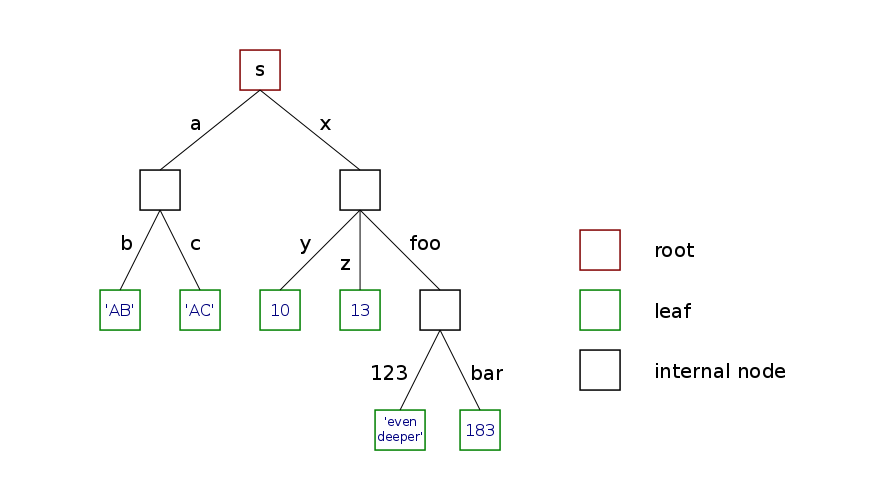

[Free trial](https://www.scm.com/free-trial/)

  * [Applications](https://www.scm.com/applications/ "Applications")
  * [Products](https://www.scm.com/amsterdam-modeling-suite/ "Products")
  * [Support](https://www.scm.com/support/ "Support")
  * [About us](https://www.scm.com/about-us/ "About us")

Search

  * 

Table of contents

  * [General](../general.html)
  * [Introduction](../intro.html)
  * [Getting started](../started.html)
  * [Components overview](components.html)
    * Settings
      * Tree-like structure
      * Dot notation
      * Case sensitivity
      * Global settings
      * API
    * [Jobs](jobs.html)
    * [Results](results.html)
    * [Job runners](runners.html)
    * [Job manager](jobmanager.html)
    * [Public functions](functions.html)
    * [Molecule](molecule.html)
    * [Utilities](utils.html)
    * [Trajectories](trajectories.html)
  * [Interfaces](../interfaces/interfaces.html)
  * [Examples](../examples/examples.html)
  * [Cookbook](../cookbook/cookbook.html)
  * [Citations](../citations.html)

  * [FAQ](../FAQ.html)

__[PLAMS](../index.html)

  * [Documentation](../PLAMS.html/../../Documentation/index.html)/
  * [PLAMS](../index.html)/
  * [Components overview](components.html)/
  * Settings

# Settings¶

The `Settings` class provides a general purpose data container for various kinds of information that need to be stored and processed by PLAMS environment. Other PLAMS objects (like for example [`Job`](jobs.html#scm.plams.core.basejob.Job "scm.plams.core.basejob.Job"), [`JobManager`](jobmanager.html#scm.plams.core.jobmanager.JobManager "scm.plams.core.jobmanager.JobManager") or [`GridRunner`](runners.html#scm.plams.core.jobrunner.GridRunner "scm.plams.core.jobrunner.GridRunner")) have their own `Settings` instances that store data defining and adjusting their behavior. The global scope `Settings` instance (`config`) is used for global settings.

It should be stressed here that there are no different types of `Settings` in the sense that there are no special subclasses of `Settings` for job settings, global settings etc. Everything is stored in the same type of object and the role of a particular `Settings` instance is determined only by its content.

## Tree-like structure¶

The `Settings` class is based on the regular Python dictionary (built-in class [`dict`](https://docs.python.org/3.8/library/stdtypes.html#dict "\(in Python v3.8\)"), tutorial can be found [here](https://docs.python.org/3.8/tutorial/datastructures.html#tut-dictionaries "\(in Python v3.8\)")) and in many aspects works just like it:
[code] 
    >>> s = Settings()
    >>> s['abc'] = 283
    >>> s[147147] = 'some string'
    >>> print(s['abc'])
    283
    >>> del s[147147]
    
[/code]

The main difference is that data in `Settings` can be stored in multilevel fashion, whereas an ordinary dictionary is just a flat structure of key-value pairs. That means a sequence of keys can be used to store a value. In the example below `s['a']` is itself a `Settings` instance with two key-value pairs inside:
[code] 
    >>> s = Settings()
    >>> s['a']['b'] = 'AB'
    >>> s['a']['c'] = 'AC'
    >>> s['x']['y'] = 10
    >>> s['x']['z'] = 13
    >>> s['x']['foo'][123] = 'even deeper'
    >>> s['x']['foo']['bar'] = 183
    >>> print(s)
    a:
      b:    AB
      c:    AC
    x:
      foo:
          123:  even deeper
          bar:  183
      y:    10
      z:    13
    >>> print(s['x'])
    foo:
        123:    even deeper
        bar:    183
    y:  10
    z:  13
    
[/code]

So for each key the value can be either a “proper value” (string, number, list etc.) or another `Settings` instance that creates a new level in the data hierarchy. That way similar information can be arranged in subgroups that can be copied, moved and updated together. It is convenient to think of a `Settings` object as a tree. The root of the tree is the top instance (`s` in the above example), “proper values” are stored in leaves (a leaf is a childless node) and internal nodes correspond to nested `Settings` instances (we will call them _branches_). Tree representation of `s` from the example above is illustrated on the following picture:

Tree-like structure could also be achieved with regular dictionaries, but in a rather cumbersome way:
[code] 
    >>> d = dict()
    >>> d['a'] = dict()
    >>> d['a']['b'] = dict()
    >>> d['a']['b']['c'] = dict()
    >>> d['a']['b']['c']['d'] = 'ABCD'
    ===========================
    >>> s = Settings()
    >>> s['a']['b']['c']['d'] = 'ABCD'
    
[/code]

In the last line of the above example all intermediate `Settings` instances are created and inserted automatically. Such a behavior, however, has some downsides – every time you request a key that is not present in a particular `Settings` instance (for example as a result of a typo), a new empty instance is created and inserted as a value of this key. This is different from dictionaries where exception is raised in such a case:
[code] 
    >>> d = dict()
    >>> d['foo'] = 'bar'
    >>> x = d['fo']
    KeyError: 'fo'
    ===========================
    >>> s = Settings()
    >>> s['foo'] = 'bar'
    >>> x = s['fo']
    
    >>> print(s)
    fo:            #the value here is an empty Settings instance
    foo:    bar
    
[/code]

## Dot notation¶

To avoid inconvenient punctuation, keys stored in `Settings` can be accessed using the dot notation in addition to the usual bracket notation. In other words `s.abc` works as a shortcut for `s['abc']`. Both notations can be used interchangeably:
[code] 
    >>> s.a.b = 'AB'
    >>> s['a'].c = 'AC'
    >>> s.x['y'] = 10
    >>> s['x']['z'] = 13
    >>> s['x'].foo[123] = 'even deeper'
    >>> s.x.foo.bar = 183
    >>> print(s)
    a:
      b:    AB
      c:    AC
    x:
      foo:
          123:  even deeper
          bar:  183
      y:    10
      z:    13
    
[/code]

Due to the internal limitation of the Python syntax parser, keys other than single word strings cannot work with that shortcut, for example:
[code] 
    >>> s.123.b.c = 12
    SyntaxError: invalid syntax
    >>> s.q we.r.t.y = 'aaa'
    SyntaxError: invalid syntax
    >>> s.5fr = True
    SyntaxError: invalid syntax
    
[/code]

In those cases one has to use the regular bracket notation:
[code] 
    >>> s[123].b.c = 12
    >>> s['q we'].r.t.y = 'aaa'
    >>> s['5fr'] = True
    
[/code]

The dot shortcut does not work for keys which begin and end with two (or more) underscores (like `__key__`). This is done on purpose to ensure that Python magic methods work properly.

## Case sensitivity¶

`Settings` are case-preserving but case-insensitive. That means every key is stored in its original form, but when looked up (for example, to access value, test existence or delete), any casing can be used:
[code] 
    >>> s = Settings()
    >>> s.foo = 'bar'
    >>> s.System.one = 1
    >>> s.system.two = 2
    >>> print(s.FOO)
    bar
    >>> 'Foo' in s
    True
    >>> print(s)
    foo:    bar
    System:
       one:     1
       two:     2
    >>> 'oNe' in s.SYSTEM
    True
    
[/code]

## Global settings¶

Global settings are stored in a public `Settings` instance named `config`. They contain variables adjusting general behavior of PLAMS as well as default settings for various objects (jobs, job manager etc.) The `config` instance is created during initialization of PLAMS environment (see [`init()`](functions.html#scm.plams.core.functions.init "scm.plams.core.functions.init")) and populated by executing `plams_defaults` file. It is visible in the main PLAMS namespace so every time you wish to adjust some settings you can simply type in your script, for example:
[code] 
    config.job.pickle = False
    config.sleepstep = 10
    
[/code]

These changes are going to affect only the script they are called from. If you wish to permanently change some setting for all PLAMS executions, you can do it by editing `plams_defaults`, which is located in the root folder of the package (`$AMSHOME/scripting/scm/plams`).

Note

You can create multiple “profiles” of PLAMS behavior by creating multiple different copies of `plams_defaults` (also with different filenames). If the environmental variable `$PLAMSDEFAULTS` is present and its value points to an existing file, this file is used instead of `plams_defaults` from the root folder.

## API¶

_class _`Settings`(_* args_, _** kwargs_)[[source]](../_modules/scm/plams/core/settings.html#Settings)¶
    
Automatic multi-level dictionary. Subclass of built-in class [`dict`](https://docs.python.org/3.8/library/stdtypes.html#dict "\(in Python v3.8\)").

The shortcut dot notation (`s.basis` instead of `s['basis']`) can be used for keys that:

  * are strings

  * don’t contain whitespaces

  * begin with a letter or an underscore

  * don’t both begin and end with two or more underscores.

Iteration follows lexicographical order (via [`sorted()`](https://docs.python.org/3.8/library/functions.html#sorted "\(in Python v3.8\)") function)

Methods for displaying content ([`__str__()`](https://docs.python.org/3.8/reference/datamodel.html#object.__str__ "\(in Python v3.8\)") and [`__repr__()`](https://docs.python.org/3.8/reference/datamodel.html#object.__repr__ "\(in Python v3.8\)")) are overridden to recursively show nested instances in easy-readable format.

Regular dictionaries (also multi-level ones) used as values (or passed to the constructor) are automatically transformed to `Settings` instances:
[code] 
    >>> s = Settings({'a': {1: 'a1', 2: 'a2'}, 'b': {1: 'b1', 2: 'b2'}})
    >>> s.a[3] = {'x': {12: 'q', 34: 'w'}, 'y': 7}
    >>> print(s)
    a:
      1:    a1
      2:    a2
      3:
        x:
          12:   q
          34:   w
        y:  7
    b:
      1:    b1
      2:    b2
    
[/code]

`__init__`(_* args_, _** kwargs_)[[source]](../_modules/scm/plams/core/settings.html#Settings.__init__)¶
    
Initialize self. See help(type(self)) for accurate signature.

`copy`()[[source]](../_modules/scm/plams/core/settings.html#Settings.copy)¶
    
Return a new instance that is a copy of this one. Nested `Settings` instances are copied recursively, not linked.

In practice this method works as a shallow copy: all “proper values” (leaf nodes) in the returned copy point to the same objects as the original instance (unless they are immutable, like `int` or `tuple`). However, nested `Settings` instances (internal nodes) are copied in a deep-copy fashion. In other words, copying a `Settings` instance creates a brand new “tree skeleton” and populates its leaf nodes with values taken directly from the original instance.

This behavior is illustrated by the following example:
[code] 
    >>> s = Settings()
    >>> s.a = 'string'
    >>> s.b = ['l','i','s','t']
    >>> s.x.y = 12
    >>> s.x.z = {'s','e','t'}
    >>> c = s.copy()
    >>> s.a += 'word'
    >>> s.b += [3]
    >>> s.x.u = 'new'
    >>> s.x.y += 10
    >>> s.x.z.add(1)
    >>> print(c)
    a:  string
    b:  ['l', 'i', 's', 't', 3]
    x:
      y:    12
      z:    set([1, 's', 'e', 't'])
    >>> print(s)
    a:  stringword
    b:  ['l', 'i', 's', 't', 3]
    x:
      u:    new
      y:    22
      z:    set([1, 's', 'e', 't'])
    
[/code]

This method is also used when [`copy.copy()`](https://docs.python.org/3.8/library/copy.html#copy.copy "\(in Python v3.8\)") is called.

`soft_update`(_other_)[[source]](../_modules/scm/plams/core/settings.html#Settings.soft_update)¶
    
Update this instance with data from _other_ , but do not overwrite existing keys. Nested `Settings` instances are soft-updated recursively.

In the following example `s` and `o` are previously prepared `Settings` instances:
[code] 
    >>> print(s)
    a:  AA
    b:  BB
    x:
      y1:   XY1
      y2:   XY2
    >>> print(o)
    a:  O_AA
    c:  O_CC
    x:
      y1:   O_XY1
      y3:   O_XY3
    >>> s.soft_update(o)
    >>> print(s)
    a:  AA        #original value s.a not overwritten by o.a
    b:  BB
    c:  O_CC
    x:
      y1:   XY1   #original value s.x.y1 not overwritten by o.x.y1
      y2:   XY2
      y3:   O_XY3
    
[/code]

_Other_ can also be a regular dictionary. Of course in that case only top level keys are updated.

Shortcut `A += B` can be used instead of `A.soft_update(B)`.

`update`(_other_)[[source]](../_modules/scm/plams/core/settings.html#Settings.update)¶
    
Update this instance with data from _other_ , overwriting existing keys. Nested `Settings` instances are updated recursively.

In the following example `s` and `o` are previously prepared `Settings` instances:
[code] 
    >>> print(s)
    a:  AA
    b:  BB
    x:
      y1:   XY1
      y2:   XY2
    >>> print(o)
    a:  O_AA
    c:  O_CC
    x:
      y1:   O_XY1
      y3:   O_XY3
    >>> s.update(o)
    >>> print(s)
    a:  O_AA        #original value s.a overwritten by o.a
    b:  BB
    c:  O_CC
    x:
      y1:   O_XY1   #original value s.x.y1 overwritten by o.x.y1
      y2:   XY2
      y3:   O_XY3
    
[/code]

_Other_ can also be a regular dictionary. Of course in that case only top level keys are updated.

`merge`(_other_)[[source]](../_modules/scm/plams/core/settings.html#Settings.merge)¶
    
Return new instance of `Settings` that is a copy of this instance soft-updated with _other_.

Shortcut `A + B` can be used instead of `A.merge(B)`.

`find_case`(_key_)[[source]](../_modules/scm/plams/core/settings.html#Settings.find_case)¶
    
Check if this instance contains a key consisting of the same letters as _key_ , but possibly with different case. If found, return such a key. If not, return _key_.

`get`(_key_ , _default =None_)[[source]](../_modules/scm/plams/core/settings.html#Settings.get)¶
    
Like regular `get`, but ignore the case.

`pop`(_key_ , _* args_)[[source]](../_modules/scm/plams/core/settings.html#Settings.pop)¶
    
Like regular `pop`, but ignore the case.

`popitem`(_key_)[[source]](../_modules/scm/plams/core/settings.html#Settings.popitem)¶
    
Like regular `popitem`, but ignore the case.

`setdefault`(_key_ , _default =None_)[[source]](../_modules/scm/plams/core/settings.html#Settings.setdefault)¶
    
Like regular `setdefault`, but ignore the case and if the value is a dict, convert it to `Settings`.

`as_dict`()[[source]](../_modules/scm/plams/core/settings.html#Settings.as_dict)¶
    
Return a copy of this instance with all `Settings` replaced by regular Python dictionaries.

_classmethod _`suppress_missing`()[[source]](../_modules/scm/plams/core/settings.html#Settings.suppress_missing)¶
    
A context manager for temporary disabling the `Settings.__missing__()` magic method: all calls now raising a [`KeyError`](https://docs.python.org/3.8/library/exceptions.html#KeyError "\(in Python v3.8\)").

As a results, attempting to access keys absent from an arbitrary `Settings` instance will raise a [`KeyError`](https://docs.python.org/3.8/library/exceptions.html#KeyError "\(in Python v3.8\)"), thus reverting to the default dictionary behaviour.

Note

The `Settings.__missing__()` method is (temporary) suppressed at the class level to ensure consistent invocation by the Python interpreter. See also [special method lookup](https://docs.python.org/3/reference/datamodel.html#special-method-lookup).

Example:
[code] 
    >>> s = Settings()
    
    >>> with s.suppress_missing():
    ...     s.a.b.c = True
    KeyError: 'a'
    
    >>> s.a.b.c = True
    >>> print(s.a.b.c)
    True
    
[/code]

`get_nested`(_key_tuple_ , _suppress_missing =False_)[[source]](../_modules/scm/plams/core/settings.html#Settings.get_nested)¶
    
Retrieve a nested value by, recursively, iterating through this instance using the keys in _key_tuple_.

The `Settings.__getitem__()` method is called recursively on this instance until all keys in key_tuple are exhausted.

Setting _suppress_missing_ to `True` will internally open the `Settings.suppress_missing()` context manager, thus raising a [`KeyError`](https://docs.python.org/3.8/library/exceptions.html#KeyError "\(in Python v3.8\)") if a key in _key_tuple_ is absent from this instance.
[code] 
    >>> s = Settings()
    >>> s.a.b.c = True
    >>> value = s.get_nested(('a', 'b', 'c'))
    >>> print(value)
    True
    
[/code]

`set_nested`(_key_tuple_ , _value_ , _suppress_missing =False_)[[source]](../_modules/scm/plams/core/settings.html#Settings.set_nested)¶
    
Set a nested value by, recursively, iterating through this instance using the keys in _key_tuple_.

The `Settings.__getitem__()` method is called recursively on this instance, followed by `Settings.__setitem__()`, until all keys in key_tuple are exhausted.

Setting _suppress_missing_ to `True` will internally open the `Settings.suppress_missing()` context manager, thus raising a [`KeyError`](https://docs.python.org/3.8/library/exceptions.html#KeyError "\(in Python v3.8\)") if a key in _key_tuple_ is absent from this instance.
[code] 
    >>> s = Settings()
    >>> s.set_nested(('a', 'b', 'c'), True)
    >>> print(s)
    a:
      b:
        c:      True
    
[/code]

`flatten`(_flatten_list =True_)[[source]](../_modules/scm/plams/core/settings.html#Settings.flatten)¶
    
Return a flattened copy of this instance.

New keys are constructed by concatenating the (nested) keys of this instance into tuples.

Opposite of the `Settings.unflatten()` method.

If _flatten_list_ is `True`, all nested lists will be flattened as well. Dictionary keys are replaced with list indices in such case.
[code] 
    >>> s = Settings()
    >>> s.a.b.c = True
    >>> print(s)
    a:
      b:
        c:      True
    
    >>> s_flat = s.flatten()
    >>> print(s_flat)
    ('a', 'b', 'c'):    True
    
[/code]

`unflatten`(_unflatten_list =True_)[[source]](../_modules/scm/plams/core/settings.html#Settings.unflatten)¶
    
Return a nested copy of this instance.

New keys are constructed by expanding the keys of this instance (_e.g._ tuples) into new nested `Settings` instances.

If _unflatten_list_ is `True`, integers will be interpretted as list indices and are used for creating nested lists.

Opposite of the `Settings.flatten()` method.
[code] 
    >>> s = Settings()
    >>> s[('a', 'b', 'c')] = True
    >>> print(s)
    ('a', 'b', 'c'):    True
    
    >>> s_nested = s.unflatten()
    >>> print(s_nested)
    a:
      b:
        c:      True
    
[/code]

`__iter__`()[[source]](../_modules/scm/plams/core/settings.html#Settings.__iter__)¶
    
Iteration through keys follows lexicographical order. All keys are sorted as if they were strings.

`__missing__`(_name_)[[source]](../_modules/scm/plams/core/settings.html#Settings.__missing__)¶
    
When requested key is not present, add it with an empty `Settings` instance as a value.

This method is essential for automatic insertions in deeper levels. Without it things like:
[code] 
    >>> s = Settings()
    >>> s.a.b.c = 12
    
[/code]

will not work.

The behaviour of this method can be suppressed by initializing the `Settings.suppress_missing` context manager.

`__contains__`(_name_)[[source]](../_modules/scm/plams/core/settings.html#Settings.__contains__)¶
    
Like regular `__contains`__`, but ignore the case.

`__getitem__`(_name_)[[source]](../_modules/scm/plams/core/settings.html#Settings.__getitem__)¶
    
Like regular `__getitem__`, but ignore the case.

`__setitem__`(_name_ , _value_)[[source]](../_modules/scm/plams/core/settings.html#Settings.__setitem__)¶
    
Like regular `__setitem__`, but ignore the case and if the value is a dict, convert it to `Settings`.

`__delitem__`(_name_)[[source]](../_modules/scm/plams/core/settings.html#Settings.__delitem__)¶
    
Like regular `__detitem__`, but ignore the case.

`__getattr__`(_name_)[[source]](../_modules/scm/plams/core/settings.html#Settings.__getattr__)¶
    
If name is not a magic method, redirect it to `__getitem__`.

`__setattr__`(_name_ , _value_)[[source]](../_modules/scm/plams/core/settings.html#Settings.__setattr__)¶
    
If name is not a magic method, redirect it to `__setitem__`.

`__delattr__`(_name_)[[source]](../_modules/scm/plams/core/settings.html#Settings.__delattr__)¶
    
If name is not a magic method, redirect it to `__delitem__`.

`_str`(_indent_)[[source]](../_modules/scm/plams/core/settings.html#Settings._str)¶
    
Print contents with _indent_ spaces of indentation. Recursively used for printing nested `Settings` instances with proper indentation.

`__str__`()[[source]](../_modules/scm/plams/core/settings.html#Settings.__str__)¶
    
Return str(self).

`__repr__`()¶
    
Return str(self).

Note

Methods `update()` and `soft_update()` are complementary. Given two `Settings` instances `A` and `B`, the command `A.update(B)` would result in `A` being exactly the same as `B` would be after `B.soft_update(A)`.

[Next ](jobs.html "Jobs") [ Previous](components.html "Components overview")

* * *

  * ### Application Areas

    * [Batteries & PVs](https://www.scm.com/applications/batteries/)
    * [Bonding Analysis](https://www.scm.com/applications/chemical-bonding-analysis/)
    * [Catalysis](https://www.scm.com/applications/catalysis/)
    * [Heavy Elements](https://www.scm.com/applications/heavy-elements/)
    * [Inorganic Chemistry](https://www.scm.com/applications/inorganic-chemistry/)
    * [Life Sciences](https://www.scm.com/applications/pharma/)
    * [Materials Science](https://www.scm.com/applications/materials-science/)
    * [Nanotechnology](https://www.scm.com/applications/nanotechnology/)
    * [Oil and Gas](https://www.scm.com/applications/oil-and-gas/)
    * [Organic Electronics](https://www.scm.com/applications/organic-electronics/)
    * [Polymers](https://www.scm.com/applications/polymers/)
    * [Spectroscopy](https://www.scm.com/applications/spectroscopy/)
    * [Supercomputer / HPC](https://www.scm.com/applications/a-computing-center/)
    * [Teaching Computational Chemistry with AMS](https://www.scm.com/applications/teaching/)

  * ### Products

    * [AMS Driver](https://www.scm.com/product/ams/)
    * [ADF](https://www.scm.com/product/adf/)
    * [BAND](https://www.scm.com/product/band_periodicdft/)
    * [COSMO-RS](https://www.scm.com/product/cosmo-rs/)
    * [DFTB](https://www.scm.com/product/dftb/)
    * [GUI](https://www.scm.com/product/gui/)
    * [ML Potentials & FF](https://www.scm.com/product/machine-learning-potentials/)
    * [MOPAC](https://www.scm.com/product/mopac/)
    * [ParAMS](https://www.scm.com/product/params/)
    * [PLAMS](https://www.scm.com/product/plams/)
    * [Quantum ESPRESSO](https://www.scm.com/product/quantum-espresso/)
    * [ReaxFF](https://www.scm.com/product/reaxff/)
    * [Workflows](https://www.scm.com/product/advanced-workflows/)

  * ### Support

    * [Brochure](https://www.scm.com/amsterdam-modeling-suite/brochures/)
    * [Consulting & Contract Research](https://www.scm.com/amsterdam-modeling-suite/consulting/)
    * [Discussion List](https://www.scm.com/adf-discussion-list/)
    * [Documentation](https://www.scm.com/support/ams-tutorials-and-manuals/)
    * [Downloads](https://www.scm.com/support/downloads/)
    * [FAQs](https://www.scm.com/faq/)
    * [GUI Tutorials](https://www.scm.com/doc/Tutorials/GUI_overview/GUI_overview_tutorials.html)
    * [Installation](https://www.scm.com/support/ams-installation-videos/)
    * [Literature Highlights](https://www.scm.com/category/highlights/)
    * [Papers Citing ADF](https://www.scm.com/amsterdam-modeling-suite/research-papers-citing-adf/)
    * [Release Notes](https://www.scm.com/support/documentation-previous-versions/release-notes/)
    * [Support Overview](https://www.scm.com/support/)
    * [Teaching Materials](https://www.scm.com/support/background/amsterdam-modeling-suite-teaching-materials/)
    * [Videos](https://www.scm.com/amsterdam-modeling-suite/videos-tutorials-and-web-presentations/)
    * [Webinars](https://www.scm.com/about-us/news-agenda/web-presentations-by-adf-experts/)
    * [Workshops](https://www.scm.com/about-us/news-agenda/adf-hands-on-workshops/)

  * ### About Us

    * [Careers](https://www.scm.com/about-us/careers/)
    * [Collaborations](https://www.scm.com/about-us/collaborations/)
    * [Contact Us](https://www.scm.com/about-us/contact-us/)
    * [Contributors](https://www.scm.com/about-us/our-authors/)
    * [EU Projects](https://www.scm.com/about-us/eu-projects/)
    * [Events](https://www.scm.com/about-us/news-agenda/)
    * [Mission & Vision](https://www.scm.com/about-us/mission-vision/)
    * [News](https://www.scm.com/category/news/)
    * [Newsletters](https://www.scm.com/newsletters/)
    * [The SCM Team](https://www.scm.com/about-us/our-people/)

  * ### Pricing & Licensing

    * [License Terms](https://www.scm.com/amsterdam-modeling-suite/pricing-licensing/scm-license-terms/)
    * [Ordering](https://www.scm.com/amsterdam-modeling-suite/pricing-licensing/ordering-procedure/)
    * [Price Calculator](https://www.scm.com/amsterdam-modeling-suite/pricing-licensing/price-quote/calculate-your-price/)
    * [Price Quote](https://www.scm.com/amsterdam-modeling-suite/pricing-licensing/price-quote/)
    * [Pricing & Licensing](https://www.scm.com/amsterdam-modeling-suite/pricing-licensing/)
    * [Resellers](https://www.scm.com/amsterdam-modeling-suite/pricing-licensing/adf-resellers/)

  * [Copyright](https://www.scm.com/copyright/)
  * [Terms of Use](https://www.scm.com/terms-of-use/)
  * [Privacy Policy](https://www.scm.com/privacy-policy/)
