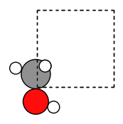

[Free trial](https://www.scm.com/free-trial/)

  * [Applications](https://www.scm.com/applications/ "Applications")
  * [Products](https://www.scm.com/amsterdam-modeling-suite/ "Products")
  * [Support](https://www.scm.com/support/ "Support")
  * [About us](https://www.scm.com/about-us/ "About us")

Search

  * 

Table of contents

  * [General](../../general.html)
  * [Introduction](../../intro.html)
  * [Getting started](../../started.html)
  * [Components overview](../../components/components.html)
  * [Interfaces](../../interfaces/interfaces.html)
  * [Examples](../examples.html)
    * [Getting Started](../examples.html#getting-started)
    * [Molecule analysis](../examples.html#molecule-analysis)
    * [Benchmarks](../examples.html#benchmarks)
    * [Workflows](../examples.html#workflows)
    * [COSMO-RS and property prediction](../examples.html#cosmo-rs-and-property-prediction)
    * [Packmol and AMS-ASE interfaces](../examples.html#packmol-and-ams-ase-interfaces)
      * [Packmol example](../PackMolExample/PackMolExample.html)
      * [Engine ASE: AMS geometry optimizer with forces from any ASE calculator](../CustomASECalculator.html)
      * AMSCalculator: ASE geometry optimizer with AMS forces
        * Initial imports
        * Construct an initial system
        * Set the AMS settings
        * Run the ASE optimizer
        * Finish PLAMS
        * Complete Python code
      * [AMSCalculator: Access results files & Charged systems](ChargedAMSCalculator.html)
      * [i-PI path integral MD with AMS](../i-PI-AMS.html)
      * [Sella transition state search with AMS](../SellaTransitionStateSearch.html)
    * [ParAMS and pyZacros](../examples.html#params-and-pyzacros)
    * [Other AMS calculations](../examples.html#other-ams-calculations)
    * [Pymatgen](../examples.html#pymatgen)
    * [Pre-made recipes](../examples.html#pre-made-recipes)
  * [Cookbook](../../cookbook/cookbook.html)
  * [Citations](../../citations.html)

  * [FAQ](../../FAQ.html)

__[PLAMS](../../index.html)

  * [Documentation](../../PLAMS.html/../../Documentation/index.html)/
  * [PLAMS](../../index.html)/
  * [Examples](../examples.html)/
  * AMSCalculator: ASE geometry optimizer with AMS forces

# AMSCalculator: ASE geometry optimizer with AMS forces¶

**Note** : This example requires AMS2023 or later.

Note

Follow this example only if you need to use ASE. If you just want to run a normal AMS single-point or geometry optimization, do not go through ASE but instead see the [Geometry optimization of water](../WaterOptimization.html#geooptwaterexample) example.

Example illustrating how to use the [ASE Calculator for AMS](../../interfaces/amscalculator.html#amscalculator). The `BFGS` geometry optimizer from ASE is used together with AMS-calculated forces (negative gradients).

In this example, the AMS **driver** is replaced by ASE tools, that use the AMS **engines** (ADF, BAND, DFTB, ForceField, …) to calculate energies and forces.

See also

In the [Engine ASE: AMS geometry optimizer with forces from any ASE calculator](../CustomASECalculator.html#customasecalculatorexample) example, the AMS _engines_ are instead replaced with external ASE calculators, that can be coupled to AMS _driver_ tasks (GeometryOptimization, TransitionStateSearch, MolecularDynamics, …).

Note

This example launches AMS in “AMSworker” mode. This means that AMS is only started at the beginning of the calculation.

To follow along, either

  * Download [`AMSCalculatorWorkerMode.py`](../../_downloads/12217afc5bd62cedcfe1cecdc67fbf88/AMSCalculatorWorkerMode.py) (run as `$AMSBIN/amspython AMSCalculatorWorkerMode.py`).

  * Download [`AMSCalculatorWorkerMode.ipynb`](../../_downloads/e2295f36ee92fd927eeb68de631bc709/AMSCalculatorWorkerMode.ipynb) (see also: how to install [Jupyterlab](../../../Scripting/Python_Stack/Python_Stack.html#install-and-run-jupyter-lab-jupyter-notebooks) in AMS)

## Initial imports¶
[code] 
    from scm.plams import *
    from ase.optimize import BFGS
    from ase.build import molecule as ase_build_molecule
    from ase.visualize.plot import plot_atoms
    import matplotlib.pyplot as plt
    
    # Before running AMS jobs, you need to call init()
    init()
    
    # In this example AMS runs in AMSWorker mode, so we have no use for the PLAMS working directory
    # Let's delete it after the calculations are done
    config.erase_workdir = True
    
[/code]
[code] 
    PLAMS working folder: /home/user/adfhome/scripting/scm/plams/doc/source/examples/AMSCalculator/plams_workdir
    
[/code]

## Construct an initial system¶

Here, we use the `molecule()` from `ase.build` to construct an ASE Atoms object.

You could also convert a PLAMS Molecule to the ASE format using `toASE()`.
[code] 
    atoms = ase_build_molecule('CH3OH')
    # alternatively:
    #atoms = toASE(from_smiles('CO'))
    
    atoms.set_pbc((True, True, True)) # 3D periodic
    atoms.set_cell([4.0, 4.0, 4.0])  # cubic box
    
    # plot the atoms
    plt.figure(figsize=(2,2))
    plt.axis('off')
    plot_atoms(atoms, scale=0.5);
    
[/code]

## Set the AMS settings¶

First, set the AMS settings as you normally would do:
[code] 
    s = Settings()
    s.input.ams.Task = 'SinglePoint' # the geometry optimization is handled by ASE
    s.input.ams.Properties.Gradients = "Yes" # ensures the forces are returned
    s.input.ams.Properties.StressTensor = "Yes" # ensures the stress tensor is returned
    
    # Engine definition, could also be used to set up ADF, ReaxFF, ...
    s.input.ForceField.Type = 'UFF'
    
    # run in serial
    s.runscript.nproc = 1
    
[/code]

## Run the ASE optimizer¶
[code] 
    print("Initial coordinates:")
    print(atoms.get_positions())
    
    with AMSCalculator(settings=s, amsworker=True) as calc:
        atoms.set_calculator(calc)
        optimizer = BFGS(atoms)
        optimizer.run(fmax=0.27) # optimize until forces are smaller than 0.27 eV/ang
    
    print(f"Optimized energy (eV): {atoms.get_potential_energy()}")
    print("Optimized coordinates:")
    print(atoms.get_positions())
    
[/code]
[code] 
    Initial coordinates:
    [[-0.047131  0.664389  0.      ]
     [-0.047131 -0.758551  0.      ]
     [-1.092995  0.969785  0.      ]
     [ 0.878534 -1.048458  0.      ]
     [ 0.437145  1.080376  0.891772]
     [ 0.437145  1.080376 -0.891772]]
          Step     Time          Energy         fmax
    BFGS:    0 15:41:44        0.424475        3.0437
    BFGS:    1 15:41:44        0.354817        2.8239
    BFGS:    2 15:41:44        0.270256        0.9678
    BFGS:    3 15:41:44        0.223897        0.6128
    BFGS:    4 15:41:44        0.200223        0.5503
    BFGS:    5 15:41:44        0.196200        0.1861
    Optimized energy (eV): 0.19620006656661343
    Optimized coordinates:
    [[-7.36222829e-02  6.46660224e-01 -2.64165697e-17]
     [-4.27710560e-02 -7.22615924e-01  8.03241547e-18]
     [-1.12651815e+00  9.85598502e-01  7.26450168e-18]
     [ 9.22587449e-01 -9.45309675e-01  6.26464128e-18]
     [ 4.42945518e-01  1.01179194e+00  9.09790370e-01]
     [ 4.42945518e-01  1.01179194e+00 -9.09790370e-01]]
    
[/code]

## Finish PLAMS¶
[code] 
    finish()
    
[/code]
[code] 
    [14.12|15:41:44] PLAMS run finished. Goodbye
    
[/code]

## Complete Python code¶
[code] 
    #!/usr/bin/env amspython
    # coding: utf-8
    
    # ## Initial imports
    
    from scm.plams import *
    from ase.optimize import BFGS
    from ase.build import molecule as ase_build_molecule
    from ase.visualize.plot import plot_atoms
    import matplotlib.pyplot as plt
    
    # Before running AMS jobs, you need to call init()
    init()
    
    # In this example AMS runs in AMSWorker mode, so we have no use for the PLAMS working directory
    # Let's delete it after the calculations are done
    config.erase_workdir = True
    
    # ## Construct an initial system
    # Here, we use the ``molecule()`` from ``ase.build`` to construct an ASE Atoms object.
    # 
    # You could also convert a PLAMS Molecule to the ASE format using ``toASE()``.
    
    atoms = ase_build_molecule('CH3OH')
    # alternatively:
    #atoms = toASE(from_smiles('CO'))
    
    atoms.set_pbc((True, True, True)) # 3D periodic
    atoms.set_cell([4.0, 4.0, 4.0])  # cubic box
    
    # plot the atoms
    plt.figure(figsize=(2,2))
    plt.axis('off')
    plot_atoms(atoms, scale=0.5);
    
    # ## Set the AMS settings
    # 
    # First, set the AMS settings as you normally would do:
    
    s = Settings() 
    s.input.ams.Task = 'SinglePoint' # the geometry optimization is handled by ASE
    s.input.ams.Properties.Gradients = "Yes" # ensures the forces are returned
    s.input.ams.Properties.StressTensor = "Yes" # ensures the stress tensor is returned
    
    # Engine definition, could also be used to set up ADF, ReaxFF, ...
    s.input.ForceField.Type = 'UFF' 
    
    # run in serial
    s.runscript.nproc = 1 
    
    # ## Run the ASE optimizer
    
    print("Initial coordinates:")
    print(atoms.get_positions())
    
    with AMSCalculator(settings=s, amsworker=True) as calc:
        atoms.set_calculator(calc)
        optimizer = BFGS(atoms)
        optimizer.run(fmax=0.27) # optimize until forces are smaller than 0.27 eV/ang
    
    print(f"Optimized energy (eV): {atoms.get_potential_energy()}")
    print("Optimized coordinates:")
    print(atoms.get_positions())
    
    # ## Finish PLAMS
    
    finish()
    
[/code]

[Next ](ChargedAMSCalculator.html "AMSCalculator: Access results files & Charged systems") [ Previous](../CustomASECalculator.html "Engine ASE: AMS geometry optimizer with forces from any ASE calculator")

* * *

  * ### Application Areas

    * [Batteries & PVs](https://www.scm.com/applications/batteries/)
    * [Bonding Analysis](https://www.scm.com/applications/chemical-bonding-analysis/)
    * [Catalysis](https://www.scm.com/applications/catalysis/)
    * [Heavy Elements](https://www.scm.com/applications/heavy-elements/)
    * [Inorganic Chemistry](https://www.scm.com/applications/inorganic-chemistry/)
    * [Life Sciences](https://www.scm.com/applications/pharma/)
    * [Materials Science](https://www.scm.com/applications/materials-science/)
    * [Nanotechnology](https://www.scm.com/applications/nanotechnology/)
    * [Oil and Gas](https://www.scm.com/applications/oil-and-gas/)
    * [Organic Electronics](https://www.scm.com/applications/organic-electronics/)
    * [Polymers](https://www.scm.com/applications/polymers/)
    * [Spectroscopy](https://www.scm.com/applications/spectroscopy/)
    * [Supercomputer / HPC](https://www.scm.com/applications/a-computing-center/)
    * [Teaching Computational Chemistry with AMS](https://www.scm.com/applications/teaching/)

  * ### Products

    * [AMS Driver](https://www.scm.com/product/ams/)
    * [ADF](https://www.scm.com/product/adf/)
    * [BAND](https://www.scm.com/product/band_periodicdft/)
    * [COSMO-RS](https://www.scm.com/product/cosmo-rs/)
    * [DFTB](https://www.scm.com/product/dftb/)
    * [GUI](https://www.scm.com/product/gui/)
    * [ML Potentials & FF](https://www.scm.com/product/machine-learning-potentials/)
    * [MOPAC](https://www.scm.com/product/mopac/)
    * [ParAMS](https://www.scm.com/product/params/)
    * [PLAMS](https://www.scm.com/product/plams/)
    * [Quantum ESPRESSO](https://www.scm.com/product/quantum-espresso/)
    * [ReaxFF](https://www.scm.com/product/reaxff/)
    * [Workflows](https://www.scm.com/product/advanced-workflows/)

  * ### Support

    * [Brochure](https://www.scm.com/amsterdam-modeling-suite/brochures/)
    * [Consulting & Contract Research](https://www.scm.com/amsterdam-modeling-suite/consulting/)
    * [Discussion List](https://www.scm.com/adf-discussion-list/)
    * [Documentation](https://www.scm.com/support/ams-tutorials-and-manuals/)
    * [Downloads](https://www.scm.com/support/downloads/)
    * [FAQs](https://www.scm.com/faq/)
    * [GUI Tutorials](https://www.scm.com/doc/Tutorials/GUI_overview/GUI_overview_tutorials.html)
    * [Installation](https://www.scm.com/support/ams-installation-videos/)
    * [Literature Highlights](https://www.scm.com/category/highlights/)
    * [Papers Citing ADF](https://www.scm.com/amsterdam-modeling-suite/research-papers-citing-adf/)
    * [Release Notes](https://www.scm.com/support/documentation-previous-versions/release-notes/)
    * [Support Overview](https://www.scm.com/support/)
    * [Teaching Materials](https://www.scm.com/support/background/amsterdam-modeling-suite-teaching-materials/)
    * [Videos](https://www.scm.com/amsterdam-modeling-suite/videos-tutorials-and-web-presentations/)
    * [Webinars](https://www.scm.com/about-us/news-agenda/web-presentations-by-adf-experts/)
    * [Workshops](https://www.scm.com/about-us/news-agenda/adf-hands-on-workshops/)

  * ### About Us

    * [Careers](https://www.scm.com/about-us/careers/)
    * [Collaborations](https://www.scm.com/about-us/collaborations/)
    * [Contact Us](https://www.scm.com/about-us/contact-us/)
    * [Contributors](https://www.scm.com/about-us/our-authors/)
    * [EU Projects](https://www.scm.com/about-us/eu-projects/)
    * [Events](https://www.scm.com/about-us/news-agenda/)
    * [Mission & Vision](https://www.scm.com/about-us/mission-vision/)
    * [News](https://www.scm.com/category/news/)
    * [Newsletters](https://www.scm.com/newsletters/)
    * [The SCM Team](https://www.scm.com/about-us/our-people/)

  * ### Pricing & Licensing

    * [License Terms](https://www.scm.com/amsterdam-modeling-suite/pricing-licensing/scm-license-terms/)
    * [Ordering](https://www.scm.com/amsterdam-modeling-suite/pricing-licensing/ordering-procedure/)
    * [Price Calculator](https://www.scm.com/amsterdam-modeling-suite/pricing-licensing/price-quote/calculate-your-price/)
    * [Price Quote](https://www.scm.com/amsterdam-modeling-suite/pricing-licensing/price-quote/)
    * [Pricing & Licensing](https://www.scm.com/amsterdam-modeling-suite/pricing-licensing/)
    * [Resellers](https://www.scm.com/amsterdam-modeling-suite/pricing-licensing/adf-resellers/)

  * [Copyright](https://www.scm.com/copyright/)
  * [Terms of Use](https://www.scm.com/terms-of-use/)
  * [Privacy Policy](https://www.scm.com/privacy-policy/)
