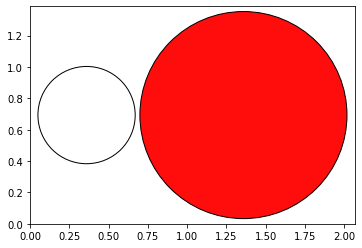

[Free trial](https://www.scm.com/free-trial/)

  * [Applications](https://www.scm.com/applications/ "Applications")
  * [Products](https://www.scm.com/amsterdam-modeling-suite/ "Products")
  * [Support](https://www.scm.com/support/ "Support")
  * [About us](https://www.scm.com/about-us/ "About us")

Search

  * 

Table of contents

  * [General](../../general.html)
  * [Introduction](../../intro.html)
  * [Getting started](../../started.html)
  * [Components overview](../../components/components.html)
  * [Interfaces](../../interfaces/interfaces.html)
  * [Examples](../examples.html)
    * [Getting Started](../examples.html#getting-started)
    * [Molecule analysis](../examples.html#molecule-analysis)
    * [Benchmarks](../examples.html#benchmarks)
    * [Workflows](../examples.html#workflows)
    * [COSMO-RS and property prediction](../examples.html#cosmo-rs-and-property-prediction)
    * [Packmol and AMS-ASE interfaces](../examples.html#packmol-and-ams-ase-interfaces)
      * [Packmol example](../PackMolExample/PackMolExample.html)
      * [Engine ASE: AMS geometry optimizer with forces from any ASE calculator](../CustomASECalculator.html)
      * [AMSCalculator: ASE geometry optimizer with AMS forces](ASECalculator.html)
      * AMSCalculator: Access results files & Charged systems
        * Initial imports
        * Example 1: Total system charge
        * Example 2: Define atomic charges
        * Example 3: Set the charge in the AMS System block
        * Finish PLAMS
        * Complete Python code
      * [i-PI path integral MD with AMS](../i-PI-AMS.html)
      * [Sella transition state search with AMS](../SellaTransitionStateSearch.html)
    * [ParAMS and pyZacros](../examples.html#params-and-pyzacros)
    * [Other AMS calculations](../examples.html#other-ams-calculations)
    * [Pymatgen](../examples.html#pymatgen)
    * [Pre-made recipes](../examples.html#pre-made-recipes)
  * [Cookbook](../../cookbook/cookbook.html)
  * [Citations](../../citations.html)

  * [FAQ](../../FAQ.html)

__[PLAMS](../../index.html)

  * [Documentation](../../PLAMS.html/../../Documentation/index.html)/
  * [PLAMS](../../index.html)/
  * [Examples](../examples.html)/
  * AMSCalculator: Access results files & Charged systems

# AMSCalculator: Access results files & Charged systems¶

**Note** : This example requires AMS2023 or later.

Example illustrating how to use the [ASE Calculator for AMS](../../interfaces/amscalculator.html#amscalculator) for charged systems.

  * Download [`ChargedAMSCalculatorExample.py`](../../_downloads/efbc2b8e7e40c53af0efba509521468b/ChargedAMSCalculatorExample.py) (run as `$AMSBIN/amspython ChargedAMSCalculatorExample.py`).

  * Download [`ChargedAMSCalculatorExample.ipynb`](../../_downloads/42bd2d0d2a2a1be8eb84e59a34387ef3/ChargedAMSCalculatorExample.ipynb) (see also: how to install [Jupyterlab](../../../Scripting/Python_Stack/Python_Stack.html#install-and-run-jupyter-lab-jupyter-notebooks) in AMS)

## Initial imports¶
[code] 
    from scm.plams import *
    from ase import Atoms
    from ase.visualize.plot import plot_atoms
    
    # Before running AMS jobs, you need to call init()
    init()
    
[/code]
[code] 
    PLAMS working folder: AMSCalculator/plams_workdir
    
[/code]

## Example 1: Total system charge¶

### Create the charged molecule (ion)¶

Create a charged ion using using `ase.Atoms` and setting the `info` dictionairy.
[code] 
    atoms = Atoms('OH',
                  positions = [[1.0,0.0,0.0],[0.0,0.0,0.0]]
                 )
    #define a total charge
    atoms.info['charge'] = -1
    
    plot_atoms(atoms);
    
[/code]

### Set the AMS settings¶

First, set the AMS settings as you normally would do in PLAMS:
[code] 
    settings = Settings()
    settings.input.ADF #Use ADF with the default settings
    settings.input.ams.Task = "SinglePoint"
    
[/code]

### Run AMS through the ASE Calculator¶

Below, the `amsworker=False` (default) will cause AMS to run in standalone mode. This means that all input and output files will be stored on disk.
[code] 
    atoms.calc = AMSCalculator(settings = settings, name='total_charge', amsworker=False)
    
    energy = atoms.get_potential_energy() #calculate the energy of a charged ion
    print(f'Energy: {energy:.3f} eV') # ASE uses eV as energy unit
    
[/code]
[code] 
    [18.04|09:39:55] JOB total_charge1 STARTED
    [18.04|09:39:55] JOB total_charge1 RUNNING
    [18.04|09:39:57] JOB total_charge1 FINISHED
    [18.04|09:39:57] JOB total_charge1 SUCCESSFUL
    Energy: -8.325 eV
    
[/code]

### Access the input file¶

`atoms.calc.amsresults` contains the corresponding PLAMS AMSResults object.

`atoms.calc.amsresults.job` contains the corresponding PLAMS AMSJob object. This object has, for example, the `get_input()` method to access the input to AMS.

**Note** : These are actually properties of the Calculator, not the Atoms! So if you run more calculations with the same calculator you will **overwrite** the AMSResults in `atoms.calc.amsresults`!

AMS used the following input:
[code] 
    print(atoms.calc.amsresults.job.get_input())
    
[/code]
[code] 
    Task SinglePoint
    
    system
      Atoms
                  O       1.0000000000       0.0000000000       0.0000000000
                  H       0.0000000000       0.0000000000       0.0000000000
      End
      Charge -1.0
    End
    
    Engine ADF
    EndEngine
    
[/code]

### Access the binary .rkf results files and use PLAMS AMSResults methods¶

Access the paths to the binary results files:
[code] 
    ams_rkf = atoms.calc.amsresults.rkfpath(file='ams')
    print(ams_rkf)
    
[/code]
[code] 
    AMSCalculator/plams_workdir/total_charge1/ams.rkf
    
[/code]

If you prefer, you can use the PLAMS methods to access results like the energy:
[code] 
    energy2 = atoms.calc.amsresults.get_energy(unit='eV')
    print(f'Energy: {energy2:.3f} eV')
    
[/code]
[code] 
    Energy: -8.325 eV
    
[/code]

## Example 2: Define atomic charges¶

### Construct a charged ion with atomic charges¶
[code] 
    atoms = Atoms('OH',
                  positions = [[1.0,0.0,0.0],[0.0,0.0,0.0]],
                  charges = [-1, 0]
                 )
    
    plot_atoms(atoms);
    
[/code]

### Run AMS¶
[code] 
    calc = AMSCalculator(settings = settings, name='atomic_charges')
    atoms.calc = calc
    
    atoms.get_potential_energy() #calculate the energy of a charged ion
    
[/code]
[code] 
    [18.04|09:39:58] JOB atomic_charges1 STARTED
    [18.04|09:39:58] Job atomic_charges1 previously run as total_charge1, using old results
    [18.04|09:39:58] JOB atomic_charges1 COPIED
    
[/code]
[code] 
    -8.325219526830319
    
[/code]

AMS only considers the total charge of the system and not the individual atomic charges. PLAMS thus reuses the results of the previous calculation since the calculation is for the same chemical system. Both input options are allowed. If both input options are used, the total charge is the sum of both.
[code] 
    print(calc.amsresults.job.get_input())
    
[/code]
[code] 
    Task SinglePoint
    
    system
      Atoms
                  O       1.0000000000       0.0000000000       0.0000000000
                  H       0.0000000000       0.0000000000       0.0000000000
      End
      Charge -1.0
    End
    
    Engine ADF
    EndEngine
    
[/code]

## Example 3: Set the charge in the AMS System block¶

### Set the charge in the AMS System block¶

A charge can be set for the calculator in the settings object.
[code] 
    atoms = Atoms('OH',
                  positions = [[1.0,0.0,0.0],[0.0,0.0,0.0]]
                 )
    
    settings = Settings()
    settings.input.ADF #Use ADF with the default settings
    settings.input.ams.Task = "SinglePoint"
    settings.input.ams.System.Charge = -1
    
    calc = AMSCalculator(settings = settings, name='default_charge')
    atoms.calc = calc
    atoms.get_potential_energy() #calculate the energy of a charged ion
    print(calc.amsresults.job.get_input())
    
[/code]
[code] 
    [18.04|09:39:58] JOB default_charge1 STARTED
    [18.04|09:39:58] JOB default_charge1 RUNNING
    [18.04|09:40:00] JOB default_charge1 FINISHED
    [18.04|09:40:00] JOB default_charge1 SUCCESSFUL
    System
      Atoms
                  O       1.0000000000       0.0000000000       0.0000000000
                  H       0.0000000000       0.0000000000       0.0000000000
      End
      Charge -1
    End
    
    Task SinglePoint
    
    Engine ADF
    EndEngine
    
[/code]

In this case, the charge of the `Atoms` object is no longer used.
[code] 
    atoms = Atoms('OH',
                  positions = [[1.0,0.0,0.0],[0.0,0.0,0.0]],
                 )
    atoms.info['charge'] = 100
    
    settings = Settings()
    settings.input.ADF #Use ADF with the default settings
    settings.input.ams.Task = "SinglePoint"
    settings.input.ams.System.Charge = -1
    
    calc = AMSCalculator(settings = settings, name='default_charge_overridden')
    atoms.calc = calc
    atoms.get_potential_energy() #calculate the energy of a charged ion
    print(calc.amsresults.job.get_input())
    
[/code]
[code] 
    [18.04|09:40:00] JOB default_charge_overridden1 STARTED
    [18.04|09:40:00] Job default_charge_overridden1 previously run as default_charge1, using old results
    [18.04|09:40:00] JOB default_charge_overridden1 COPIED
    System
      Atoms
                  O       1.0000000000       0.0000000000       0.0000000000
                  H       0.0000000000       0.0000000000       0.0000000000
      End
      Charge -1
    End
    
    Task SinglePoint
    
    Engine ADF
    EndEngine
    
[/code]

## Finish PLAMS¶
[code] 
    finish()
    
[/code]
[code] 
    [18.04|09:40:00] PLAMS run finished. Goodbye
    
[/code]

## Complete Python code¶
[code] 
    #!/usr/bin/env amspython
    # coding: utf-8
    
    # ## Initial imports
    
    from scm.plams import *
    from ase import Atoms
    from ase.visualize.plot import plot_atoms
    
    # Before running AMS jobs, you need to call init()
    init()
    
    # ## Example 1: Total system charge
    # 
    # ### Create the charged molecule (ion)
    # Create a charged ion using using `ase.Atoms` and setting the `info` dictionairy.
    
    atoms = Atoms('OH',
                  positions = [[1.0,0.0,0.0],[0.0,0.0,0.0]]
                 )
    #define a total charge
    atoms.info['charge'] = -1
    
    plot_atoms(atoms);
    
    # ### Set the AMS settings
    # 
    # First, set the AMS settings as you normally would do in PLAMS:
    
    settings = Settings()
    settings.input.ADF #Use ADF with the default settings
    settings.input.ams.Task = "SinglePoint"
    
    # ### Run AMS through the ASE Calculator
    # 
    # Below, the ``amsworker=False`` (default) will cause AMS to run in standalone mode. This means that all input and output files will be stored on disk.
    
    atoms.calc = AMSCalculator(settings = settings, name='total_charge', amsworker=False)
    
    energy = atoms.get_potential_energy() #calculate the energy of a charged ion
    print(f'Energy: {energy:.3f} eV') # ASE uses eV as energy unit
    
    # ### Access the input file
    # 
    # ``atoms.calc.amsresults`` contains the corresponding PLAMS AMSResults object.
    # 
    # ``atoms.calc.amsresults.job`` contains the corresponding PLAMS AMSJob object. This object has, for example, the ``get_input()`` method to access the input to AMS.
    # 
    # **Note**: These are actually properties of the Calculator, not the Atoms! So if you run more calculations with the same calculator you will **overwrite** the AMSResults in ``atoms.calc.amsresults``!
    # 
    # AMS used the following input:
    
    print(atoms.calc.amsresults.job.get_input())
    
    # ### Access the binary .rkf results files and use PLAMS AMSResults methods
    # 
    # Access the paths to the binary results files:
    
    ams_rkf = atoms.calc.amsresults.rkfpath(file='ams')
    print(ams_rkf)
    
    # If you prefer, you can use the PLAMS methods to access results like the energy:
    
    energy2 = atoms.calc.amsresults.get_energy(unit='eV')
    print(f'Energy: {energy2:.3f} eV')
    
    # ## Example 2: Define atomic charges
    # 
    # ### Construct a charged ion with atomic charges
    
    atoms = Atoms('OH',
                  positions = [[1.0,0.0,0.0],[0.0,0.0,0.0]],
                  charges = [-1, 0]
                 )
    
    plot_atoms(atoms);
    
    # ### Run AMS 
    
    calc = AMSCalculator(settings = settings, name='atomic_charges')
    atoms.calc = calc
    
    atoms.get_potential_energy() #calculate the energy of a charged ion
    
    # AMS only considers the total charge of the system and not the individual atomic charges. PLAMS thus reuses the results of the previous calculation since the calculation is for the same chemical system. Both input options are allowed. If both input options are used, the total charge is the sum of both.
    
    print(calc.amsresults.job.get_input())
    
    # ## Example 3: Set the charge in the AMS System block
    # 
    # ### Set the charge in the AMS System block
    # A charge can be set for the calculator in the settings object. 
    
    atoms = Atoms('OH',
                  positions = [[1.0,0.0,0.0],[0.0,0.0,0.0]]
                 )
    
    settings = Settings()
    settings.input.ADF #Use ADF with the default settings
    settings.input.ams.Task = "SinglePoint"
    settings.input.ams.System.Charge = -1
    
    calc = AMSCalculator(settings = settings, name='default_charge')
    atoms.calc = calc
    atoms.get_potential_energy() #calculate the energy of a charged ion
    print(calc.amsresults.job.get_input())
    
    # In this case, the charge of the `Atoms` object is no longer used.
    
    atoms = Atoms('OH',
                  positions = [[1.0,0.0,0.0],[0.0,0.0,0.0]],
                 )
    atoms.info['charge'] = 100
    
    settings = Settings()
    settings.input.ADF #Use ADF with the default settings
    settings.input.ams.Task = "SinglePoint"
    settings.input.ams.System.Charge = -1
    
    calc = AMSCalculator(settings = settings, name='default_charge_overridden')
    atoms.calc = calc
    atoms.get_potential_energy() #calculate the energy of a charged ion
    print(calc.amsresults.job.get_input())
    
    # ## Finish PLAMS
    
    finish()
    
[/code]

[Next ](../i-PI-AMS.html "i-PI path integral MD with AMS") [ Previous](ASECalculator.html "AMSCalculator: ASE geometry optimizer with AMS forces")

* * *

  * ### Application Areas

    * [Batteries & PVs](https://www.scm.com/applications/batteries/)
    * [Bonding Analysis](https://www.scm.com/applications/chemical-bonding-analysis/)
    * [Catalysis](https://www.scm.com/applications/catalysis/)
    * [Heavy Elements](https://www.scm.com/applications/heavy-elements/)
    * [Inorganic Chemistry](https://www.scm.com/applications/inorganic-chemistry/)
    * [Life Sciences](https://www.scm.com/applications/pharma/)
    * [Materials Science](https://www.scm.com/applications/materials-science/)
    * [Nanotechnology](https://www.scm.com/applications/nanotechnology/)
    * [Oil and Gas](https://www.scm.com/applications/oil-and-gas/)
    * [Organic Electronics](https://www.scm.com/applications/organic-electronics/)
    * [Polymers](https://www.scm.com/applications/polymers/)
    * [Spectroscopy](https://www.scm.com/applications/spectroscopy/)
    * [Supercomputer / HPC](https://www.scm.com/applications/a-computing-center/)
    * [Teaching Computational Chemistry with AMS](https://www.scm.com/applications/teaching/)

  * ### Products

    * [AMS Driver](https://www.scm.com/product/ams/)
    * [ADF](https://www.scm.com/product/adf/)
    * [BAND](https://www.scm.com/product/band_periodicdft/)
    * [COSMO-RS](https://www.scm.com/product/cosmo-rs/)
    * [DFTB](https://www.scm.com/product/dftb/)
    * [GUI](https://www.scm.com/product/gui/)
    * [ML Potentials & FF](https://www.scm.com/product/machine-learning-potentials/)
    * [MOPAC](https://www.scm.com/product/mopac/)
    * [ParAMS](https://www.scm.com/product/params/)
    * [PLAMS](https://www.scm.com/product/plams/)
    * [Quantum ESPRESSO](https://www.scm.com/product/quantum-espresso/)
    * [ReaxFF](https://www.scm.com/product/reaxff/)
    * [Workflows](https://www.scm.com/product/advanced-workflows/)

  * ### Support

    * [Brochure](https://www.scm.com/amsterdam-modeling-suite/brochures/)
    * [Consulting & Contract Research](https://www.scm.com/amsterdam-modeling-suite/consulting/)
    * [Discussion List](https://www.scm.com/adf-discussion-list/)
    * [Documentation](https://www.scm.com/support/ams-tutorials-and-manuals/)
    * [Downloads](https://www.scm.com/support/downloads/)
    * [FAQs](https://www.scm.com/faq/)
    * [GUI Tutorials](https://www.scm.com/doc/Tutorials/GUI_overview/GUI_overview_tutorials.html)
    * [Installation](https://www.scm.com/support/ams-installation-videos/)
    * [Literature Highlights](https://www.scm.com/category/highlights/)
    * [Papers Citing ADF](https://www.scm.com/amsterdam-modeling-suite/research-papers-citing-adf/)
    * [Release Notes](https://www.scm.com/support/documentation-previous-versions/release-notes/)
    * [Support Overview](https://www.scm.com/support/)
    * [Teaching Materials](https://www.scm.com/support/background/amsterdam-modeling-suite-teaching-materials/)
    * [Videos](https://www.scm.com/amsterdam-modeling-suite/videos-tutorials-and-web-presentations/)
    * [Webinars](https://www.scm.com/about-us/news-agenda/web-presentations-by-adf-experts/)
    * [Workshops](https://www.scm.com/about-us/news-agenda/adf-hands-on-workshops/)

  * ### About Us

    * [Careers](https://www.scm.com/about-us/careers/)
    * [Collaborations](https://www.scm.com/about-us/collaborations/)
    * [Contact Us](https://www.scm.com/about-us/contact-us/)
    * [Contributors](https://www.scm.com/about-us/our-authors/)
    * [EU Projects](https://www.scm.com/about-us/eu-projects/)
    * [Events](https://www.scm.com/about-us/news-agenda/)
    * [Mission & Vision](https://www.scm.com/about-us/mission-vision/)
    * [News](https://www.scm.com/category/news/)
    * [Newsletters](https://www.scm.com/newsletters/)
    * [The SCM Team](https://www.scm.com/about-us/our-people/)

  * ### Pricing & Licensing

    * [License Terms](https://www.scm.com/amsterdam-modeling-suite/pricing-licensing/scm-license-terms/)
    * [Ordering](https://www.scm.com/amsterdam-modeling-suite/pricing-licensing/ordering-procedure/)
    * [Price Calculator](https://www.scm.com/amsterdam-modeling-suite/pricing-licensing/price-quote/calculate-your-price/)
    * [Price Quote](https://www.scm.com/amsterdam-modeling-suite/pricing-licensing/price-quote/)
    * [Pricing & Licensing](https://www.scm.com/amsterdam-modeling-suite/pricing-licensing/)
    * [Resellers](https://www.scm.com/amsterdam-modeling-suite/pricing-licensing/adf-resellers/)

  * [Copyright](https://www.scm.com/copyright/)
  * [Terms of Use](https://www.scm.com/terms-of-use/)
  * [Privacy Policy](https://www.scm.com/privacy-policy/)
