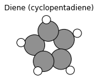
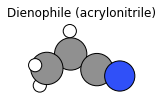
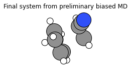
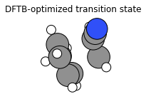
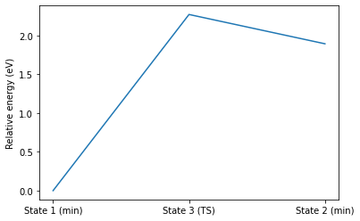
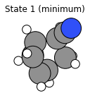
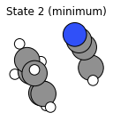
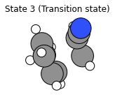

[Free trial](https://www.scm.com/free-trial/)

  * [Applications](https://www.scm.com/applications/ "Applications")
  * [Products](https://www.scm.com/amsterdam-modeling-suite/ "Products")
  * [Support](https://www.scm.com/support/ "Support")
  * [About us](https://www.scm.com/about-us/ "About us")

Search

  * 

Table of contents

  * [General](../../general.html)
  * [Introduction](../../intro.html)
  * [Getting started](../../started.html)
  * [Components overview](../../components/components.html)
  * [Interfaces](../../interfaces/interfaces.html)
  * [Examples](../examples.html)
    * [Getting Started](../examples.html#getting-started)
    * [Molecule analysis](../examples.html#molecule-analysis)
    * [Benchmarks](../examples.html#benchmarks)
    * [Workflows](../examples.html#workflows)
      * [Reduction and oxidation potentials](../RedoxPotential.html)
      * [Workflow: filtering molecules based on excitation energies](../ExcitationsWorkflow.html)
      * AMS transition state workflow
        * Initial imports
        * Function definitions
        * Run the calculations
        * Preliminary biased MD results (UFF)
        * TS search results (DFTB)
        * Energy landscape refinement results (DFTB)
        * Finish plams
        * Complete Python code
      * [Charge transfer integrals with ADF](../ChargeTransferIntegralsADF.html)
      * [Tuning the range separation](../gammascan.html)
      * [Conformers Generation](../ConformersGeneration/ConformersGeneration.html)
    * [COSMO-RS and property prediction](../examples.html#cosmo-rs-and-property-prediction)
    * [Packmol and AMS-ASE interfaces](../examples.html#packmol-and-ams-ase-interfaces)
    * [ParAMS and pyZacros](../examples.html#params-and-pyzacros)
    * [Other AMS calculations](../examples.html#other-ams-calculations)
    * [Pymatgen](../examples.html#pymatgen)
    * [Pre-made recipes](../examples.html#pre-made-recipes)
  * [Cookbook](../../cookbook/cookbook.html)
  * [Citations](../../citations.html)

  * [FAQ](../../FAQ.html)

__[PLAMS](../../index.html)

  * [Documentation](../../PLAMS.html/../../Documentation/index.html)/
  * [PLAMS](../../index.html)/
  * [Examples](../examples.html)/
  * AMS transition state workflow

# AMS transition state workflow¶

Example illustrating a Diels-Alder addition between cyclopentadiene and acrylonitrile.

In this example, a preliminary biased UFF MD simulation is run to orient the two reactant molecules near the transition state.

Then a transition state search is performed.

The PESExploration LandscapeRefinement is used to find the two minima on either side of the transition state.

See also

The [AMS biased MD / PLUMED](../AMSPlumedMD/AMSPlumedMD.html#amsplumedmd) example is similar, but in that example the reaction happens during the MD simulation. That type of simulation can be performed when the potential is reactive.

In the current example, the MD simulation is performed with UFF which is not reactive.

See also

Example: [Molecule substitution: Attach ligands to substrates](../MoleculeSubstitution/MoleculeSubstitutionExample.html#moleculesubstitution)

To follow along, either

  * Download [`diels_alder_addition.py`](../../_downloads/3c116b7113c5ce0a79c2c0ad43a260d7/diels_alder_addition.py) (run as `$AMSBIN/amspython diels_alder_addition.py`).

  * Download [`diels_alder_addition.ipynb`](../../_downloads/a9c9783ae2efaf5fe91bcc3c856b8f12/diels_alder_addition.ipynb) (see also: how to install [Jupyterlab](../../../Scripting/Python_Stack/Python_Stack.html#install-and-run-jupyter-lab-jupyter-notebooks) in AMS)

## Initial imports¶
[code] 
    from scm.plams import *
    import numpy as np
    import os
    import matplotlib.pyplot as plt
    from typing import List
    
[/code]

## Function definitions¶

The `addition()` function

  * performs a preliminary MD simulation with UFF to arrange the two reactant molecules at an approximate transition state,

  * then does a transition state search with DFTB, specifying the known reaction coordinate (bond formation),

  * then uses the PESExploration LandscapeRefinement tool to get the two corresponding minima and energy landscape. Alternatively, one could also do an IRC (intrinsic reaction coordinate) calculation.

[code] 
    def addition(
        mol1: Molecule,
        mol2: Molecule,
        covalent_radius_multiplier: float = 1.2,
    ):
        mol1_ind = get_active_i(mol1)
        mol2_ind = get_active_i(mol2)
        if len(mol1_ind) != 2:
            raise ValueError(
                f"Set at.properties.active_bond for two atoms in mol1. Current mol1_ind: {mol1_ind}"
            )
        if len(mol2_ind) != 2:
            raise ValueError(
                f"Set at.properties.active_bond for two atoms in mol2. Current mol2_ind: {mol2_ind}"
            )
    
        target_distances = []
    
        for i1, i2 in zip(mol1_ind, mol2_ind):
            r = get_atom_radius(mol1[i1]) + get_atom_radius(mol2[i2])
            target_distances.append(r * covalent_radius_multiplier)
    
        combined = mol1.copy()
        combined.add_molecule(mol2, margin=2)
        combined.properties.charge = mol1.properties.get("charge", 0) + mol2.properties.get("charge", 0)
    
        mol2_ind = [x + len(mol1) for x in mol2_ind]
    
        preliminary_md_results = preliminary_md(
            combined,
            mol1_ind,
            mol2_ind,
            target_distances=target_distances,
            temperature=600,
            nsteps=20000,
        )
        mol = preliminary_md_results.get_main_molecule()
    
        ts_search_results = ts_search(mol, mol1_ind, mol2_ind)
        mol = ts_search_results.get_main_molecule()
    
        relax_from_saddle_results = relax_from_saddle(mol)
    
        return preliminary_md_results, ts_search_results, relax_from_saddle_results
    
    def ts_search(
        molecule, atom_indices_1: List[int], atom_indices_2: List[int], settings:Settings=None
    ) -> AMSResults:
        if settings is None:
            settings = Settings()
            settings.input.DFTB
            # settings.runscript.nproc = 1
            settings.input.ams.GeometryOptimization.InitialHessian.Type = "Calculate"
            settings.input.ams.Properties.NormalModes = "Yes"
            settings.input.ams.GeometryOptimization.Convergence.Quality = "Good"
    
        s = settings.copy()
        s.input.ams.task = "TransitionStateSearch"
        s.input.ams.TransitionStateSearch.ReactionCoordinate.Distance = [
            f"{a1} {a2} 1.0" for a1, a2 in zip(atom_indices_1, atom_indices_2)
        ]
    
        job = AMSJob(settings=s, name="ts_search", molecule=molecule)
        job.run()
    
        return job.results
    
    def relax_from_saddle(molecule:Molecule, settings:Settings=None) -> AMSResults:
        if settings is None:
            settings = Settings()
            settings.input.DFTB
            settings.input.ams.GeometryOptimization.InitialHessian.Type = "Calculate"
            # settings.runscript.nproc = 1
    
        s = settings.copy()
        s.input.ams.task = "PESExploration"
        s.input.ams.PESExploration.Job = "LandscapeRefinement"
        s.input.ams.PESExploration.LandscapeRefinement.RelaxFromSaddlePoint = "T"
    
        dummy = from_smiles("[HH]")
        m = {"state1 ts=Yes": molecule, "": dummy}
    
        job = AMSJob(settings=s, name="refinement", molecule=m)
        job.run()
    
        return job.results
    
    def irc(molecule:Molecule, settings:Settings=None):
        if settings is None:
            settings = Settings()
            settings.input.DFTB
            # settings.runscript.nproc = 1
    
        s = settings.copy()
        s.input.ams.task = "IRC"
        s.input.ams.IRC.MinEnergyProfile = "Yes"
    
        job = AMSJob(settings=s, name="irc", molecule=molecule)
        job.run()
    
        converged = job.results.get_history_property("Converged")
        direction = job.results.get_history_property("IRCDirection")
        energies = job.results.get_history_property("Energy")
        ind = dict()
        energy = dict()
        for i, (c, d, e) in enumerate(zip(converged, direction, energies)):
            if c:
                ind[d] = i + 1
                energy[d] = e
    
        min1 = job.results.get_history_molecule(ind[1])
        min2 = job.results.get_history_molecule(ind[2])
        ts = job.results.get_input_molecule()
    
        return min1, energy[1], min2, energy[2], ts, energies[0]
    
    def preliminary_md(
        molecule: Molecule,
        atom_indices_1: List[int],
        atom_indices_2: List[int],
        target_distances: List[float],
        nsteps: int = 10000,
        kappa: float = 100000,
        settings: Settings = None,
        temperature: float = 300,
    ) -> Molecule:
        if settings is None:
            settings = Settings()
            settings.input.ForceField.Type = "UFF"
            settings.runscript.nproc = 1
    
        plumed_input = "\n"
        for a1, a2, d in zip(atom_indices_1, atom_indices_2, target_distances):
            # current_d = molecule[a1].distance_to(molecule[a2])
            plumed_input += f"DISTANCE ATOMS={a1},{a2} LABEL=d_{a1}_{a2}\n"
            plumed_input += f"MOVINGRESTRAINT ARG=d_{a1}_{a2}"
            plumed_input += f" STEP0=1 AT0={d*0.1} KAPPA0=0"
            plumed_input += f" STEP1={1*nsteps//4} KAPPA1={kappa/1000}"
            plumed_input += f" STEP2={2*nsteps//4} KAPPA2={kappa/100}"
            plumed_input += f" STEP3={3*nsteps//4} KAPPA3={kappa/10}"
            plumed_input += f" STEP4={4*nsteps//4} KAPPA4={kappa}"
            plumed_input += f"\n"
    
        plumed_input += "   End"
        settings.input.ams.MolecularDynamics.Plumed.Input = plumed_input
    
        job = AMSNVTJob(
            name='preliminary_md',
            settings=settings,
            molecule=molecule,
            nsteps=nsteps,
            temperature=3 * [temperature] + [1],
        )
        job.run()
    
        return job.results
    
    def set_active(mol: Molecule, indices: List[int]):
        for at in mol:
            if "active_bond" in at.properties:
                del at.properties["active_bond"]
        for i, ind in enumerate(indices, 1):
            mol[ind].properties.active_bond = i
    
    def get_active_i(mol: Molecule) -> List[int]:
        d = {}
        for i, at in enumerate(mol, 1):
            if 'active_bond' in at.properties and at.properties.active_bond:
                d[i] = at.properties.active_bond
    
        return sorted(d, key=lambda x: d[x])
    
    def get_atom_radius(at: Atom) -> float:
        return PeriodicTable.get_radius(at.symbol)
    
[/code]

## Run the calculations¶
[code] 
    init()
    
[/code]
[code] 
    PLAMS working folder: AMSTSWorkflow/plams_workdir
    
[/code]
[code] 
    diene_smiles = "C1C=CC=C1"
    diene = from_smiles(diene_smiles)  # carbon 2, 4 will form bonds. Do diene.write('diene.xyz') and open diene.xyz in the AMS GUI to find out which atom indices are correct.
    set_active(diene, [2, 4])
    
[/code]
[code] 
    plot_molecule(diene)
    plt.title('Diene (cyclopentadiene)');
    
[/code]

[code] 
    dienophile = from_smiles("N#CC=C")  # carbon 1, 2 will form bonds
    set_active(dienophile, [1, 2])
    
[/code]
[code] 
    plot_molecule(dienophile)
    plt.title('Dienophile (acrylonitrile)');
    
[/code]

[code] 
    preliminary_md_results, ts_search_results, relax_from_saddle_results = addition(diene, dienophile)
    
[/code]
[code] 
    [28.03|14:41:11] JOB preliminary_md STARTED
    [28.03|14:41:11] JOB preliminary_md RUNNING
    [28.03|14:41:18] JOB preliminary_md FINISHED
    [28.03|14:41:18] JOB preliminary_md SUCCESSFUL
    [28.03|14:41:18] JOB ts_search STARTED
    [28.03|14:41:18] JOB ts_search RUNNING
    [28.03|14:41:21] JOB ts_search FINISHED
    [28.03|14:41:21] JOB ts_search SUCCESSFUL
    [28.03|14:41:21] JOB refinement STARTED
    [28.03|14:41:21] JOB refinement RUNNING
    [28.03|14:41:27] JOB refinement FINISHED
    [28.03|14:41:27] JOB refinement SUCCESSFUL
    
[/code]

## Preliminary biased MD results (UFF)¶
[code] 
    final_md_system = preliminary_md_results.get_main_molecule()
    plot_molecule(final_md_system)
    plt.title('Final system from preliminary biased MD');
    
[/code]

## TS search results (DFTB)¶
[code] 
    final_ts_system = ts_search_results.get_main_molecule()
    plot_molecule(final_ts_system)
    plt.title("DFTB-optimized transition state");
    
[/code]

## Energy landscape refinement results (DFTB)¶
[code] 
    landscape = relax_from_saddle_results.get_energy_landscape()
    print(landscape)
    
[/code]
[code] 
    All stationary points:
    ======================
    State 1: C8H9N local minimum @ -24.90376082 Hartree (found 1 times, results on State-1_MIN)
    State 2: C8H9N local minimum @ -24.83422501 Hartree (found 1 times, results on State-2_MIN)
    State 3: C8H9N transition state @ -24.82034339 Hartree (found 1 times, results on State-3_TS_1-2)
      +- Reactants: State 1: C8H9N local minimum @ -24.90376082 Hartree (found 1 times, results on State-1_MIN)
         Products:  State 2: C8H9N local minimum @ -24.83422501 Hartree (found 1 times, results on State-2_MIN)
         Prefactors: 0.000E+00:0.000E+00 s^-1
         Barriers: 2.270:0.378 eV
    
[/code]

Above we see that the forward and backward barriers are 2.27 and 0.39 eV, respectively.
[code] 
    Ha2eV = Units.convert(1.0, 'hartree', 'eV')
    energies = landscape[1].energy, landscape[3].energy, landscape[2].energy
    energies = (np.array(energies) - landscape[1].energy) * Ha2eV
    plt.plot(energies)
    plt.ylabel('Relative energy (eV)')
    plt.xticks([0, 1, 2], ['State 1 (min)', 'State 3 (TS)', 'State 2 (min)']);
    
[/code]

[code] 
    plot_molecule(landscape[1].molecule)
    plt.title('State 1 (minimum)');
    
[/code]

[code] 
    plot_molecule(landscape[2].molecule)
    plt.title('State 2 (minimum)');
    
[/code]

[code] 
    plot_molecule(landscape[3].molecule)
    plt.title('State 3 (Transition state)');
    
[/code]

## Finish plams¶
[code] 
    finish()
    
[/code]
[code] 
    [28.03|14:41:28] PLAMS run finished. Goodbye
    
[/code]

## Complete Python code¶
[code] 
    #!/usr/bin/env amspython
    # coding: utf-8
    
    # ## Initial imports
    
    from scm.plams import *
    import numpy as np
    import os
    import matplotlib.pyplot as plt
    from typing import List
    
    # ## Function definitions
    # 
    # The ``addition()`` function 
    # 
    # * performs a preliminary MD simulation with UFF to arrange the two reactant molecules at an approximate transition state,
    # 
    # * then does a transition state search with DFTB, specifying the known reaction coordinate (bond formation),
    # 
    # * then uses the PESExploration LandscapeRefinement tool to get the two corresponding minima and energy landscape. Alternatively, one could also do an IRC (intrinsic reaction coordinate) calculation.
    
    def addition(
        mol1: Molecule,
        mol2: Molecule,
        covalent_radius_multiplier: float = 1.2,
    ):
        mol1_ind = get_active_i(mol1)
        mol2_ind = get_active_i(mol2)
        if len(mol1_ind) != 2:
            raise ValueError(
                f"Set at.properties.active_bond for two atoms in mol1. Current mol1_ind: {mol1_ind}"
            )
        if len(mol2_ind) != 2:
            raise ValueError(
                f"Set at.properties.active_bond for two atoms in mol2. Current mol2_ind: {mol2_ind}"
            )
    
        target_distances = []
    
        for i1, i2 in zip(mol1_ind, mol2_ind):
            r = get_atom_radius(mol1[i1]) + get_atom_radius(mol2[i2])
            target_distances.append(r * covalent_radius_multiplier)
    
        combined = mol1.copy()
        combined.add_molecule(mol2, margin=2)
        combined.properties.charge = mol1.properties.get("charge", 0) + mol2.properties.get("charge", 0)
    
        mol2_ind = [x + len(mol1) for x in mol2_ind]
    
        preliminary_md_results = preliminary_md(
            combined,
            mol1_ind,
            mol2_ind,
            target_distances=target_distances,
            temperature=600,
            nsteps=20000,
        )
        mol = preliminary_md_results.get_main_molecule()
    
        ts_search_results = ts_search(mol, mol1_ind, mol2_ind)
        mol = ts_search_results.get_main_molecule()
    
        relax_from_saddle_results = relax_from_saddle(mol)
        
        return preliminary_md_results, ts_search_results, relax_from_saddle_results
    
    def ts_search(
        molecule, atom_indices_1: List[int], atom_indices_2: List[int], settings:Settings=None
    ) -> AMSResults:
        if settings is None:
            settings = Settings()
            settings.input.DFTB
            # settings.runscript.nproc = 1
            settings.input.ams.GeometryOptimization.InitialHessian.Type = "Calculate"
            settings.input.ams.Properties.NormalModes = "Yes"
            settings.input.ams.GeometryOptimization.Convergence.Quality = "Good"
    
        s = settings.copy()
        s.input.ams.task = "TransitionStateSearch"
        s.input.ams.TransitionStateSearch.ReactionCoordinate.Distance = [
            f"{a1} {a2} 1.0" for a1, a2 in zip(atom_indices_1, atom_indices_2)
        ]
    
        job = AMSJob(settings=s, name="ts_search", molecule=molecule)
        job.run()
    
        return job.results
    
    def relax_from_saddle(molecule:Molecule, settings:Settings=None) -> AMSResults:
        if settings is None:
            settings = Settings()
            settings.input.DFTB
            settings.input.ams.GeometryOptimization.InitialHessian.Type = "Calculate"
            # settings.runscript.nproc = 1
    
        s = settings.copy()
        s.input.ams.task = "PESExploration"
        s.input.ams.PESExploration.Job = "LandscapeRefinement"
        s.input.ams.PESExploration.LandscapeRefinement.RelaxFromSaddlePoint = "T"
    
        dummy = from_smiles("[HH]")
        m = {"state1 ts=Yes": molecule, "": dummy}
    
        job = AMSJob(settings=s, name="refinement", molecule=m)
        job.run()
        
        return job.results
    
    def irc(molecule:Molecule, settings:Settings=None):
        if settings is None:
            settings = Settings()
            settings.input.DFTB
            # settings.runscript.nproc = 1
    
        s = settings.copy()
        s.input.ams.task = "IRC"
        s.input.ams.IRC.MinEnergyProfile = "Yes"
    
        job = AMSJob(settings=s, name="irc", molecule=molecule)
        job.run()
    
        converged = job.results.get_history_property("Converged")
        direction = job.results.get_history_property("IRCDirection")
        energies = job.results.get_history_property("Energy")
        ind = dict()
        energy = dict()
        for i, (c, d, e) in enumerate(zip(converged, direction, energies)):
            if c:
                ind[d] = i + 1
                energy[d] = e
    
        min1 = job.results.get_history_molecule(ind[1])
        min2 = job.results.get_history_molecule(ind[2])
        ts = job.results.get_input_molecule()
    
        return min1, energy[1], min2, energy[2], ts, energies[0]
    
    def preliminary_md(
        molecule: Molecule,
        atom_indices_1: List[int],
        atom_indices_2: List[int],
        target_distances: List[float],
        nsteps: int = 10000,
        kappa: float = 100000,
        settings: Settings = None,
        temperature: float = 300,
    ) -> Molecule:
        if settings is None:
            settings = Settings()
            settings.input.ForceField.Type = "UFF"
            settings.runscript.nproc = 1
    
        plumed_input = "\n"
        for a1, a2, d in zip(atom_indices_1, atom_indices_2, target_distances):
            # current_d = molecule[a1].distance_to(molecule[a2])
            plumed_input += f"DISTANCE ATOMS={a1},{a2} LABEL=d_{a1}_{a2}\n"
            plumed_input += f"MOVINGRESTRAINT ARG=d_{a1}_{a2}"
            plumed_input += f" STEP0=1 AT0={d*0.1} KAPPA0=0"
            plumed_input += f" STEP1={1*nsteps//4} KAPPA1={kappa/1000}"
            plumed_input += f" STEP2={2*nsteps//4} KAPPA2={kappa/100}"
            plumed_input += f" STEP3={3*nsteps//4} KAPPA3={kappa/10}"
            plumed_input += f" STEP4={4*nsteps//4} KAPPA4={kappa}"
            plumed_input += f"\n"
    
        plumed_input += "   End"
        settings.input.ams.MolecularDynamics.Plumed.Input = plumed_input
    
        job = AMSNVTJob(
            name='preliminary_md',
            settings=settings,
            molecule=molecule,
            nsteps=nsteps,
            temperature=3 * [temperature] + [1],
        )
        job.run()
    
        return job.results
    
    def set_active(mol: Molecule, indices: List[int]):
        for at in mol:
            if "active_bond" in at.properties:
                del at.properties["active_bond"]
        for i, ind in enumerate(indices, 1):
            mol[ind].properties.active_bond = i
    
    def get_active_i(mol: Molecule) -> List[int]:
        d = {}
        for i, at in enumerate(mol, 1):
            if 'active_bond' in at.properties and at.properties.active_bond:
                d[i] = at.properties.active_bond
    
        return sorted(d, key=lambda x: d[x])
    
    def get_atom_radius(at: Atom) -> float:
        return PeriodicTable.get_radius(at.symbol)
    
    # ## Run the calculations
    
    init()
    
    diene_smiles = "C1C=CC=C1"
    diene = from_smiles(diene_smiles)  # carbon 2, 4 will form bonds. Do diene.write('diene.xyz') and open diene.xyz in the AMS GUI to find out which atom indices are correct.
    set_active(diene, [2, 4])
    
    plot_molecule(diene)
    plt.title('Diene (cyclopentadiene)');
    
    dienophile = from_smiles("N#CC=C")  # carbon 1, 2 will form bonds
    set_active(dienophile, [1, 2])
    
    plot_molecule(dienophile)
    plt.title('Dienophile (acrylonitrile)');
    
    preliminary_md_results, ts_search_results, relax_from_saddle_results = addition(diene, dienophile)
    
    # ## Preliminary biased MD results (UFF)
    
    final_md_system = preliminary_md_results.get_main_molecule()
    plot_molecule(final_md_system)
    plt.title('Final system from preliminary biased MD');
    
    # ## TS search results (DFTB)
    
    final_ts_system = ts_search_results.get_main_molecule()
    plot_molecule(final_ts_system)
    plt.title("DFTB-optimized transition state");
    
    # ## Energy landscape refinement results (DFTB)
    
    landscape = relax_from_saddle_results.get_energy_landscape()
    print(landscape)
    
    # Above we see that the forward and backward barriers are 2.27 and 0.39 eV, respectively.
    
    Ha2eV = Units.convert(1.0, 'hartree', 'eV')
    energies = landscape[1].energy, landscape[3].energy, landscape[2].energy
    energies = (np.array(energies) - landscape[1].energy) * Ha2eV
    plt.plot(energies)
    plt.ylabel('Relative energy (eV)')
    plt.xticks([0, 1, 2], ['State 1 (min)', 'State 3 (TS)', 'State 2 (min)']);
    
    plot_molecule(landscape[1].molecule)
    plt.title('State 1 (minimum)');
    
    plot_molecule(landscape[2].molecule)
    plt.title('State 2 (minimum)');
    
    plot_molecule(landscape[3].molecule)
    plt.title('State 3 (Transition state)');
    
    # ## Finish plams
    
    finish()
    
[/code]

[Next ](../ChargeTransferIntegralsADF.html "Charge transfer integrals with ADF") [ Previous](../ExcitationsWorkflow.html "Workflow: filtering molecules based on excitation energies")

* * *

  * ### Application Areas

    * [Batteries & PVs](https://www.scm.com/applications/batteries/)
    * [Bonding Analysis](https://www.scm.com/applications/chemical-bonding-analysis/)
    * [Catalysis](https://www.scm.com/applications/catalysis/)
    * [Heavy Elements](https://www.scm.com/applications/heavy-elements/)
    * [Inorganic Chemistry](https://www.scm.com/applications/inorganic-chemistry/)
    * [Life Sciences](https://www.scm.com/applications/pharma/)
    * [Materials Science](https://www.scm.com/applications/materials-science/)
    * [Nanotechnology](https://www.scm.com/applications/nanotechnology/)
    * [Oil and Gas](https://www.scm.com/applications/oil-and-gas/)
    * [Organic Electronics](https://www.scm.com/applications/organic-electronics/)
    * [Polymers](https://www.scm.com/applications/polymers/)
    * [Spectroscopy](https://www.scm.com/applications/spectroscopy/)
    * [Supercomputer / HPC](https://www.scm.com/applications/a-computing-center/)
    * [Teaching Computational Chemistry with AMS](https://www.scm.com/applications/teaching/)

  * ### Products

    * [AMS Driver](https://www.scm.com/product/ams/)
    * [ADF](https://www.scm.com/product/adf/)
    * [BAND](https://www.scm.com/product/band_periodicdft/)
    * [COSMO-RS](https://www.scm.com/product/cosmo-rs/)
    * [DFTB](https://www.scm.com/product/dftb/)
    * [GUI](https://www.scm.com/product/gui/)
    * [ML Potentials & FF](https://www.scm.com/product/machine-learning-potentials/)
    * [MOPAC](https://www.scm.com/product/mopac/)
    * [ParAMS](https://www.scm.com/product/params/)
    * [PLAMS](https://www.scm.com/product/plams/)
    * [Quantum ESPRESSO](https://www.scm.com/product/quantum-espresso/)
    * [ReaxFF](https://www.scm.com/product/reaxff/)
    * [Workflows](https://www.scm.com/product/advanced-workflows/)

  * ### Support

    * [Brochure](https://www.scm.com/amsterdam-modeling-suite/brochures/)
    * [Consulting & Contract Research](https://www.scm.com/amsterdam-modeling-suite/consulting/)
    * [Discussion List](https://www.scm.com/adf-discussion-list/)
    * [Documentation](https://www.scm.com/support/ams-tutorials-and-manuals/)
    * [Downloads](https://www.scm.com/support/downloads/)
    * [FAQs](https://www.scm.com/faq/)
    * [GUI Tutorials](https://www.scm.com/doc/Tutorials/GUI_overview/GUI_overview_tutorials.html)
    * [Installation](https://www.scm.com/support/ams-installation-videos/)
    * [Literature Highlights](https://www.scm.com/category/highlights/)
    * [Papers Citing ADF](https://www.scm.com/amsterdam-modeling-suite/research-papers-citing-adf/)
    * [Release Notes](https://www.scm.com/support/documentation-previous-versions/release-notes/)
    * [Support Overview](https://www.scm.com/support/)
    * [Teaching Materials](https://www.scm.com/support/background/amsterdam-modeling-suite-teaching-materials/)
    * [Videos](https://www.scm.com/amsterdam-modeling-suite/videos-tutorials-and-web-presentations/)
    * [Webinars](https://www.scm.com/about-us/news-agenda/web-presentations-by-adf-experts/)
    * [Workshops](https://www.scm.com/about-us/news-agenda/adf-hands-on-workshops/)

  * ### About Us

    * [Careers](https://www.scm.com/about-us/careers/)
    * [Collaborations](https://www.scm.com/about-us/collaborations/)
    * [Contact Us](https://www.scm.com/about-us/contact-us/)
    * [Contributors](https://www.scm.com/about-us/our-authors/)
    * [EU Projects](https://www.scm.com/about-us/eu-projects/)
    * [Events](https://www.scm.com/about-us/news-agenda/)
    * [Mission & Vision](https://www.scm.com/about-us/mission-vision/)
    * [News](https://www.scm.com/category/news/)
    * [Newsletters](https://www.scm.com/newsletters/)
    * [The SCM Team](https://www.scm.com/about-us/our-people/)

  * ### Pricing & Licensing

    * [License Terms](https://www.scm.com/amsterdam-modeling-suite/pricing-licensing/scm-license-terms/)
    * [Ordering](https://www.scm.com/amsterdam-modeling-suite/pricing-licensing/ordering-procedure/)
    * [Price Calculator](https://www.scm.com/amsterdam-modeling-suite/pricing-licensing/price-quote/calculate-your-price/)
    * [Price Quote](https://www.scm.com/amsterdam-modeling-suite/pricing-licensing/price-quote/)
    * [Pricing & Licensing](https://www.scm.com/amsterdam-modeling-suite/pricing-licensing/)
    * [Resellers](https://www.scm.com/amsterdam-modeling-suite/pricing-licensing/adf-resellers/)

  * [Copyright](https://www.scm.com/copyright/)
  * [Terms of Use](https://www.scm.com/terms-of-use/)
  * [Privacy Policy](https://www.scm.com/privacy-policy/)
