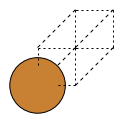
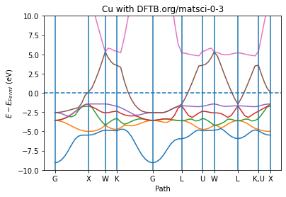
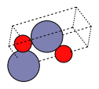
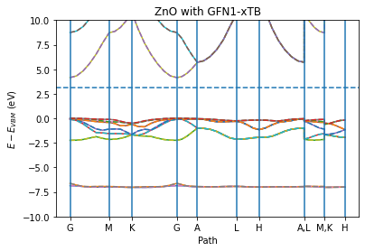
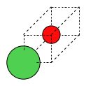
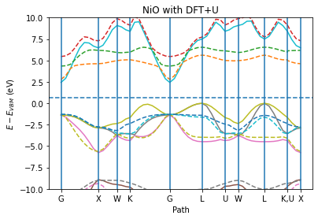

[Free trial](https://www.scm.com/free-trial/)

  * [Applications](https://www.scm.com/applications/ "Applications")
  * [Products](https://www.scm.com/amsterdam-modeling-suite/ "Products")
  * [Support](https://www.scm.com/support/ "Support")
  * [About us](https://www.scm.com/about-us/ "About us")

Search

  * 

Table of contents

  * [General](../../general.html)
  * [Introduction](../../intro.html)
  * [Getting started](../../started.html)
  * [Components overview](../../components/components.html)
  * [Interfaces](../../interfaces/interfaces.html)
  * [Examples](../examples.html)
    * [Getting Started](../examples.html#getting-started)
    * [Molecule analysis](../examples.html#molecule-analysis)
    * [Benchmarks](../examples.html#benchmarks)
    * [Workflows](../examples.html#workflows)
    * [COSMO-RS and property prediction](../examples.html#cosmo-rs-and-property-prediction)
    * [Packmol and AMS-ASE interfaces](../examples.html#packmol-and-ams-ase-interfaces)
    * [ParAMS and pyZacros](../examples.html#params-and-pyzacros)
    * [Other AMS calculations](../examples.html#other-ams-calculations)
      * [BAND: NiO with DFT+U](../BAND_NiO_HubbardU.html)
      * Band structure
        * Initial imports
        * Metal band structure relative to Fermi energy
        * Semiconductor band structure relative to VBM
        * Spin-up and spin-down band structures
        * Complete Python code
      * [AMS biased MD / PLUMED](../AMSPlumedMD/AMSPlumedMD.html)
      * [Quantum ESPRESSO as an AMS engine: Antiferromagnetic FeO](../QE_AMS_AFM_HubbardU.html)
      * [Basic molecular dynamics analysis](../BasicMDPostanalysis.html)
      * [Hybrid engine: Use lowest energy](../UseLowestEnergy.html)
      * [Universal Potential: M3GNet-UP-2022](../M3GNet.html)
    * [Pymatgen](../examples.html#pymatgen)
    * [Pre-made recipes](../examples.html#pre-made-recipes)
  * [Cookbook](../../cookbook/cookbook.html)
  * [Citations](../../citations.html)

  * [FAQ](../../FAQ.html)

__[PLAMS](../../index.html)

  * [Documentation](../../PLAMS.html/../../Documentation/index.html)/
  * [PLAMS](../../index.html)/
  * [Examples](../examples.html)/
  * Band structure

# Band structure¶

**Note** : This example requires AMS2023 or later.

See also

[Plotting tools](../../components/utils.html#plottingtools)

To follow along, either

  * Download [`BandStructureExample.py`](../../_downloads/71adb8386ca08853e01fc6c8f20a2ffb/BandStructureExample.py) (run as `$AMSBIN/amspython BandStructureExample.py`).

  * Download [`BandStructureExample.ipynb`](../../_downloads/87bd84a9614074cd8aec7650e91059df/BandStructureExample.ipynb) (see also: how to install [Jupyterlab](../../../Scripting/Python_Stack/Python_Stack.html#install-and-run-jupyter-lab-jupyter-notebooks) in AMS)

## Initial imports¶
[code] 
    from scm.plams import *
    from ase.build import bulk as ase_build_bulk
    import matplotlib.pyplot as plt
    import numpy as np
    init()
    
[/code]
[code] 
    PLAMS working folder: /home/user/adfhome/scripting/scm/plams/doc/source/examples/BandStructure/plams_workdir
    
[/code]

## Metal band structure relative to Fermi energy¶
[code] 
    Cu = fromASE(ase_build_bulk('Cu', 'fcc', a=3.6)) # primitive cell
    plot_molecule(Cu)
    
[/code]

[code] 
    s = Settings()
    s.input.ams.Task = 'SinglePoint'
    s.input.DFTB.Periodic.BandStructure.Enabled = 'Yes'
    s.input.DFTB.Model = 'SCC-DFTB'
    s.input.DFTB.ResourcesDir = 'DFTB.org/matsci-0-3'
    s.runscript.nproc = 1
    
[/code]
[code] 
    job = AMSJob(settings=s, name='Cu', molecule=Cu)
    job.run();
    
[/code]
[code] 
    [16.01|17:09:06] JOB Cu STARTED
    [16.01|17:09:06] JOB Cu RUNNING
    [16.01|17:09:11] JOB Cu FINISHED
    [16.01|17:09:11] JOB Cu SUCCESSFUL
    
[/code]
[code] 
    x, y_spin_up, y_spin_down, labels, fermi_energy = job.results.get_band_structure(unit='eV')
    plot_band_structure(x, y_spin_up, None, labels, fermi_energy, zero='fermi')
    plt.ylim(-10, 10)
    plt.ylabel('$E - E_{Fermi}$ (eV)')
    plt.xlabel('Path')
    plt.title('Cu with DFTB.org/matsci-0-3')
    plt.show()
    
[/code]

## Semiconductor band structure relative to VBM¶

For a semiconductor like ZnO you can also choose to put the zero at the VBM (‘vbm’) or CBM (‘cbm’)
[code] 
    ZnO = fromASE(ase_build_bulk('ZnO', 'wurtzite', a=3.2, c=5.3, u=0.375))
    plot_molecule(ZnO, rotation=('60x,60y,80z'))
    
[/code]

[code] 
    s = Settings()
    s.input.ams.Task = 'SinglePoint'
    s.input.DFTB.Periodic.BandStructure.Enabled = 'Yes'
    s.input.DFTB.Model = 'GFN1-xTB'
    s.runscript.nproc = 1
    job = AMSJob(settings=s, molecule=ZnO, name='ZnO')
    job.run();
    
[/code]
[code] 
    [16.01|17:09:11] JOB ZnO STARTED
    [16.01|17:09:11] JOB ZnO RUNNING
    [16.01|17:09:14] JOB ZnO FINISHED
    [16.01|17:09:14] JOB ZnO SUCCESSFUL
    
[/code]

The below call to `plot_band_structure` plots both the spin up and spin down. The spin-down bands are plotted as dashed lines. Note that in this case there is no spin polarization so the spin-down bands perfectly overlap the spin-up bands.
[code] 
    plot_band_structure(*job.results.get_band_structure(unit='eV'), zero='vbmax')
    plt.ylim(-10, 10)
    plt.ylabel('$E - E_{VBM}$ (eV)')
    plt.xlabel('Path')
    plt.title('ZnO with GFN1-xTB')
    plt.show()
    
[/code]

## Spin-up and spin-down band structures¶

If you perform a spin-polarized calculation you get both spin-up and spin-down bands. Below a spin-polarized DFT+U calculation on NiO is performed together with the BAND engine.
[code] 
    d =  2.085
    mol = Molecule()
    mol.add_atom(Atom(symbol='Ni', coords=(0, 0, 0)))
    mol.add_atom(Atom(symbol='O', coords=(d, d, d)))
    mol.lattice = [[0.0, d, d], [d, 0.0, d], [d, d, 0.0]]
    plot_molecule(mol)
    
[/code]

[code] 
    s = Settings()
    s.input.ams.task = 'SinglePoint'
    s.input.band.Unrestricted = 'yes'
    s.input.band.XC.GGA = 'BP86'
    s.input.band.Basis.Type = 'DZ'
    s.input.band.NumericalQuality = 'Basic'
    s.input.band.HubbardU.Enabled = 'Yes'
    s.input.band.HubbardU.UValue = '0.6 0.0'
    s.input.band.HubbardU.LValue = '2 -1'
    s.input.band.BandStructure.Enabled = 'Yes'
    
    job = AMSJob(settings=s, molecule=mol, name='NiO')
    job.run();
    
[/code]
[code] 
    [16.01|17:09:14] JOB NiO STARTED
    [16.01|17:09:14] JOB NiO RUNNING
    [16.01|17:09:45] JOB NiO FINISHED
    [16.01|17:09:45] JOB NiO SUCCESSFUL
    
[/code]
[code] 
    plot_band_structure(*job.results.get_band_structure(unit='eV'), zero='vbmax')
    plt.ylim(-10, 10)
    plt.ylabel('$E - E_{VBM}$ (eV)')
    plt.xlabel('Path')
    plt.title('NiO with DFT+U')
    plt.show()
    
[/code]

## Complete Python code¶
[code] 
    #!/usr/bin/env amspython
    # coding: utf-8
    
    # ## Initial imports
    
    from scm.plams import *
    from ase.build import bulk as ase_build_bulk
    import matplotlib.pyplot as plt
    import numpy as np
    init()
    
    # ## Metal band structure relative to Fermi energy
    
    Cu = fromASE(ase_build_bulk('Cu', 'fcc', a=3.6)) # primitive cell
    plot_molecule(Cu)
    
    s = Settings()
    s.input.ams.Task = 'SinglePoint'
    s.input.DFTB.Periodic.BandStructure.Enabled = 'Yes'
    s.input.DFTB.Model = 'SCC-DFTB'
    s.input.DFTB.ResourcesDir = 'DFTB.org/matsci-0-3'
    s.runscript.nproc = 1
    
    job = AMSJob(settings=s, name='Cu', molecule=Cu)
    job.run();
    
    x, y_spin_up, y_spin_down, labels, fermi_energy = job.results.get_band_structure(unit='eV')
    plot_band_structure(x, y_spin_up, None, labels, fermi_energy, zero='fermi')
    plt.ylim(-10, 10)
    plt.ylabel('$E - E_{Fermi}$ (eV)')
    plt.xlabel('Path')
    plt.title('Cu with DFTB.org/matsci-0-3')
    plt.show()
    
    # ## Semiconductor band structure relative to VBM
    # 
    # For a semiconductor like ZnO you can also choose to put the zero at the VBM ('vbm') or CBM ('cbm')
    
    ZnO = fromASE(ase_build_bulk('ZnO', 'wurtzite', a=3.2, c=5.3, u=0.375))
    plot_molecule(ZnO, rotation=('60x,60y,80z'))
    
    s = Settings()
    s.input.ams.Task = 'SinglePoint'
    s.input.DFTB.Periodic.BandStructure.Enabled = 'Yes'
    s.input.DFTB.Model = 'GFN1-xTB'
    s.runscript.nproc = 1
    job = AMSJob(settings=s, molecule=ZnO, name='ZnO')
    job.run();
    
    # The below call to ``plot_band_structure`` plots both the spin up and spin down. The spin-down bands are plotted as dashed lines. Note that in this case there is no spin polarization so the spin-down bands perfectly overlap the spin-up bands.
    
    plot_band_structure(*job.results.get_band_structure(unit='eV'), zero='vbmax')
    plt.ylim(-10, 10)
    plt.ylabel('$E - E_{VBM}$ (eV)')
    plt.xlabel('Path')
    plt.title('ZnO with GFN1-xTB')
    plt.show()
    
    # ## Spin-up and spin-down band structures
    # If you perform a spin-polarized calculation you get both spin-up and spin-down bands. Below a spin-polarized DFT+U calculation on NiO is performed together with the BAND engine.
    
    d =  2.085
    mol = Molecule()
    mol.add_atom(Atom(symbol='Ni', coords=(0, 0, 0)))
    mol.add_atom(Atom(symbol='O', coords=(d, d, d)))
    mol.lattice = [[0.0, d, d], [d, 0.0, d], [d, d, 0.0]]
    plot_molecule(mol)
    
    s = Settings()
    s.input.ams.task = 'SinglePoint'
    s.input.band.Unrestricted = 'yes'
    s.input.band.XC.GGA = 'BP86'
    s.input.band.Basis.Type = 'DZ'
    s.input.band.NumericalQuality = 'Basic'
    s.input.band.HubbardU.Enabled = 'Yes'
    s.input.band.HubbardU.UValue = '0.6 0.0'
    s.input.band.HubbardU.LValue = '2 -1'
    s.input.band.BandStructure.Enabled = 'Yes'
    
    job = AMSJob(settings=s, molecule=mol, name='NiO')
    job.run();
    
    plot_band_structure(*job.results.get_band_structure(unit='eV'), zero='vbmax')
    plt.ylim(-10, 10)
    plt.ylabel('$E - E_{VBM}$ (eV)')
    plt.xlabel('Path')
    plt.title('NiO with DFT+U')
    plt.show()
    
[/code]

[Next ](../AMSPlumedMD/AMSPlumedMD.html "AMS biased MD / PLUMED") [ Previous](../BAND_NiO_HubbardU.html "BAND: NiO with DFT+U")

* * *

  * ### Application Areas

    * [Batteries & PVs](https://www.scm.com/applications/batteries/)
    * [Bonding Analysis](https://www.scm.com/applications/chemical-bonding-analysis/)
    * [Catalysis](https://www.scm.com/applications/catalysis/)
    * [Heavy Elements](https://www.scm.com/applications/heavy-elements/)
    * [Inorganic Chemistry](https://www.scm.com/applications/inorganic-chemistry/)
    * [Life Sciences](https://www.scm.com/applications/pharma/)
    * [Materials Science](https://www.scm.com/applications/materials-science/)
    * [Nanotechnology](https://www.scm.com/applications/nanotechnology/)
    * [Oil and Gas](https://www.scm.com/applications/oil-and-gas/)
    * [Organic Electronics](https://www.scm.com/applications/organic-electronics/)
    * [Polymers](https://www.scm.com/applications/polymers/)
    * [Spectroscopy](https://www.scm.com/applications/spectroscopy/)
    * [Supercomputer / HPC](https://www.scm.com/applications/a-computing-center/)
    * [Teaching Computational Chemistry with AMS](https://www.scm.com/applications/teaching/)

  * ### Products

    * [AMS Driver](https://www.scm.com/product/ams/)
    * [ADF](https://www.scm.com/product/adf/)
    * [BAND](https://www.scm.com/product/band_periodicdft/)
    * [COSMO-RS](https://www.scm.com/product/cosmo-rs/)
    * [DFTB](https://www.scm.com/product/dftb/)
    * [GUI](https://www.scm.com/product/gui/)
    * [ML Potentials & FF](https://www.scm.com/product/machine-learning-potentials/)
    * [MOPAC](https://www.scm.com/product/mopac/)
    * [ParAMS](https://www.scm.com/product/params/)
    * [PLAMS](https://www.scm.com/product/plams/)
    * [Quantum ESPRESSO](https://www.scm.com/product/quantum-espresso/)
    * [ReaxFF](https://www.scm.com/product/reaxff/)
    * [Workflows](https://www.scm.com/product/advanced-workflows/)

  * ### Support

    * [Brochure](https://www.scm.com/amsterdam-modeling-suite/brochures/)
    * [Consulting & Contract Research](https://www.scm.com/amsterdam-modeling-suite/consulting/)
    * [Discussion List](https://www.scm.com/adf-discussion-list/)
    * [Documentation](https://www.scm.com/support/ams-tutorials-and-manuals/)
    * [Downloads](https://www.scm.com/support/downloads/)
    * [FAQs](https://www.scm.com/faq/)
    * [GUI Tutorials](https://www.scm.com/doc/Tutorials/GUI_overview/GUI_overview_tutorials.html)
    * [Installation](https://www.scm.com/support/ams-installation-videos/)
    * [Literature Highlights](https://www.scm.com/category/highlights/)
    * [Papers Citing ADF](https://www.scm.com/amsterdam-modeling-suite/research-papers-citing-adf/)
    * [Release Notes](https://www.scm.com/support/documentation-previous-versions/release-notes/)
    * [Support Overview](https://www.scm.com/support/)
    * [Teaching Materials](https://www.scm.com/support/background/amsterdam-modeling-suite-teaching-materials/)
    * [Videos](https://www.scm.com/amsterdam-modeling-suite/videos-tutorials-and-web-presentations/)
    * [Webinars](https://www.scm.com/about-us/news-agenda/web-presentations-by-adf-experts/)
    * [Workshops](https://www.scm.com/about-us/news-agenda/adf-hands-on-workshops/)

  * ### About Us

    * [Careers](https://www.scm.com/about-us/careers/)
    * [Collaborations](https://www.scm.com/about-us/collaborations/)
    * [Contact Us](https://www.scm.com/about-us/contact-us/)
    * [Contributors](https://www.scm.com/about-us/our-authors/)
    * [EU Projects](https://www.scm.com/about-us/eu-projects/)
    * [Events](https://www.scm.com/about-us/news-agenda/)
    * [Mission & Vision](https://www.scm.com/about-us/mission-vision/)
    * [News](https://www.scm.com/category/news/)
    * [Newsletters](https://www.scm.com/newsletters/)
    * [The SCM Team](https://www.scm.com/about-us/our-people/)

  * ### Pricing & Licensing

    * [License Terms](https://www.scm.com/amsterdam-modeling-suite/pricing-licensing/scm-license-terms/)
    * [Ordering](https://www.scm.com/amsterdam-modeling-suite/pricing-licensing/ordering-procedure/)
    * [Price Calculator](https://www.scm.com/amsterdam-modeling-suite/pricing-licensing/price-quote/calculate-your-price/)
    * [Price Quote](https://www.scm.com/amsterdam-modeling-suite/pricing-licensing/price-quote/)
    * [Pricing & Licensing](https://www.scm.com/amsterdam-modeling-suite/pricing-licensing/)
    * [Resellers](https://www.scm.com/amsterdam-modeling-suite/pricing-licensing/adf-resellers/)

  * [Copyright](https://www.scm.com/copyright/)
  * [Terms of Use](https://www.scm.com/terms-of-use/)
  * [Privacy Policy](https://www.scm.com/privacy-policy/)
