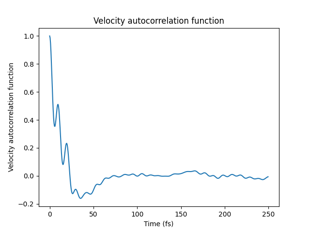
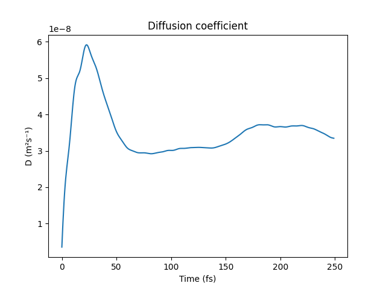
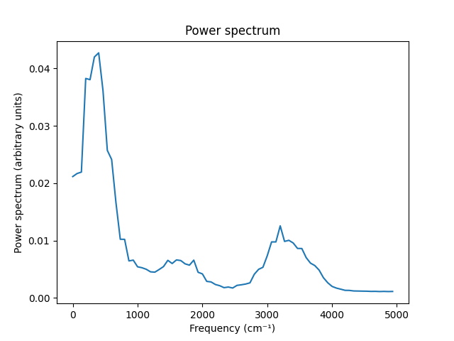
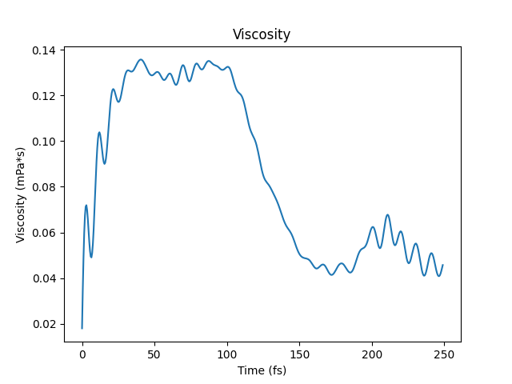
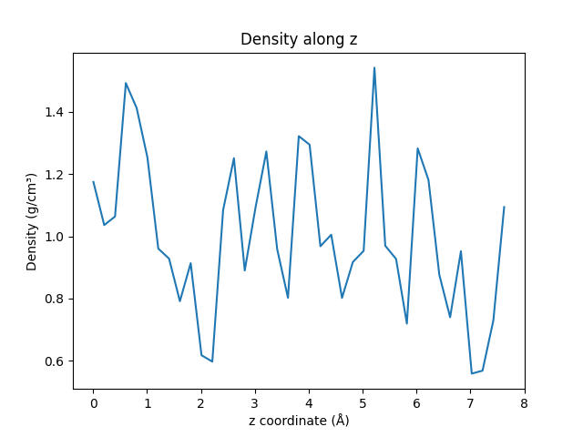

[Free trial](https://www.scm.com/free-trial/)

  * [Applications](https://www.scm.com/applications/ "Applications")
  * [Products](https://www.scm.com/amsterdam-modeling-suite/ "Products")
  * [Support](https://www.scm.com/support/ "Support")
  * [About us](https://www.scm.com/about-us/ "About us")

Search

  * 

Table of contents

  * [General](../general.html)
  * [Introduction](../intro.html)
  * [Getting started](../started.html)
  * [Components overview](../components/components.html)
  * [Interfaces](../interfaces/interfaces.html)
  * [Examples](examples.html)
    * [Getting Started](examples.html#getting-started)
    * [Molecule analysis](examples.html#molecule-analysis)
    * [Benchmarks](examples.html#benchmarks)
    * [Workflows](examples.html#workflows)
    * [COSMO-RS and property prediction](examples.html#cosmo-rs-and-property-prediction)
    * [Packmol and AMS-ASE interfaces](examples.html#packmol-and-ams-ase-interfaces)
    * [ParAMS and pyZacros](examples.html#params-and-pyzacros)
    * [Other AMS calculations](examples.html#other-ams-calculations)
      * [BAND: NiO with DFT+U](BAND_NiO_HubbardU.html)
      * [Band structure](BandStructure/BandStructure.html)
      * [AMS biased MD / PLUMED](AMSPlumedMD/AMSPlumedMD.html)
      * [Quantum ESPRESSO as an AMS engine: Antiferromagnetic FeO](QE_AMS_AFM_HubbardU.html)
      * Basic molecular dynamics analysis
      * [Hybrid engine: Use lowest energy](UseLowestEnergy.html)
      * [Universal Potential: M3GNet-UP-2022](M3GNet.html)
    * [Pymatgen](examples.html#pymatgen)
    * [Pre-made recipes](examples.html#pre-made-recipes)
  * [Cookbook](../cookbook/cookbook.html)
  * [Citations](../citations.html)

  * [FAQ](../FAQ.html)

__[PLAMS](../index.html)

  * [Documentation](../PLAMS.html/../../Documentation/index.html)/
  * [PLAMS](../index.html)/
  * [Examples](examples.html)/
  * Basic molecular dynamics analysis

# Basic molecular dynamics analysis¶

**Note** : This example requires AMS2023 or later.

This example illustrates how to calculate the basic

  * velocity autocorrelation function (VACF)

  * diffusion coefficient from the integral of the VACF

  * power spectrum (Fourier transform of the VACF)

  * viscosity from the Green-Kubo relation (integral of the off-diagonal pressure tensor autocorrelation function)

  * density along the _z_ axis

For details about the functions, see the [`AMSResults`](../interfaces/ams.html#scm.plams.interfaces.adfsuite.ams.AMSResults "scm.plams.interfaces.adfsuite.ams.AMSResults") API.

Technical

The example only shows how to technically calculate the numbers. For real simulations, run longer MD simulations and carefully converge any calculated quantities.

Note

More advanced analysis is possible by setting up an [`AMSAnalysisJob`](../interfaces/postadf.html#scm.plams.interfaces.adfsuite.amsanalysis.AMSAnalysisJob "scm.plams.interfaces.adfsuite.amsanalysis.AMSAnalysisJob") job.

See also: [Molecular Dynamics with Python](../../Tutorials/MolecularDynamicsAndMonteCarlo/MDintroPython/intro.html)

**Example usage:** ([`Download BasicMDPostanalysis.py`](../_downloads/6812904e9fcd2913ad4991b3ce1c1e3b/BasicMDPostanalysis.py))

    
[code] 
    #!/usr/bin/env plams
    from scm.plams import *
    import numpy as np
    import os
    import matplotlib.pyplot as plt
    
    def run_md():
        mol = packmol_liquid(from_smiles('O'), n_molecules=16, density=1.0)
        s = Settings()
        s.input.ams.Task = 'MolecularDynamics'
        s.input.ReaxFF.ForceField = 'Water2017.ff'
        s.input.ams.MolecularDynamics.CalcPressure = 'Yes'
        s.input.ams.MolecularDynamics.InitialVelocities.Temperature = 300
        s.input.ams.MolecularDynamics.Trajectory.SamplingFreq = 1
        s.input.ams.MolecularDynamics.TimeStep = 0.5
        s.input.ams.MolecularDynamics.NSteps = 2000
        s.runscript.nproc = 1
        os.environ['OMP_NUM_THREADS'] = '1'
        job = AMSJob(settings=s, molecule=mol, name='md')
        job.run()
        return job
    
    def plot_results(results):
        plt.clf()
        times, vacf = results.get_velocity_acf(start_fs=0, max_dt_fs=250, normalize=False)
        normalized_vacf = vacf / vacf[0]
        plt.plot(times, normalized_vacf)
        plt.xlabel("Time (fs)")
        plt.ylabel("Velocity autocorrelation function")
        plt.title("Velocity autocorrelation function")
        plt.savefig("plams_vacf.png")
        A = np.stack((times, normalized_vacf), axis=1)
        np.savetxt("plams_vacf.txt", A, header="Time(fs) VACF")
    
        plt.clf()
        t_D, D = results.get_diffusion_coefficient_from_velocity_acf(times, vacf)
        plt.plot(t_D, D)
        plt.xlabel("Time (fs)")
        plt.ylabel("D (m²s⁻¹)")
        plt.title("Diffusion coefficient")
        plt.savefig("plams_vacf_D.png")
        A = np.stack((t_D, D), axis=1)
        np.savetxt("plams_vacf_D.txt", A, header="time(fs) D(m^2*s^-1)")
    
        plt.clf()
        freq, intensities = results.get_power_spectrum(times, vacf, number_of_points=1000)
        plt.plot(freq, intensities)
        plt.xlabel("Frequency (cm⁻¹)")
        plt.ylabel("Power spectrum (arbitrary units)")
        plt.title("Power spectrum")
        plt.savefig("plams_power_spectrum.png")
        A = np.stack((freq, intensities), axis=1)
        np.savetxt("plams_power_spectrum.txt", A, header="Frequency(cm^-1) PowerSpectrum")
    
        plt.clf()
        t, viscosity = results.get_green_kubo_viscosity(start_fs=0, max_dt_fs=250) # do not do this for NPT simulations
        plt.plot(t, viscosity)
        plt.xlabel("Time (fs)")
        plt.ylabel("Viscosity (mPa*s)")
        plt.title("Viscosity")
        plt.savefig("plams_green_kubo_viscosity.png")
        A = np.stack((t, viscosity), axis=1)
        np.savetxt("plams_green_kubo_viscosity.txt", A, header="Time(fs) Viscosity(mPa*s)")
    
        plt.clf()
        z, density = results.get_density_along_axis(axis='z', density_type='mass', bin_width=0.2, atom_indices=None)
        plt.plot(z, density)
        plt.xlabel("z coordinate (Å)")
        plt.ylabel("Density (g/cm³)")
        plt.title("Density along z")
        plt.savefig("plams_density_along_z.png")
        A = np.stack((z, density), axis=1)
        np.savetxt("plams_density_along_z.txt", A, header="z(angstrom) density(g/cm^3)")
    
    def main():
        job = run_md()
        # alternatively:
        # job = AMSJob.load_external('/path/to/ams.rkf')
        plot_results(job.results)
    
    if __name__ == '__main__':
        main()
    
[/code]

[Next ](UseLowestEnergy.html "Hybrid engine: Use lowest energy") [ Previous](QE_AMS_AFM_HubbardU.html "Quantum ESPRESSO as an AMS engine: Antiferromagnetic FeO")

* * *

  * ### Application Areas

    * [Batteries & PVs](https://www.scm.com/applications/batteries/)
    * [Bonding Analysis](https://www.scm.com/applications/chemical-bonding-analysis/)
    * [Catalysis](https://www.scm.com/applications/catalysis/)
    * [Heavy Elements](https://www.scm.com/applications/heavy-elements/)
    * [Inorganic Chemistry](https://www.scm.com/applications/inorganic-chemistry/)
    * [Life Sciences](https://www.scm.com/applications/pharma/)
    * [Materials Science](https://www.scm.com/applications/materials-science/)
    * [Nanotechnology](https://www.scm.com/applications/nanotechnology/)
    * [Oil and Gas](https://www.scm.com/applications/oil-and-gas/)
    * [Organic Electronics](https://www.scm.com/applications/organic-electronics/)
    * [Polymers](https://www.scm.com/applications/polymers/)
    * [Spectroscopy](https://www.scm.com/applications/spectroscopy/)
    * [Supercomputer / HPC](https://www.scm.com/applications/a-computing-center/)
    * [Teaching Computational Chemistry with AMS](https://www.scm.com/applications/teaching/)

  * ### Products

    * [AMS Driver](https://www.scm.com/product/ams/)
    * [ADF](https://www.scm.com/product/adf/)
    * [BAND](https://www.scm.com/product/band_periodicdft/)
    * [COSMO-RS](https://www.scm.com/product/cosmo-rs/)
    * [DFTB](https://www.scm.com/product/dftb/)
    * [GUI](https://www.scm.com/product/gui/)
    * [ML Potentials & FF](https://www.scm.com/product/machine-learning-potentials/)
    * [MOPAC](https://www.scm.com/product/mopac/)
    * [ParAMS](https://www.scm.com/product/params/)
    * [PLAMS](https://www.scm.com/product/plams/)
    * [Quantum ESPRESSO](https://www.scm.com/product/quantum-espresso/)
    * [ReaxFF](https://www.scm.com/product/reaxff/)
    * [Workflows](https://www.scm.com/product/advanced-workflows/)

  * ### Support

    * [Brochure](https://www.scm.com/amsterdam-modeling-suite/brochures/)
    * [Consulting & Contract Research](https://www.scm.com/amsterdam-modeling-suite/consulting/)
    * [Discussion List](https://www.scm.com/adf-discussion-list/)
    * [Documentation](https://www.scm.com/support/ams-tutorials-and-manuals/)
    * [Downloads](https://www.scm.com/support/downloads/)
    * [FAQs](https://www.scm.com/faq/)
    * [GUI Tutorials](https://www.scm.com/doc/Tutorials/GUI_overview/GUI_overview_tutorials.html)
    * [Installation](https://www.scm.com/support/ams-installation-videos/)
    * [Literature Highlights](https://www.scm.com/category/highlights/)
    * [Papers Citing ADF](https://www.scm.com/amsterdam-modeling-suite/research-papers-citing-adf/)
    * [Release Notes](https://www.scm.com/support/documentation-previous-versions/release-notes/)
    * [Support Overview](https://www.scm.com/support/)
    * [Teaching Materials](https://www.scm.com/support/background/amsterdam-modeling-suite-teaching-materials/)
    * [Videos](https://www.scm.com/amsterdam-modeling-suite/videos-tutorials-and-web-presentations/)
    * [Webinars](https://www.scm.com/about-us/news-agenda/web-presentations-by-adf-experts/)
    * [Workshops](https://www.scm.com/about-us/news-agenda/adf-hands-on-workshops/)

  * ### About Us

    * [Careers](https://www.scm.com/about-us/careers/)
    * [Collaborations](https://www.scm.com/about-us/collaborations/)
    * [Contact Us](https://www.scm.com/about-us/contact-us/)
    * [Contributors](https://www.scm.com/about-us/our-authors/)
    * [EU Projects](https://www.scm.com/about-us/eu-projects/)
    * [Events](https://www.scm.com/about-us/news-agenda/)
    * [Mission & Vision](https://www.scm.com/about-us/mission-vision/)
    * [News](https://www.scm.com/category/news/)
    * [Newsletters](https://www.scm.com/newsletters/)
    * [The SCM Team](https://www.scm.com/about-us/our-people/)

  * ### Pricing & Licensing

    * [License Terms](https://www.scm.com/amsterdam-modeling-suite/pricing-licensing/scm-license-terms/)
    * [Ordering](https://www.scm.com/amsterdam-modeling-suite/pricing-licensing/ordering-procedure/)
    * [Price Calculator](https://www.scm.com/amsterdam-modeling-suite/pricing-licensing/price-quote/calculate-your-price/)
    * [Price Quote](https://www.scm.com/amsterdam-modeling-suite/pricing-licensing/price-quote/)
    * [Pricing & Licensing](https://www.scm.com/amsterdam-modeling-suite/pricing-licensing/)
    * [Resellers](https://www.scm.com/amsterdam-modeling-suite/pricing-licensing/adf-resellers/)

  * [Copyright](https://www.scm.com/copyright/)
  * [Terms of Use](https://www.scm.com/terms-of-use/)
  * [Privacy Policy](https://www.scm.com/privacy-policy/)
