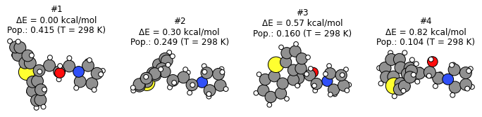
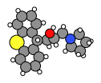
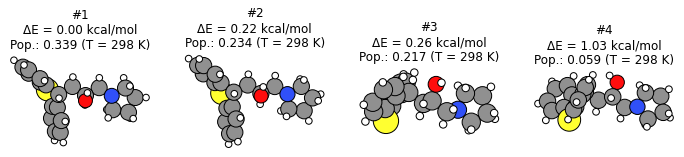
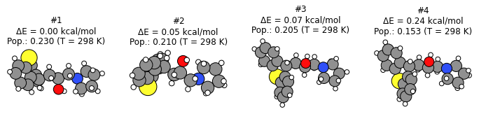
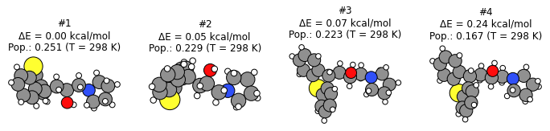

[Free trial](https://www.scm.com/free-trial/)

  * [Applications](https://www.scm.com/applications/ "Applications")
  * [Products](https://www.scm.com/amsterdam-modeling-suite/ "Products")
  * [Support](https://www.scm.com/support/ "Support")
  * [About us](https://www.scm.com/about-us/ "About us")

Search

  * 

Table of contents

  * [General](../../general.html)
  * [Introduction](../../intro.html)
  * [Getting started](../../started.html)
  * [Components overview](../../components/components.html)
  * [Interfaces](../../interfaces/interfaces.html)
  * [Examples](../examples.html)
    * [Getting Started](../examples.html#getting-started)
    * [Molecule analysis](../examples.html#molecule-analysis)
    * [Benchmarks](../examples.html#benchmarks)
    * [Workflows](../examples.html#workflows)
      * [Reduction and oxidation potentials](../RedoxPotential.html)
      * [Workflow: filtering molecules based on excitation energies](../ExcitationsWorkflow.html)
      * [AMS transition state workflow](../AMSTSWorkflow/AMSTSWorkflow.html)
      * [Charge transfer integrals with ADF](../ChargeTransferIntegralsADF.html)
      * [Tuning the range separation](../gammascan.html)
      * Conformers Generation
        * Initial imports
        * Initial structure
        * Generate conformers with RDKit and UFF
        * Conformer generation results
        * Re-optimize conformers with GFNFF
        * Score conformers with DFTB
        * Filter a conformer set
        * Finish PLAMS
        * More about conformers
        * Complete Python code
    * [COSMO-RS and property prediction](../examples.html#cosmo-rs-and-property-prediction)
    * [Packmol and AMS-ASE interfaces](../examples.html#packmol-and-ams-ase-interfaces)
    * [ParAMS and pyZacros](../examples.html#params-and-pyzacros)
    * [Other AMS calculations](../examples.html#other-ams-calculations)
    * [Pymatgen](../examples.html#pymatgen)
    * [Pre-made recipes](../examples.html#pre-made-recipes)
  * [Cookbook](../../cookbook/cookbook.html)
  * [Citations](../../citations.html)

  * [FAQ](../../FAQ.html)

__[PLAMS](../../index.html)

  * [Documentation](../../PLAMS.html/../../Documentation/index.html)/
  * [PLAMS](../../index.html)/
  * [Examples](../examples.html)/
  * Conformers Generation

# Conformers Generation¶

See also

  * [Conformers](../../interfaces/conformers.html#conformers-interface) PLAMS interface

  * [Conformers for COSMO-RS](../../../COSMO-RS/advanced_scripts/Conformers.html)

Example illustrating how to generate conformers with AMS.

**This example is only compatible with AMS2023**.

To follow along, either

  * Download [`conformers.py`](../../_downloads/71ffc78f1c634f7cfd49b38fac75dab9/conformers.py) (run as `$AMSBIN/amspython conformers.py`).

  * Download [`conformers.ipynb`](../../_downloads/fc59c91df23f0766059e77c2db8f9bb1/conformers.ipynb) (see also: how to install [Jupyterlab](../../../Scripting/Python_Stack/Python_Stack.html#install-and-run-jupyter-lab-jupyter-notebooks) in AMS)

Note

Conformers generation depends on random numbers. You are likely to get somewhat different results if you run this example!

## Initial imports¶
[code] 
    from scm.plams import *
    from scm.conformers import ConformersJob, ConformersResults
    import matplotlib.pyplot as plt
    import numpy as np
    import os
    init()
    
[/code]

## Initial structure¶
[code] 
    molecule = from_smiles('OC(CC1c2ccccc2Sc2ccccc21)CN1CCCC1')
    plot_molecule(molecule)
    
[/code]

## Generate conformers with RDKit and UFF¶

The fastest way to generate conformers is to use RDKit with the UFF force field.

Below we specify to generate 16 initial conformers. The final number of conformers may be smaller, as the geometry optimization may cause several structures to enter the same minimum.

### Conformer generation settings¶
[code] 
    s = Settings()
    s.input.ams.Task = 'Generate'                 # default
    s.input.ams.Generator.Method = 'RDKit'        # default
    s.input.ams.Generator.RDKit.InitialNConformers = 16    # optional, non-default
    s.input.ForceField.Type = 'UFF'               # default
    
[/code]

### Conformer generation input file¶
[code] 
    print(ConformersJob(settings=s).get_input())
    
[/code]
[code] 
    Generator
      Method RDKit
      RDKit
        InitialNConformers 16
      End
    End
    
    Task Generate
    
    Engine ForceField
      Type UFF
    EndEngine
    
[/code]

### Run conformer generation¶
[code] 
    generate_job = ConformersJob(name='generate', molecule=molecule, settings=s)
    generate_job.run();
    
[/code]
[code] 
    [05.03|08:59:21] JOB generate STARTED
    [05.03|08:59:21] JOB generate RUNNING
    [05.03|08:59:28] JOB generate FINISHED
    [05.03|08:59:28] JOB generate SUCCESSFUL
    
[/code]

## Conformer generation results¶

### Some helper functions¶
[code] 
    def get_main_results(job:ConformersJob, temperature=298, unit='kcal/mol', return_molecules:bool=True):
        molecules = None
        if return_molecules:
            molecules = job.results.get_conformers()
        energies = job.results.get_relative_energies(unit)
        populations = job.results.get_boltzmann_distribution(temperature)
    
        return molecules, energies, populations
    
    def print_results(job:ConformersJob, temperature=298, unit='kcal/mol'):
        _, energies, populations = get_main_results(job, temperature, unit, return_molecules=False)
    
        print(f"Total # conformers in set: {len(energies)}")
        dE_header = f"ΔE [{unit}]"
        pop_header = f"Pop. (T = {temperature} K)"
        print(f'{"#":>4s} {dE_header:>14s} {pop_header:>18s}')
    
        for i, (E, pop) in enumerate(zip(energies, populations)):
            print(f'{i+1:4d} {E:14.2f} {pop:18.3f}')
    
    def plot_conformers(job:ConformersJob, indices=None, temperature=298, unit='kcal/mol', lowest=True):
        molecules, energies, populations = get_main_results(job)
    
        if isinstance(indices, int):
            N_plot = min(indices, len(energies))
            if lowest:
                indices = list(range(N_plot))
            else:
                indices = np.linspace(0, len(energies)-1, N_plot, dtype=np.int32)
        if indices is None:
            indices = list(range(min(3, len(energies))))
    
        fig, axes = plt.subplots(1, len(indices), figsize=(12,3))
        if len(indices) == 1:
            axes = [axes]
    
        for ax, i in zip(axes, indices):
            mol = molecules[i]
            E = energies[i]
            population = populations[i]
    
            plot_molecule(mol, ax=ax)
            ax.set_title(f"#{i+1}\nΔE = {E:.2f} kcal/mol\nPop.: {population:.3f} (T = {temperature} K)")
    
[/code]

### Actual results¶

Below we see that the **conformer generation gave 14 distinct conformers** , where the highest-energy conformer is 18 kcal/mol higher in energy than the lowest energy conformer.

You can also see the **relative populations** of these conformers at the specified temperature. The populations are calculated from the **Boltzmann distribution** and the relative energies.
[code] 
    unit = 'kcal/mol'
    temperature = 298
    
[/code]
[code] 
    print_results(generate_job, temperature=temperature, unit=unit)
    plot_conformers(generate_job, 4, temperature=temperature, unit=unit, lowest=True)  # plot 4 lowest conformers
    #plot_conformers(generate_job, 4, temperature=temperature, unit=unit, lowest=False)  # plot 4 conformers from lowest to highest
    #plot_conformers(generate_job, [0, 2], temperature=temperature, unit=unit) # plot first and third conformers
    
[/code]
[code] 
    Total # conformers in set: 14
       #  ΔE [kcal/mol]   Pop. (T = 298 K)
       1           0.00              0.415
       2           0.30              0.249
       3           0.57              0.160
       4           0.82              0.104
       5           1.50              0.033
       6           1.79              0.020
       7           2.25              0.009
       8           2.30              0.009
       9           3.72              0.001
      10           3.76              0.001
      11          13.99              0.000
      12          15.25              0.000
      13          17.96              0.000
      14          18.20              0.000
    
[/code]

## Re-optimize conformers with GFNFF¶

The UFF force field is not very accurate for geometries and energies. From an initial conformer set you can reoptimize it with a better level of theory.

The **Optimize** task performs **GeometryOptimization** jobs on each conformer in a set.

Below, the 10 most stable conformers (within 8 kcal/mol of the most stable conformer) at the UFF level of theory are re-optimized with GFNFF, which gives more accurate geometries.
[code] 
    s = Settings()
    s.input.ams.Task = 'Optimize'
    s.input.ams.InputConformersSet = os.path.abspath(generate_job.results.rkfpath())  # must be absolute path
    s.input.ams.InputMaxEnergy = 8.0   # only conformers within 8 kcal/mol at the PREVIOUS level of theory
    s.input.GFNFF  # or choose a different engine if you don't have a GFNFF license
    
    reoptimize_job = ConformersJob(settings=s, name='reoptimize')
    print(reoptimize_job.get_input())
    
[/code]
[code] 
    InputConformersSet /home/user/temp/conformers/plams/plams_workdir/generate/conformers.rkf
    
    InputMaxEnergy 8.0
    
    Task Optimize
    
    Engine GFNFF
    EndEngine
    
[/code]
[code] 
    reoptimize_job.run();
    
[/code]
[code] 
    [05.03|08:59:28] JOB reoptimize STARTED
    [05.03|08:59:28] JOB reoptimize RUNNING
    [05.03|08:59:32] JOB reoptimize FINISHED
    [05.03|08:59:32] JOB reoptimize SUCCESSFUL
    
[/code]
[code] 
    print_results(reoptimize_job, temperature=temperature, unit=unit)
    plot_conformers(reoptimize_job, 4, temperature=temperature, unit=unit, lowest=True)
    
[/code]
[code] 
    Total # conformers in set: 10
       #  ΔE [kcal/mol]   Pop. (T = 298 K)
       1           0.00              0.339
       2           0.22              0.234
       3           0.26              0.217
       4           1.03              0.059
       5           1.07              0.055
       6           1.24              0.042
       7           1.38              0.033
       8           1.78              0.017
       9           2.72              0.003
      10           4.75              0.000
    
[/code]

## Score conformers with DFTB¶

If you have many conformers or a very large molecule, it can be computationally expensive to do the conformer generation or reoptimization and a high level of theory.

The **Score** task runs **SinglePoint** jobs on the conformers in a set. This lets you use a more computationally expensive method. Here, we choose DFTB, although normally you may choose some DFT method.
[code] 
    s = Settings()
    s.input.ams.Task = 'Score'
    s.input.ams.InputConformersSet = os.path.abspath(reoptimize_job.results.rkfpath())   # must be absolute path
    s.input.ams.InputMaxEnergy = 4.0   # only conformers within 4 kcal/mol at the PREVIOUS level of theory
    s.input.DFTB.Model = 'GFN1-xTB'   # or choose a different engine if you don't have a DFTB license
    #s.input.adf.XC.GGA = 'PBE'                       # to use ADF PBE
    #s.input.adf.XC.DISPERSION = 'GRIMME3 BJDAMP'     # to use ADF PBE with Grimme D3(BJ) dispersion
    
    score_job = ConformersJob(settings=s, name='score')
    score_job.run();
    
[/code]
[code] 
    [05.03|08:59:32] JOB score STARTED
    [05.03|08:59:32] JOB score RUNNING
    [05.03|08:59:34] JOB score FINISHED
    [05.03|08:59:34] JOB score SUCCESSFUL
    
[/code]
[code] 
    print_results(score_job, temperature=temperature, unit=unit)
    plot_conformers(score_job, 4, temperature=temperature, unit=unit, lowest=True)
    
[/code]
[code] 
    Total # conformers in set: 9
       #  ΔE [kcal/mol]   Pop. (T = 298 K)
       1           0.00              0.230
       2           0.05              0.210
       3           0.07              0.205
       4           0.24              0.153
       5           0.66              0.075
       6           1.00              0.043
       7           1.04              0.040
       8           1.08              0.037
       9           2.01              0.008
    
[/code]

Here, you see that from the conformers in the set, **DFTB predicts a different lowest-energy conformer than GFNFF** (compare to previous figure).

## Filter a conformer set¶

In practice, you may have generated thousands of conformers for a particular structure. Many of those conformers may be so high in energy that their Boltzmann weights are very small.

The **Filter** task only filters the conformers, it does not perform any additional calculations. It can be used to reduce a conformer set so that it is more convenient to work with.

Below, we filter the conformers set to only the conformers within 1 kcal/mol of the minimum.
[code] 
    s = Settings()
    s.input.ams.Task = 'Filter'
    s.input.ams.InputConformersSet = os.path.abspath(score_job.results.rkfpath())
    s.input.ams.InputMaxEnergy = 1.0
    
    filter_job = ConformersJob(settings=s, name='filter')
    filter_job.run()
    print_results(filter_job, temperature=temperature, unit=unit)
    plot_conformers(filter_job, 4, temperature=temperature, unit=unit, lowest=True)
    
[/code]
[code] 
    [05.03|09:20:16] JOB filter STARTED
    [05.03|09:20:16] JOB filter RUNNING
    [05.03|09:20:17] JOB filter FINISHED
    [05.03|09:20:17] JOB filter SUCCESSFUL
    Total # conformers in set: 6
       #  ΔE [kcal/mol]   Pop. (T = 298 K)
       1           0.00              0.251
       2           0.05              0.229
       3           0.07              0.223
       4           0.24              0.167
       5           0.66              0.082
       6           1.00              0.047
    
[/code]

The structures and energies are identical to before. However, the relative populations changed slightly as there are now fewer conformers in the set.

## Finish PLAMS¶
[code] 
    finish()
    
[/code]
[code] 
    [05.03|09:34:38] PLAMS run finished. Goodbye
    
[/code]

## More about conformers¶

  * Try **CREST** instead of RDKit to generate the initial conformer set

  * The **Expand** task can be used to expand a set of conformers.

## Complete Python code¶
[code] 
    #!/usr/bin/env amspython
    # coding: utf-8
    
    # ## Initial imports
    
    from scm.plams import *
    from scm.conformers import ConformersJob, ConformersResults
    import matplotlib.pyplot as plt
    import numpy as np
    import os
    init()
    
    # ## Initial structure
    
    molecule = from_smiles('OC(CC1c2ccccc2Sc2ccccc21)CN1CCCC1')
    plot_molecule(molecule)
    
    # ## Generate conformers with RDKit and UFF
    # The fastest way to generate conformers is to use RDKit with the UFF force field.
    # 
    # Below we specify to generate 16 initial conformers. The final number of conformers may be smaller, as the geometry optimization may cause several structures to enter the same minimum.
    
    # ### Conformer generation settings
    
    s = Settings()
    s.input.ams.Task = 'Generate'                 # default
    s.input.ams.Generator.Method = 'RDKit'        # default
    s.input.ams.Generator.RDKit.InitialNConformers = 16    # optional, non-default
    s.input.ForceField.Type = 'UFF'               # default
    
    # ### Conformer generation input file
    
    print(ConformersJob(settings=s).get_input())
    
    # ### Run conformer generation
    
    generate_job = ConformersJob(name='generate', molecule=molecule, settings=s)
    generate_job.run();
    
    # ## Conformer generation results
    
    # ### Some helper functions
    
    def get_main_results(job:ConformersJob, temperature=298, unit='kcal/mol', return_molecules:bool=True):
        molecules = None
        if return_molecules:
            molecules = job.results.get_conformers()
        energies = job.results.get_relative_energies(unit)
        populations = job.results.get_boltzmann_distribution(temperature)
        
        return molecules, energies, populations
    
    def print_results(job:ConformersJob, temperature=298, unit='kcal/mol'):
        _, energies, populations = get_main_results(job, temperature, unit, return_molecules=False)
        
        print(f"Total # conformers in set: {len(energies)}")
        dE_header = f"ΔE [{unit}]"
        pop_header = f"Pop. (T = {temperature} K)"
        print(f'{"#":>4s} {dE_header:>14s} {pop_header:>18s}')
        
        for i, (E, pop) in enumerate(zip(energies, populations)):
            print(f'{i+1:4d} {E:14.2f} {pop:18.3f}')
    
    def plot_conformers(job:ConformersJob, indices=None, temperature=298, unit='kcal/mol', lowest=True):
        molecules, energies, populations = get_main_results(job)
        
        if isinstance(indices, int):
            N_plot = min(indices, len(energies))
            if lowest:
                indices = list(range(N_plot))
            else:
                indices = np.linspace(0, len(energies)-1, N_plot, dtype=np.int32)
        if indices is None:
            indices = list(range(min(3, len(energies))))
        
        fig, axes = plt.subplots(1, len(indices), figsize=(12,3))
        if len(indices) == 1:
            axes = [axes]
    
        for ax, i in zip(axes, indices):
            mol = molecules[i]
            E = energies[i]
            population = populations[i]
    
            plot_molecule(mol, ax=ax)
            ax.set_title(f"#{i+1}\nΔE = {E:.2f} kcal/mol\nPop.: {population:.3f} (T = {temperature} K)")    
    
    # ### Actual results
    # 
    # Below we see that the **conformer generation gave 14 distinct conformers**, where the highest-energy conformer is 18 kcal/mol higher in energy than the lowest energy conformer.
    # 
    # You can also see the **relative populations** of these conformers at the specified temperature. The populations are calculated from the **Boltzmann distribution** and the relative energies.
    
    unit = 'kcal/mol'
    temperature = 298
    
    print_results(generate_job, temperature=temperature, unit=unit)
    plot_conformers(generate_job, 4, temperature=temperature, unit=unit, lowest=True)  # plot 4 lowest conformers
    #plot_conformers(generate_job, 4, temperature=temperature, unit=unit, lowest=False)  # plot 4 conformers from lowest to highest
    #plot_conformers(generate_job, [0, 2], temperature=temperature, unit=unit) # plot first and third conformers
    
    # ## Re-optimize conformers with GFNFF
    # 
    # The UFF force field is not very accurate for geometries and energies. From an initial conformer set you can reoptimize it with a better level of theory.
    # 
    # The **Optimize** task performs **GeometryOptimization** jobs on each conformer in a set.
    # 
    # Below, the 10 most stable conformers (within 8 kcal/mol of the most stable conformer) at the UFF level of theory are re-optimized with GFNFF, which gives more accurate geometries.
    
    s = Settings()
    s.input.ams.Task = 'Optimize'
    s.input.ams.InputConformersSet = os.path.abspath(generate_job.results.rkfpath())  # must be absolute path
    s.input.ams.InputMaxEnergy = 8.0   # only conformers within 8 kcal/mol at the PREVIOUS level of theory
    s.input.GFNFF  # or choose a different engine if you don't have a GFNFF license
    
    reoptimize_job = ConformersJob(settings=s, name='reoptimize')
    print(reoptimize_job.get_input())
    
    reoptimize_job.run();
    
    print_results(reoptimize_job, temperature=temperature, unit=unit)
    plot_conformers(reoptimize_job, 4, temperature=temperature, unit=unit, lowest=True)
    
    # ## Score conformers with DFTB
    # 
    # If you have many conformers or a very large molecule, it can be computationally expensive to do the conformer generation or reoptimization and a high level of theory.
    # 
    # The **Score** task runs **SinglePoint** jobs on the conformers in a set. This lets you use a more computationally expensive method. Here, we choose DFTB, although normally you may choose some DFT method.
    
    s = Settings()
    s.input.ams.Task = 'Score'
    s.input.ams.InputConformersSet = os.path.abspath(reoptimize_job.results.rkfpath())   # must be absolute path
    s.input.ams.InputMaxEnergy = 4.0   # only conformers within 4 kcal/mol at the PREVIOUS level of theory
    s.input.DFTB.Model = 'GFN1-xTB'   # or choose a different engine if you don't have a DFTB license
    #s.input.adf.XC.GGA = 'PBE'                       # to use ADF PBE
    #s.input.adf.XC.DISPERSION = 'GRIMME3 BJDAMP'     # to use ADF PBE with Grimme D3(BJ) dispersion
    
    score_job = ConformersJob(settings=s, name='score')
    score_job.run();
    
    print_results(score_job, temperature=temperature, unit=unit)
    plot_conformers(score_job, 4, temperature=temperature, unit=unit, lowest=True)
    
    # Here, you see that from the conformers in the set, **DFTB predicts a different lowest-energy conformer than GFNFF** (compare to previous figure).
    
    # ## Filter a conformer set
    # 
    # In practice, you may have generated thousands of conformers for a particular structure. Many of those conformers may be so high in energy that their Boltzmann weights are very small.
    # 
    # The **Filter** task only filters the conformers, it does not perform any additional calculations. It can be used to reduce a conformer set so that it is more convenient to work with.
    # 
    # Below, we filter the conformers set to only the conformers within 1 kcal/mol of the minimum.
    
    s = Settings()
    s.input.ams.Task = 'Filter'
    s.input.ams.InputConformersSet = os.path.abspath(score_job.results.rkfpath())
    s.input.ams.InputMaxEnergy = 1.0
    
    filter_job = ConformersJob(settings=s, name='filter')
    filter_job.run()
    print_results(filter_job, temperature=temperature, unit=unit)
    plot_conformers(filter_job, 4, temperature=temperature, unit=unit, lowest=True)
    
    # The structures and energies are identical to before. However, the relative populations changed slightly as there are now fewer conformers in the set.
    
    # ## Finish PLAMS
    
    finish()
    
    # ## More about conformers
    # 
    # * Try **CREST** instead of RDKit to generate the initial conformer set
    # 
    # * The **Expand** task can be used to expand a set of conformers.
    
[/code]

[Next ](../PropertyPrediction/PropertyPrediction.html "Property Prediction") [ Previous](../gammascan.html "Tuning the range separation")

* * *

  * ### Application Areas

    * [Batteries & PVs](https://www.scm.com/applications/batteries/)
    * [Bonding Analysis](https://www.scm.com/applications/chemical-bonding-analysis/)
    * [Catalysis](https://www.scm.com/applications/catalysis/)
    * [Heavy Elements](https://www.scm.com/applications/heavy-elements/)
    * [Inorganic Chemistry](https://www.scm.com/applications/inorganic-chemistry/)
    * [Life Sciences](https://www.scm.com/applications/pharma/)
    * [Materials Science](https://www.scm.com/applications/materials-science/)
    * [Nanotechnology](https://www.scm.com/applications/nanotechnology/)
    * [Oil and Gas](https://www.scm.com/applications/oil-and-gas/)
    * [Organic Electronics](https://www.scm.com/applications/organic-electronics/)
    * [Polymers](https://www.scm.com/applications/polymers/)
    * [Spectroscopy](https://www.scm.com/applications/spectroscopy/)
    * [Supercomputer / HPC](https://www.scm.com/applications/a-computing-center/)
    * [Teaching Computational Chemistry with AMS](https://www.scm.com/applications/teaching/)

  * ### Products

    * [AMS Driver](https://www.scm.com/product/ams/)
    * [ADF](https://www.scm.com/product/adf/)
    * [BAND](https://www.scm.com/product/band_periodicdft/)
    * [COSMO-RS](https://www.scm.com/product/cosmo-rs/)
    * [DFTB](https://www.scm.com/product/dftb/)
    * [GUI](https://www.scm.com/product/gui/)
    * [ML Potentials & FF](https://www.scm.com/product/machine-learning-potentials/)
    * [MOPAC](https://www.scm.com/product/mopac/)
    * [ParAMS](https://www.scm.com/product/params/)
    * [PLAMS](https://www.scm.com/product/plams/)
    * [Quantum ESPRESSO](https://www.scm.com/product/quantum-espresso/)
    * [ReaxFF](https://www.scm.com/product/reaxff/)
    * [Workflows](https://www.scm.com/product/advanced-workflows/)

  * ### Support

    * [Brochure](https://www.scm.com/amsterdam-modeling-suite/brochures/)
    * [Consulting & Contract Research](https://www.scm.com/amsterdam-modeling-suite/consulting/)
    * [Discussion List](https://www.scm.com/adf-discussion-list/)
    * [Documentation](https://www.scm.com/support/ams-tutorials-and-manuals/)
    * [Downloads](https://www.scm.com/support/downloads/)
    * [FAQs](https://www.scm.com/faq/)
    * [GUI Tutorials](https://www.scm.com/doc/Tutorials/GUI_overview/GUI_overview_tutorials.html)
    * [Installation](https://www.scm.com/support/ams-installation-videos/)
    * [Literature Highlights](https://www.scm.com/category/highlights/)
    * [Papers Citing ADF](https://www.scm.com/amsterdam-modeling-suite/research-papers-citing-adf/)
    * [Release Notes](https://www.scm.com/support/documentation-previous-versions/release-notes/)
    * [Support Overview](https://www.scm.com/support/)
    * [Teaching Materials](https://www.scm.com/support/background/amsterdam-modeling-suite-teaching-materials/)
    * [Videos](https://www.scm.com/amsterdam-modeling-suite/videos-tutorials-and-web-presentations/)
    * [Webinars](https://www.scm.com/about-us/news-agenda/web-presentations-by-adf-experts/)
    * [Workshops](https://www.scm.com/about-us/news-agenda/adf-hands-on-workshops/)

  * ### About Us

    * [Careers](https://www.scm.com/about-us/careers/)
    * [Collaborations](https://www.scm.com/about-us/collaborations/)
    * [Contact Us](https://www.scm.com/about-us/contact-us/)
    * [Contributors](https://www.scm.com/about-us/our-authors/)
    * [EU Projects](https://www.scm.com/about-us/eu-projects/)
    * [Events](https://www.scm.com/about-us/news-agenda/)
    * [Mission & Vision](https://www.scm.com/about-us/mission-vision/)
    * [News](https://www.scm.com/category/news/)
    * [Newsletters](https://www.scm.com/newsletters/)
    * [The SCM Team](https://www.scm.com/about-us/our-people/)

  * ### Pricing & Licensing

    * [License Terms](https://www.scm.com/amsterdam-modeling-suite/pricing-licensing/scm-license-terms/)
    * [Ordering](https://www.scm.com/amsterdam-modeling-suite/pricing-licensing/ordering-procedure/)
    * [Price Calculator](https://www.scm.com/amsterdam-modeling-suite/pricing-licensing/price-quote/calculate-your-price/)
    * [Price Quote](https://www.scm.com/amsterdam-modeling-suite/pricing-licensing/price-quote/)
    * [Pricing & Licensing](https://www.scm.com/amsterdam-modeling-suite/pricing-licensing/)
    * [Resellers](https://www.scm.com/amsterdam-modeling-suite/pricing-licensing/adf-resellers/)

  * [Copyright](https://www.scm.com/copyright/)
  * [Terms of Use](https://www.scm.com/terms-of-use/)
  * [Privacy Policy](https://www.scm.com/privacy-policy/)
