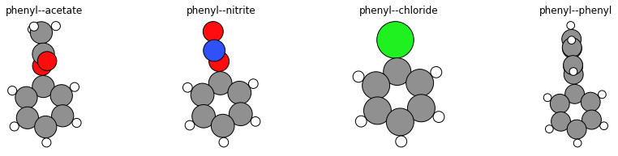
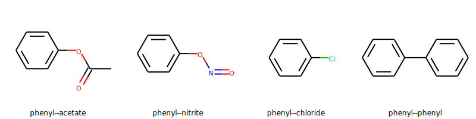
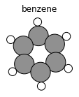
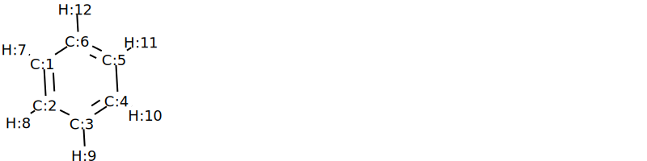
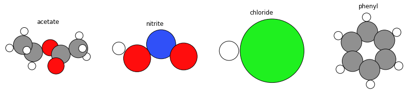
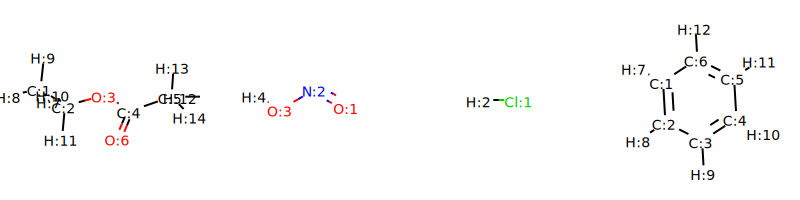

[Free trial](https://www.scm.com/free-trial/)

  * [Applications](https://www.scm.com/applications/ "Applications")
  * [Products](https://www.scm.com/amsterdam-modeling-suite/ "Products")
  * [Support](https://www.scm.com/support/ "Support")
  * [About us](https://www.scm.com/about-us/ "About us")

Search

  * 

Table of contents

  * [General](../../general.html)
  * [Introduction](../../intro.html)
  * [Getting started](../../started.html)
  * [Components overview](../../components/components.html)
  * [Interfaces](../../interfaces/interfaces.html)
  * [Examples](../examples.html)
    * [Getting Started](../examples.html#getting-started)
    * [Molecule analysis](../examples.html#molecule-analysis)
      * [Extract frames from ams.rkf trajectory](../MoleculesFromRKFTrajectory.html)
      * [Table molecule counts and bond count from reactive MD ams.rkf](../MoleculesTable.html)
      * Molecule substitution: Attach ligands to substrates
        * Initial imports
        * Helper class and function
        * Generate substrate molecule
        * Find out which bond to cleave
        * Define ligands
        * Generate substituted molecules
        * Plot 3D structures with PLAMS / ASE
        * Plot 2D Lewis structures with RDKit
        * Complete Python code
      * [Convert to ams.rkf trajectory with bond guessing](../ConvertToAMSRKFTrajectory.html)
    * [Benchmarks](../examples.html#benchmarks)
    * [Workflows](../examples.html#workflows)
    * [COSMO-RS and property prediction](../examples.html#cosmo-rs-and-property-prediction)
    * [Packmol and AMS-ASE interfaces](../examples.html#packmol-and-ams-ase-interfaces)
    * [ParAMS and pyZacros](../examples.html#params-and-pyzacros)
    * [Other AMS calculations](../examples.html#other-ams-calculations)
    * [Pymatgen](../examples.html#pymatgen)
    * [Pre-made recipes](../examples.html#pre-made-recipes)
  * [Cookbook](../../cookbook/cookbook.html)
  * [Citations](../../citations.html)

  * [FAQ](../../FAQ.html)

__[PLAMS](../../index.html)

  * [Documentation](../../PLAMS.html/../../Documentation/index.html)/
  * [PLAMS](../../index.html)/
  * [Examples](../examples.html)/
  * Molecule substitution: Attach ligands to substrates

# Molecule substitution: Attach ligands to substrates¶

 

Script showing how to created substituted benzene molecules using PLAMS, by combining a benzene molecule with a different molecule and defining one bond on each molecule (the “connector”) to break and where a new bond will be formed.

See also

  * [Workflow: filtering molecules based on excitation energies](../ExcitationsWorkflow.html#excitationsworkflow)

  * [Molecule](../../components/molecule.html#molecule)

  * [AMS transition state workflow](../AMSTSWorkflow/AMSTSWorkflow.html#amstsworkflow)

**Note** : This example requires AMS2023 or later.

To follow along, either

  * Download [`MoleculeSubstitution.py`](../../_downloads/5542d3201e7c6c301d2238b392328327/MoleculeSubstitution.py) (run as `$AMSBIN/amspython MoleculeSubstitution.py`).

  * Download [`MoleculeSubstitution.ipynb`](../../_downloads/31ab47634029a73ca66dd7f35f9956a0/MoleculeSubstitution.ipynb) (see also: how to install [Jupyterlab](../../../Scripting/Python_Stack/Python_Stack.html#install-and-run-jupyter-lab-jupyter-notebooks) in AMS)

## Initial imports¶
[code] 
    from scm.plams import *
    import matplotlib.pyplot as plt
    from rdkit import Chem
    from rdkit.Chem import Draw
    from rdkit.Chem.Draw import IPythonConsole
    from rdkit.Chem import AllChem
    from typing import List
    
    IPythonConsole.ipython_useSVG = True
    IPythonConsole.molSize = 250, 250
    
[/code]

## Helper class and function¶

The `MoleculeConnector` class and `substitute()` method below are convenient to use.
[code] 
    class MoleculeConnector:
        def __init__(self, molecule, connector, name='molecule'):
            self.name = name
            self.molecule = molecule
            self.molecule.properties.name = name
            self.connector = connector # 2-tuple of integers, unlike the Molecule.substitute() method which uses two atoms
    
        def __str__(self):
            return  f'''
    Name: {self.name}
    {self.molecule}
    Connector: {self.connector}. This means that when substitution is performed atom {self.connector[0]} will be kept in the substituted molecule. Atom {self.connector[1]}, and anything connected to it, will NOT be kept.
            '''
    
    def substitute(substrate:MoleculeConnector, ligand:MoleculeConnector):
        """
            Returns: Molecule with the ligand added to the substrate, replacing the respective connector bonds.
        """
        molecule = substrate.molecule.copy()
        molecule.substitute(
            connector=(molecule[substrate.connector[0]], molecule[substrate.connector[1]]),
            ligand=ligand.molecule,
            ligand_connector=(ligand.molecule[ligand.connector[0]], ligand.molecule[ligand.connector[1]])
        )
        return molecule
    
    def set_atom_indices(rdmol:Chem.rdchem.Mol, start=0):
        for atom in rdmol.GetAtoms():
            atom.SetAtomMapNum(atom.GetIdx()+start) # give 1-based index
        return rdmol
    
    def to_lewis(molecule:Molecule, template=None, regenerate:bool=True):
        if isinstance(molecule, Chem.rdchem.Mol):
            rdmol = molecule
        else:
            rdmol = to_rdmol(molecule)
        if regenerate:
            rdmol = Chem.RemoveHs(rdmol)
            smiles = Chem.MolToSmiles(rdmol)
            rdmol = Chem.MolFromSmiles(smiles)
        if template is not None:
            AllChem.GenerateDepictionMatching2DStructure(rdmol, template)
        try:
            if molecule.properties.name:
                rdmol.SetProp("_Name", molecule.properties.name)
        except AttributeError:
            pass
        return rdmol
    
    def smiles2template(smiles:str):
        template = Chem.MolFromSmiles(smiles)
        AllChem.Compute2DCoords(template)
        return template
    
    def draw_lewis_grid(
        molecules:List[Molecule],
        molsPerRow:int=4,
        template_smiles:str=None,
        regenerate:bool=False,
        draw_atom_indices:bool=False,
        draw_legend:bool=True,
    ):
        template = None
        if template_smiles:
            template = smiles2template(template_smiles)
    
        rdmols = [to_lewis(x, template=template, regenerate=regenerate) for x in molecules]
        if draw_atom_indices:
            for rdmol in rdmols:
                set_atom_indices(rdmol, start=1)
        legends = None
        if draw_legend:
            try:
                legends = [x.properties.name or f"mol{i}" for i, x in enumerate(molecules)]
            except AttributeError:
                pass
    
        return Draw.MolsToGridImage(rdmols, molsPerRow=molsPerRow, legends=legends)
    
[/code]

## Generate substrate molecule¶
[code] 
    substrate_smiles = 'c1ccccc1'
    substrate = from_smiles(substrate_smiles, forcefield='uff')
    substrate.properties.name = "benzene"
    
    plot_molecule(substrate)
    plt.title(substrate.properties.name);
    
[/code]

## Find out which bond to cleave¶

In the molecule you need to define which bond to cleave. To find out, run for example
[code] 
    substrate.write('substrate.xyz')
    
[/code]

Then open `substrate.xyz` in the AMS GUI and find that atoms 6 (C) and 12 (H) are bonded. We will choose this bond to cleave.

Alternatively, we can plot the molecule inside a Jupyter notebook with RDkit to also find that atoms 6 (C) and 12 (H) are bonded.
[code] 
    draw_lewis_grid([substrate], draw_atom_indices=True, draw_legend=False)
    
[/code]

[code]
    substrate_connector = MoleculeConnector(substrate, (6, 12), 'phenyl') # benzene becomes phenyl when bond between atoms 6,12 is cleaved
    
[/code]

## Define ligands¶

Similarly for the ligand, if you do not know which bond to cleave, write the molecule to a .xyz file and find out.

Or plot it with rdkit in the Jupyter notebook.

**Note** : The ligands below have an extra hydrogen or even more atoms compared to the name that they’re given.
[code] 
    ligands = [
        MoleculeConnector(from_smiles('CCOC(=O)C', forcefield='uff'), (3, 2), 'acetate'), # ethyl acetate, bond from O to C cleaved
        MoleculeConnector(from_smiles('O=NO', forcefield='uff'), (3, 4), 'nitrite'), # nitrous acid, bond from O to H cleaved
        MoleculeConnector(from_smiles('Cl', forcefield='uff'), (1, 2), 'chloride'), # hydrogen chloride, bond from Cl to H cleaved
        MoleculeConnector(from_smiles('c1ccccc1', forcefield='uff'), (6,12), 'phenyl')  # benzene, bond to C to H cleaved
    ]
    
    ligand_molecules = [ligand.molecule for ligand in ligands]
    
    fig, axes = plt.subplots(1, len(ligands), figsize=(15,3))
    
    for ax, ligand in zip(axes, ligands):
        plot_molecule(ligand.molecule, ax=ax)
        ax.set_title(ligand.name)
    
[/code]

[code] 
    draw_lewis_grid(ligand_molecules, draw_atom_indices=True, draw_legend=False, molsPerRow=4)
    
[/code]

Above we see that cleaving the bonds from O(3)-C(2), O(3)-H(4), Cl(1)-H(2), and C(6)-H(12) will give the acetate, nitrite, chloride, and phenyl substituents, respectively.

## Generate substituted molecules¶
[code] 
    mols = []
    
    for ligand in ligands:
        mol = substitute(substrate_connector, ligand)
        mol.properties.name = f'{substrate_connector.name}--{ligand.name}'
        mols.append(mol)
        print(f'Writing {mol.properties.name}.xyz')
        mol.write(f'{mol.properties.name}.xyz')
        print(f'{mol.properties.name} formula: {mol.get_formula(as_dict=True)}')
    
[/code]
[code] 
    Writing phenyl--acetate.xyz
    phenyl--acetate formula: {'C': 8, 'H': 8, 'O': 2}
    Writing phenyl--nitrite.xyz
    phenyl--nitrite formula: {'C': 6, 'H': 5, 'O': 2, 'N': 1}
    Writing phenyl--chloride.xyz
    phenyl--chloride formula: {'C': 6, 'H': 5, 'Cl': 1}
    Writing phenyl--phenyl.xyz
    phenyl--phenyl formula: {'C': 12, 'H': 10}
    
[/code]

## Plot 3D structures with PLAMS / ASE¶
[code] 
    fig, axes = plt.subplots(1, len(mols), figsize=(15,3))
    
    for ax, mol in zip(axes, mols):
        plot_molecule(mol, ax=ax)
        ax.set_title(mol.properties.name)
    
[/code]

## Plot 2D Lewis structures with RDKit¶

The molecules can be aligned by using a benzene template. The `regenerate` option regenerates the molecule with RDkit to clean up the atomic positions.
[code] 
    draw_lewis_grid(mols, template_smiles=substrate_smiles, regenerate=True)
    
[/code]

## Complete Python code¶
[code] 
    #!/usr/bin/env amspython
    # coding: utf-8
    
    # ## Initial imports
    
    from scm.plams import *
    import matplotlib.pyplot as plt
    from rdkit import Chem
    from rdkit.Chem import Draw
    from rdkit.Chem.Draw import IPythonConsole
    from rdkit.Chem import AllChem
    from typing import List
    
    IPythonConsole.ipython_useSVG = True
    IPythonConsole.molSize = 250, 250
    
    # ## Helper class and function
    # 
    # The ``MoleculeConnector`` class and ``substitute()`` method below are convenient to use.
    
    class MoleculeConnector:
        def __init__(self, molecule, connector, name='molecule'):
            self.name = name
            self.molecule = molecule
            self.molecule.properties.name = name
            self.connector = connector # 2-tuple of integers, unlike the Molecule.substitute() method which uses two atoms
    
        def __str__(self):
            return  f'''
    Name: {self.name}
    {self.molecule}
    Connector: {self.connector}. This means that when substitution is performed atom {self.connector[0]} will be kept in the substituted molecule. Atom {self.connector[1]}, and anything connected to it, will NOT be kept.
            '''
                
    def substitute(substrate:MoleculeConnector, ligand:MoleculeConnector):
        """
            Returns: Molecule with the ligand added to the substrate, replacing the respective connector bonds.
        """
        molecule = substrate.molecule.copy()
        molecule.substitute(
            connector=(molecule[substrate.connector[0]], molecule[substrate.connector[1]]),
            ligand=ligand.molecule,
            ligand_connector=(ligand.molecule[ligand.connector[0]], ligand.molecule[ligand.connector[1]])
        )
        return molecule
    
    def set_atom_indices(rdmol:Chem.rdchem.Mol, start=0):
        for atom in rdmol.GetAtoms():
            atom.SetAtomMapNum(atom.GetIdx()+start) # give 1-based index
        return rdmol
    
    def to_lewis(molecule:Molecule, template=None, regenerate:bool=True):
        if isinstance(molecule, Chem.rdchem.Mol):
            rdmol = molecule
        else:
            rdmol = to_rdmol(molecule)
        if regenerate:
            rdmol = Chem.RemoveHs(rdmol)
            smiles = Chem.MolToSmiles(rdmol)
            rdmol = Chem.MolFromSmiles(smiles)
        if template is not None:
            AllChem.GenerateDepictionMatching2DStructure(rdmol, template)
        try:
            if molecule.properties.name:
                rdmol.SetProp("_Name", molecule.properties.name)
        except AttributeError:
            pass
        return rdmol
            
    def smiles2template(smiles:str):
        template = Chem.MolFromSmiles(smiles)
        AllChem.Compute2DCoords(template)
        return template
    
    def draw_lewis_grid(
        molecules:List[Molecule], 
        molsPerRow:int=4, 
        template_smiles:str=None, 
        regenerate:bool=False, 
        draw_atom_indices:bool=False,
        draw_legend:bool=True,
    ):
        template = None
        if template_smiles:
            template = smiles2template(template_smiles)
            
        rdmols = [to_lewis(x, template=template, regenerate=regenerate) for x in molecules]
        if draw_atom_indices:
            for rdmol in rdmols:
                set_atom_indices(rdmol, start=1)
        legends = None
        if draw_legend:
            try:
                legends = [x.properties.name or f"mol{i}" for i, x in enumerate(molecules)]
            except AttributeError:
                pass
    
        return Draw.MolsToGridImage(rdmols, molsPerRow=molsPerRow, legends=legends)
    
    # ## Generate substrate molecule
    
    substrate_smiles = 'c1ccccc1'
    substrate = from_smiles(substrate_smiles, forcefield='uff')
    substrate.properties.name = "benzene"
    
    plot_molecule(substrate)
    plt.title(substrate.properties.name);
    
    # ## Find out which bond to cleave
    
    # In the molecule you need to define which bond to cleave. To find out, run for example
    
    substrate.write('substrate.xyz')
    
    # Then open ``substrate.xyz`` in the AMS GUI and find that atoms 6 (C) and 12 (H) are bonded. We will choose this bond to cleave.
    # 
    # Alternatively, we can plot the molecule inside a Jupyter notebook with RDkit to also find that atoms 6 (C) and 12 (H) are bonded.
    
    draw_lewis_grid([substrate], draw_atom_indices=True, draw_legend=False)
    
    substrate_connector = MoleculeConnector(substrate, (6, 12), 'phenyl') # benzene becomes phenyl when bond between atoms 6,12 is cleaved
    
    # ## Define ligands
    
    # Similarly for the ligand, if you do not know which bond to cleave, write the molecule to a .xyz file and find out.
    # 
    # Or plot it with rdkit in the Jupyter notebook.
    # 
    # **Note**: The ligands below have an extra hydrogen  or even more atoms compared to the name that they're given.
    
    ligands = [
        MoleculeConnector(from_smiles('CCOC(=O)C', forcefield='uff'), (3, 2), 'acetate'), # ethyl acetate, bond from O to C cleaved
        MoleculeConnector(from_smiles('O=NO', forcefield='uff'), (3, 4), 'nitrite'), # nitrous acid, bond from O to H cleaved
        MoleculeConnector(from_smiles('Cl', forcefield='uff'), (1, 2), 'chloride'), # hydrogen chloride, bond from Cl to H cleaved
        MoleculeConnector(from_smiles('c1ccccc1', forcefield='uff'), (6,12), 'phenyl')  # benzene, bond to C to H cleaved
    ]
    
    ligand_molecules = [ligand.molecule for ligand in ligands]
    
    fig, axes = plt.subplots(1, len(ligands), figsize=(15,3))
    
    for ax, ligand in zip(axes, ligands):
        plot_molecule(ligand.molecule, ax=ax)
        ax.set_title(ligand.name)
    
    draw_lewis_grid(ligand_molecules, draw_atom_indices=True, draw_legend=False, molsPerRow=4)
    
    # Above we see that cleaving the bonds from O(3)-C(2), O(3)-H(4), Cl(1)-H(2), and C(6)-H(12) will give the acetate, nitrite, chloride, and phenyl substituents, respectively.
    
    # ## Generate substituted molecules
    
    mols = []
    
    for ligand in ligands:
        mol = substitute(substrate_connector, ligand)
        mol.properties.name = f'{substrate_connector.name}--{ligand.name}'
        mols.append(mol)
        print(f'Writing {mol.properties.name}.xyz')
        mol.write(f'{mol.properties.name}.xyz')
        print(f'{mol.properties.name} formula: {mol.get_formula(as_dict=True)}')
    
    # ## Plot 3D structures with PLAMS / ASE
    
    fig, axes = plt.subplots(1, len(mols), figsize=(15,3))
    
    for ax, mol in zip(axes, mols):
        plot_molecule(mol, ax=ax)
        ax.set_title(mol.properties.name)
    
    # ## Plot 2D Lewis structures with RDKit
    # 
    # The molecules can be aligned by using a benzene template. The ``regenerate`` option regenerates the molecule with RDkit to clean up the atomic positions.
    
    draw_lewis_grid(mols, template_smiles=substrate_smiles, regenerate=True)
    
[/code]

[Next ](../ConvertToAMSRKFTrajectory.html "Convert to ams.rkf trajectory with bond guessing") [ Previous](../MoleculesTable.html "Table molecule counts and bond count from reactive MD ams.rkf")

* * *

  * ### Application Areas

    * [Batteries & PVs](https://www.scm.com/applications/batteries/)
    * [Bonding Analysis](https://www.scm.com/applications/chemical-bonding-analysis/)
    * [Catalysis](https://www.scm.com/applications/catalysis/)
    * [Heavy Elements](https://www.scm.com/applications/heavy-elements/)
    * [Inorganic Chemistry](https://www.scm.com/applications/inorganic-chemistry/)
    * [Life Sciences](https://www.scm.com/applications/pharma/)
    * [Materials Science](https://www.scm.com/applications/materials-science/)
    * [Nanotechnology](https://www.scm.com/applications/nanotechnology/)
    * [Oil and Gas](https://www.scm.com/applications/oil-and-gas/)
    * [Organic Electronics](https://www.scm.com/applications/organic-electronics/)
    * [Polymers](https://www.scm.com/applications/polymers/)
    * [Spectroscopy](https://www.scm.com/applications/spectroscopy/)
    * [Supercomputer / HPC](https://www.scm.com/applications/a-computing-center/)
    * [Teaching Computational Chemistry with AMS](https://www.scm.com/applications/teaching/)

  * ### Products

    * [AMS Driver](https://www.scm.com/product/ams/)
    * [ADF](https://www.scm.com/product/adf/)
    * [BAND](https://www.scm.com/product/band_periodicdft/)
    * [COSMO-RS](https://www.scm.com/product/cosmo-rs/)
    * [DFTB](https://www.scm.com/product/dftb/)
    * [GUI](https://www.scm.com/product/gui/)
    * [ML Potentials & FF](https://www.scm.com/product/machine-learning-potentials/)
    * [MOPAC](https://www.scm.com/product/mopac/)
    * [ParAMS](https://www.scm.com/product/params/)
    * [PLAMS](https://www.scm.com/product/plams/)
    * [Quantum ESPRESSO](https://www.scm.com/product/quantum-espresso/)
    * [ReaxFF](https://www.scm.com/product/reaxff/)
    * [Workflows](https://www.scm.com/product/advanced-workflows/)

  * ### Support

    * [Brochure](https://www.scm.com/amsterdam-modeling-suite/brochures/)
    * [Consulting & Contract Research](https://www.scm.com/amsterdam-modeling-suite/consulting/)
    * [Discussion List](https://www.scm.com/adf-discussion-list/)
    * [Documentation](https://www.scm.com/support/ams-tutorials-and-manuals/)
    * [Downloads](https://www.scm.com/support/downloads/)
    * [FAQs](https://www.scm.com/faq/)
    * [GUI Tutorials](https://www.scm.com/doc/Tutorials/GUI_overview/GUI_overview_tutorials.html)
    * [Installation](https://www.scm.com/support/ams-installation-videos/)
    * [Literature Highlights](https://www.scm.com/category/highlights/)
    * [Papers Citing ADF](https://www.scm.com/amsterdam-modeling-suite/research-papers-citing-adf/)
    * [Release Notes](https://www.scm.com/support/documentation-previous-versions/release-notes/)
    * [Support Overview](https://www.scm.com/support/)
    * [Teaching Materials](https://www.scm.com/support/background/amsterdam-modeling-suite-teaching-materials/)
    * [Videos](https://www.scm.com/amsterdam-modeling-suite/videos-tutorials-and-web-presentations/)
    * [Webinars](https://www.scm.com/about-us/news-agenda/web-presentations-by-adf-experts/)
    * [Workshops](https://www.scm.com/about-us/news-agenda/adf-hands-on-workshops/)

  * ### About Us

    * [Careers](https://www.scm.com/about-us/careers/)
    * [Collaborations](https://www.scm.com/about-us/collaborations/)
    * [Contact Us](https://www.scm.com/about-us/contact-us/)
    * [Contributors](https://www.scm.com/about-us/our-authors/)
    * [EU Projects](https://www.scm.com/about-us/eu-projects/)
    * [Events](https://www.scm.com/about-us/news-agenda/)
    * [Mission & Vision](https://www.scm.com/about-us/mission-vision/)
    * [News](https://www.scm.com/category/news/)
    * [Newsletters](https://www.scm.com/newsletters/)
    * [The SCM Team](https://www.scm.com/about-us/our-people/)

  * ### Pricing & Licensing

    * [License Terms](https://www.scm.com/amsterdam-modeling-suite/pricing-licensing/scm-license-terms/)
    * [Ordering](https://www.scm.com/amsterdam-modeling-suite/pricing-licensing/ordering-procedure/)
    * [Price Calculator](https://www.scm.com/amsterdam-modeling-suite/pricing-licensing/price-quote/calculate-your-price/)
    * [Price Quote](https://www.scm.com/amsterdam-modeling-suite/pricing-licensing/price-quote/)
    * [Pricing & Licensing](https://www.scm.com/amsterdam-modeling-suite/pricing-licensing/)
    * [Resellers](https://www.scm.com/amsterdam-modeling-suite/pricing-licensing/adf-resellers/)

  * [Copyright](https://www.scm.com/copyright/)
  * [Terms of Use](https://www.scm.com/terms-of-use/)
  * [Privacy Policy](https://www.scm.com/privacy-policy/)
