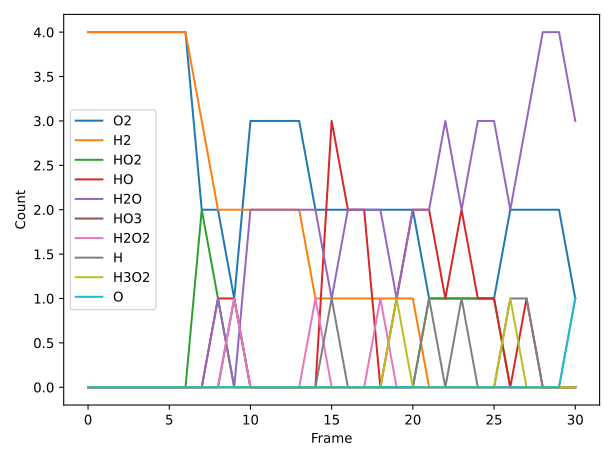
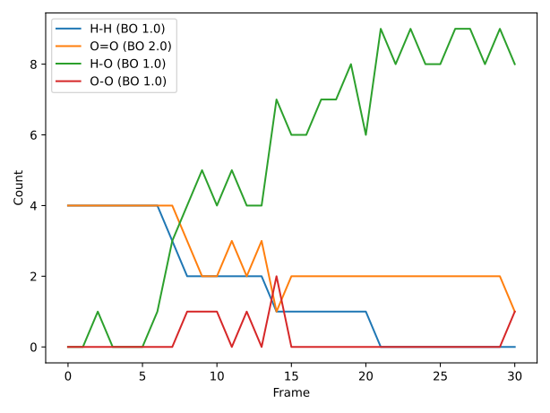

[Free trial](https://www.scm.com/free-trial/)

  * [Applications](https://www.scm.com/applications/ "Applications")
  * [Products](https://www.scm.com/amsterdam-modeling-suite/ "Products")
  * [Support](https://www.scm.com/support/ "Support")
  * [About us](https://www.scm.com/about-us/ "About us")

Search

  * 

Table of contents

  * [General](../general.html)
  * [Introduction](../intro.html)
  * [Getting started](../started.html)
  * [Components overview](../components/components.html)
  * [Interfaces](../interfaces/interfaces.html)
  * [Examples](examples.html)
    * [Getting Started](examples.html#getting-started)
    * [Molecule analysis](examples.html#molecule-analysis)
      * [Extract frames from ams.rkf trajectory](MoleculesFromRKFTrajectory.html)
      * Table molecule counts and bond count from reactive MD ams.rkf
      * [Molecule substitution: Attach ligands to substrates](MoleculeSubstitution/MoleculeSubstitutionExample.html)
      * [Convert to ams.rkf trajectory with bond guessing](ConvertToAMSRKFTrajectory.html)
    * [Benchmarks](examples.html#benchmarks)
    * [Workflows](examples.html#workflows)
    * [COSMO-RS and property prediction](examples.html#cosmo-rs-and-property-prediction)
    * [Packmol and AMS-ASE interfaces](examples.html#packmol-and-ams-ase-interfaces)
    * [ParAMS and pyZacros](examples.html#params-and-pyzacros)
    * [Other AMS calculations](examples.html#other-ams-calculations)
    * [Pymatgen](examples.html#pymatgen)
    * [Pre-made recipes](examples.html#pre-made-recipes)
  * [Cookbook](../cookbook/cookbook.html)
  * [Citations](../citations.html)

  * [FAQ](../FAQ.html)

__[PLAMS](../index.html)

  * [Documentation](../PLAMS.html/../../Documentation/index.html)/
  * [PLAMS](../index.html)/
  * [Examples](examples.html)/
  * Table molecule counts and bond count from reactive MD ams.rkf

# Table molecule counts and bond count from reactive MD ams.rkf¶

If you run a reactive molecular dynamics simulation with for example ReaxFF, you may want to see how the number of molecules of different types changes with time.

It is also interesting to follow the number of bonds of a given type. A bond type is characterized by two elements making the bond and the order of the bond. The bond order is a real number and rounding off the value provides an indictation of the type of the bond. Rounding off the bond order to the next integer value gives 1, 2, 3, corresponding to single, double, triple bonds, respectively. Rounding off the bond order to half-integer values gives some additional details to the bond type. You can edit the `round_type` variable to either integer or half-integer.

Run the below script providing the ams.rkf file as the first (and only) command-line argument. If no ams.rkf file is given, a short MD simulation is run with ReaxFF to illustrate the analysis.

**Example usage:** ([`Download MoleculesTable.py`](../_downloads/2429dba0a6f043fea4ebbc88a4130655/MoleculesTable.py))
[code] 
    #!/usr/bin/env amspython
    from scm.plams import *
    from collections import Counter
    import matplotlib.pyplot as plt
    import sys
    import os
    import numpy as np
    import time
    
    """
    
    Example printing a table of the AMS Molecule analysis and/or AMS Bond analysis
    from reactive MD simulations.
    
    For molecules, for each species and frame, print the number of species in that
    frame to molecule_analysis.txt and the corresponding plot in
    molecule_analysis.pdf.
    
    For bonds, for each frame, print the number of bonds per type in that frame to
    bond_analysis.txt and the corresponding plot to bond_analysis.pdf.  At the top
    of the main() function, set whether to round the bond orders to the nearest
    integer or half-integer.
    
    You can comment out the molecule/bonds/print/plot functions to fit your needs.
    
    Usage: $AMSBIN/amspython MoleculesTable.py /path/to/ams.rkf
    
    If no /path/to/ams.rkf is provided, the script will run a short toy MD with
    ReaxFF to illustrate the analysis (requires a ReaxFF license).
    
    """
    
    def main():
        round_type = 'integer'       # round bond orders to nearest integer
        #round_type = 'half_integer' # round bond orders to nearest half integer
    
        if len(sys.argv) > 2:
            print("Usage: $AMSBIN/amspython MoleculesTable.py /path/to/ams.rkf")
            print("   or: $AMSBIN/amspython MoleculesTable.py")
            exit(1)
    
        elif len(sys.argv) == 2:
            ams_rkf_path = sys.argv[1]
    
        elif len(sys.argv) == 1:
            # Run a short combustion MD with ReaxFF
            ams_rkf_path = run_md()
    
        try:
            # Molecule analysis
            names, counts_list = analyze_molecules(ams_rkf_path)
            molecule_analysis_table = table_results(names, counts_list)
            with open('molecule_analysis.txt', 'w') as f:
                f.write(molecule_analysis_table)
            plot_results(names, counts_list, 'molecule_analysis.pdf')
        
            # Bond analysis
            names, counts_list = analyze_bonds(ams_rkf_path,round_type)
            bond_analysis_table = table_results(names, counts_list)
            with open('bond_analysis.txt', 'w') as f:
                f.write(bond_analysis_table)
            plot_results(names, counts_list, 'bond_analysis.pdf')
    
        except Exception as e:
            print(e)
            exit(1)
    
    def table_results(names, counts_list):
        """
            This function returns the results in a space-separated table.
    
            names: list of str
                Molecule names
    
            counts_list: list of list of int
                List with dimensions nFrames x nMoleculeTypes
        """
        ret = ["frame " + " ".join(names)]
    
        for frame, counts in enumerate(counts_list, 1):
            line = f"{frame} " + " ".join(str(x) for x in counts)
            ret.append(line)
    
        return "\n".join(ret)
    
    def plot_results(names, counts_list, filename=None):
        """
            Plot the results as Count vs. frame
        """
        data = np.array(counts_list).T
        for i, name in enumerate(names, 0):
            plt.plot(data[i],label=name)
        plt.legend()
        plt.xlabel('Frame')
        plt.ylabel('Count')
        plt.tight_layout()
        if filename:
            plt.savefig(filename)
        plt.show()
    
    def round_off(number,rtype='integer'):
        """
            Round off bond order to integer or half integer.
        """
        if rtype=='half_integer':
            number = round(number * 2) / 2
        if rtype=='integer':
            number = round(number)
        return number
    
    def bo2symbol(bo):
        """
            Convert bond order to bond symbol.
        """
        s = '---'
        if bo == 0.5: s = '--'
        if bo == 1.0: s = '-'
        if bo == 1.5: s = '=='
        if bo == 2.0: s = '='
        if bo == 2.5: s = '≡≡'
        if bo == 3.0: s = '≡'
        return s
    
    def analyze_molecules(ams_rkf_path):
        """
            ams_rkf_path: str
                Path to an ams.rkf file from a reactive MD simulation
    
            Returns: 2-tuple (names, counts)
                ``names``: list of length nMoleculesTypes. ``counts``: list of
                length nFrames, each item a list of length nMoleculesTypes
                containing an integer with the number of molecules of that type at
                the particular frame.
    
        """
        
        if not os.path.exists(ams_rkf_path):
            raise FileNotFoundError(f"Couldn't find the file {ams_rkf_path}")
    
        job = AMSJob.load_external(ams_rkf_path)
    
        try:
            n_molecules = job.results.readrkf('Molecules', 'Num molecules')
        except KeyError:
            raise KeyError("Couldn't find Molecules section on ams.rkf. You need to enable MolecularDynamics%Trajectory%WriteMolecules (before running the MD simulation).")
    
        # get the names of the molecules (molecular formula)
        molecule_type_range = range(1, n_molecules+1)  # 1, 2, ..., n_molecules
        names = [job.results.readrkf('Molecules', f'Molecule name {i}') for i in molecule_type_range]
    
        # read the Mols.Type from each History element
        mols_type_list = job.results.get_history_property('Mols.Type') # list of length nFrames
        counts_list = []
    
        # loop over the frames
        # store the counts-per-molecule-type in counts_list
        for mols_types in mols_type_list:
            counts = Counter(mols_types)
            counts_list.append([counts[x] for x in molecule_type_range])
    
        return names, counts_list
    
    def analyze_bonds(ams_rkf_path,round_type):
        """
            ams_rkf_path: str
                Path to an ams.rkf file from a reactive MD simulation
    
            Returns: dict (number of bond type)
                Each element of the dict are a list of length nframes containing 
                the occurence of every bond type at a given frame. 
        """
    
        if not os.path.exists(ams_rkf_path):
            raise FileNotFoundError(f"Couldn't find the file {ams_rkf_path}")
    
        job = AMSJob.load_external(ams_rkf_path)
    
        trajectory = Trajectory(job.results.rkfpath())
        # Loop over frames
        allbonds = {}
        nframes = len(trajectory)
        for iframe, imol in enumerate(trajectory, 1):
    
            bonds,btype = [],[]
            # mol.bonds double count bonds
            for bond in imol.bonds:
    
                # Bond indices and symbols 
                b_atoms = [bond.atom1,bond.atom2]
                b_symbols = [bond.atom1.symbol,bond.atom2.symbol]
                sorted_symbols = sorted(b_symbols)
    
                # If bond has not yet been counted
                if b_atoms not in bonds:
                    # Compute BO and add bond to list
                    sorted_symbols.append(round_off(bond.order,round_type))
                    btype.append(sorted_symbols)
                    bonds.append(b_atoms)
                    bonds.append([b_atoms[1],b_atoms[0]])
    
            # Loop over unique bonds
            btype_set = set(tuple(row) for row in btype)
            for ibtype in btype_set:
                # Count how many bond of given type
                n_ibond = btype.count(list(ibtype))
                b_tag = ibtype[0]+bo2symbol(ibtype[2])+ibtype[1]
                b_label = '{:s} (BO {:2.1f})'.format(b_tag,ibtype[-1])
                # If new bond at frame iframe then create zeros 
                if b_label not in allbonds:
                    allbonds[b_label] = [0.0]*(nframes)
                allbonds[b_label][iframe-1] = n_ibond
    
            # Counter
            if iframe % 10 == 1:
                print('Currently at frame {:d}/{:d}'.format(iframe,nframes))
    
        # Convert dictionary to counts_list
        names, counts_list = [name for name in allbonds],[]
        for iframe, imol in enumerate(trajectory, 1):
            counts_list_iframe = []
            for name in names:
                counts_list_iframe.append(allbonds[name][iframe-1])
            counts_list.append(counts_list_iframe)
    
        return names, counts_list
    
    def run_md():
        """
            Define the simulation box as mixture of H2/O2 and run a short NVE at high T
        """
    
        init()
        o2 = from_smiles('O=O')
        h2 = from_smiles('[HH]')
        mixture = packmol(molecules=[o2, h2], n_molecules=[4, 4], density=1.0)
    
        s = Settings()
        s.input.reaxff.forcefield = 'CHO.ff'
        s.input.ams.task = 'MolecularDynamics'
        s.input.ams.MolecularDynamics.Nsteps = 3000
        s.input.ams.MolecularDynamics.Timestep = 0.5
        s.input.ams.MolecularDynamics.InitialVelocities.Temperature = 3500
    
        job = AMSJob(settings=s, molecule=mixture, name='md')
        job.run(watch=True)
        finish()
    
        return job.results.rkfpath()
    
    if __name__ == '__main__':
        main()
    
[/code]

[Next ](MoleculeSubstitution/MoleculeSubstitutionExample.html "Molecule substitution: Attach ligands to substrates") [ Previous](MoleculesFromRKFTrajectory.html "Extract frames from ams.rkf trajectory")

* * *

  * ### Application Areas

    * [Batteries & PVs](https://www.scm.com/applications/batteries/)
    * [Bonding Analysis](https://www.scm.com/applications/chemical-bonding-analysis/)
    * [Catalysis](https://www.scm.com/applications/catalysis/)
    * [Heavy Elements](https://www.scm.com/applications/heavy-elements/)
    * [Inorganic Chemistry](https://www.scm.com/applications/inorganic-chemistry/)
    * [Life Sciences](https://www.scm.com/applications/pharma/)
    * [Materials Science](https://www.scm.com/applications/materials-science/)
    * [Nanotechnology](https://www.scm.com/applications/nanotechnology/)
    * [Oil and Gas](https://www.scm.com/applications/oil-and-gas/)
    * [Organic Electronics](https://www.scm.com/applications/organic-electronics/)
    * [Polymers](https://www.scm.com/applications/polymers/)
    * [Spectroscopy](https://www.scm.com/applications/spectroscopy/)
    * [Supercomputer / HPC](https://www.scm.com/applications/a-computing-center/)
    * [Teaching Computational Chemistry with AMS](https://www.scm.com/applications/teaching/)

  * ### Products

    * [AMS Driver](https://www.scm.com/product/ams/)
    * [ADF](https://www.scm.com/product/adf/)
    * [BAND](https://www.scm.com/product/band_periodicdft/)
    * [COSMO-RS](https://www.scm.com/product/cosmo-rs/)
    * [DFTB](https://www.scm.com/product/dftb/)
    * [GUI](https://www.scm.com/product/gui/)
    * [ML Potentials & FF](https://www.scm.com/product/machine-learning-potentials/)
    * [MOPAC](https://www.scm.com/product/mopac/)
    * [ParAMS](https://www.scm.com/product/params/)
    * [PLAMS](https://www.scm.com/product/plams/)
    * [Quantum ESPRESSO](https://www.scm.com/product/quantum-espresso/)
    * [ReaxFF](https://www.scm.com/product/reaxff/)
    * [Workflows](https://www.scm.com/product/advanced-workflows/)

  * ### Support

    * [Brochure](https://www.scm.com/amsterdam-modeling-suite/brochures/)
    * [Consulting & Contract Research](https://www.scm.com/amsterdam-modeling-suite/consulting/)
    * [Discussion List](https://www.scm.com/adf-discussion-list/)
    * [Documentation](https://www.scm.com/support/ams-tutorials-and-manuals/)
    * [Downloads](https://www.scm.com/support/downloads/)
    * [FAQs](https://www.scm.com/faq/)
    * [GUI Tutorials](https://www.scm.com/doc/Tutorials/GUI_overview/GUI_overview_tutorials.html)
    * [Installation](https://www.scm.com/support/ams-installation-videos/)
    * [Literature Highlights](https://www.scm.com/category/highlights/)
    * [Papers Citing ADF](https://www.scm.com/amsterdam-modeling-suite/research-papers-citing-adf/)
    * [Release Notes](https://www.scm.com/support/documentation-previous-versions/release-notes/)
    * [Support Overview](https://www.scm.com/support/)
    * [Teaching Materials](https://www.scm.com/support/background/amsterdam-modeling-suite-teaching-materials/)
    * [Videos](https://www.scm.com/amsterdam-modeling-suite/videos-tutorials-and-web-presentations/)
    * [Webinars](https://www.scm.com/about-us/news-agenda/web-presentations-by-adf-experts/)
    * [Workshops](https://www.scm.com/about-us/news-agenda/adf-hands-on-workshops/)

  * ### About Us

    * [Careers](https://www.scm.com/about-us/careers/)
    * [Collaborations](https://www.scm.com/about-us/collaborations/)
    * [Contact Us](https://www.scm.com/about-us/contact-us/)
    * [Contributors](https://www.scm.com/about-us/our-authors/)
    * [EU Projects](https://www.scm.com/about-us/eu-projects/)
    * [Events](https://www.scm.com/about-us/news-agenda/)
    * [Mission & Vision](https://www.scm.com/about-us/mission-vision/)
    * [News](https://www.scm.com/category/news/)
    * [Newsletters](https://www.scm.com/newsletters/)
    * [The SCM Team](https://www.scm.com/about-us/our-people/)

  * ### Pricing & Licensing

    * [License Terms](https://www.scm.com/amsterdam-modeling-suite/pricing-licensing/scm-license-terms/)
    * [Ordering](https://www.scm.com/amsterdam-modeling-suite/pricing-licensing/ordering-procedure/)
    * [Price Calculator](https://www.scm.com/amsterdam-modeling-suite/pricing-licensing/price-quote/calculate-your-price/)
    * [Price Quote](https://www.scm.com/amsterdam-modeling-suite/pricing-licensing/price-quote/)
    * [Pricing & Licensing](https://www.scm.com/amsterdam-modeling-suite/pricing-licensing/)
    * [Resellers](https://www.scm.com/amsterdam-modeling-suite/pricing-licensing/adf-resellers/)

  * [Copyright](https://www.scm.com/copyright/)
  * [Terms of Use](https://www.scm.com/terms-of-use/)
  * [Privacy Policy](https://www.scm.com/privacy-policy/)
