[Free trial](https://www.scm.com/free-trial/)

  * [Applications](https://www.scm.com/applications/ "Applications")
  * [Products](https://www.scm.com/amsterdam-modeling-suite/ "Products")
  * [Support](https://www.scm.com/support/ "Support")
  * [About us](https://www.scm.com/about-us/ "About us")

Search

  * 

Table of contents

  * [General](../../general.html)
  * [Introduction](../../intro.html)
  * [Getting started](../../started.html)
  * [Components overview](../../components/components.html)
  * [Interfaces](../../interfaces/interfaces.html)
  * [Examples](../examples.html)
    * [Getting Started](../examples.html#getting-started)
    * [Molecule analysis](../examples.html#molecule-analysis)
    * [Benchmarks](../examples.html#benchmarks)
    * [Workflows](../examples.html#workflows)
    * [COSMO-RS and property prediction](../examples.html#cosmo-rs-and-property-prediction)
    * [Packmol and AMS-ASE interfaces](../examples.html#packmol-and-ams-ase-interfaces)
      * Packmol example
        * Initial imports
        * Helper functions
        * Liquid water (fluid with 1 component)
        * Water-acetonitrile mixture (fluid with 2 or more components)
        * Solid-liquid or solid-gas interfaces
        * Microsolvation
        * Bonds, atom properties (force field types, regions, …)
        * Complete Python code
      * [Engine ASE: AMS geometry optimizer with forces from any ASE calculator](../CustomASECalculator.html)
      * [AMSCalculator: ASE geometry optimizer with AMS forces](../AMSCalculator/ASECalculator.html)
      * [AMSCalculator: Access results files & Charged systems](../AMSCalculator/ChargedAMSCalculator.html)
      * [i-PI path integral MD with AMS](../i-PI-AMS.html)
      * [Sella transition state search with AMS](../SellaTransitionStateSearch.html)
    * [ParAMS and pyZacros](../examples.html#params-and-pyzacros)
    * [Other AMS calculations](../examples.html#other-ams-calculations)
    * [Pymatgen](../examples.html#pymatgen)
    * [Pre-made recipes](../examples.html#pre-made-recipes)
  * [Cookbook](../../cookbook/cookbook.html)
  * [Citations](../../citations.html)

  * [FAQ](../../FAQ.html)

__[PLAMS](../../index.html)

  * [Documentation](../../PLAMS.html/../../Documentation/index.html)/
  * [PLAMS](../../index.html)/
  * [Examples](../examples.html)/
  * Packmol example

# Packmol example¶

This example illustrates various ways of using the [packmol interface](../../components/mol_packmol.html#packmolinterface) for constructing liquid or gas mixtures or solid/liquid interfaces.

**Note** : This example requires AMS2023 or later.

To follow along, either

  * Download [`PackMol.py`](../../_downloads/fb908d9b1594c9d46d5f48366b57abbb/PackMol.py) (run as `$AMSBIN/amspython PackMol.py`).

  * Download [`PackMol.ipynb`](../../_downloads/09a949734ab153d779003a382595df51/PackMol.ipynb) (see also: how to install [Jupyterlab](../../../Scripting/Python_Stack/Python_Stack.html#install-and-run-jupyter-lab-jupyter-notebooks) in AMS)

## Initial imports¶
[code] 
    from scm.plams import *
    from ase.optimize import BFGS
    from ase.build import molecule as ase_build_molecule
    from ase.visualize.plot import plot_atoms
    from ase.build import fcc111
    import matplotlib.pyplot as plt
    
[/code]

## Helper functions¶
[code] 
    def printsummary(mol, details=None):
        s = f'{len(mol)} atoms, density = {mol.get_density()*1e-3:.3f} g/cm^3, box = {mol.lattice[0][0]:.3f}, {mol.lattice[1][1]:.3f}, {mol.lattice[2][2]:.3f}, formula = {mol.get_formula()}'
        if details:
            s+= f'\n#added molecules per species: {details["n_molecules"]}, mole fractions: {details["mole_fractions"]}'
        print(s)
    
    def show(mol, figsize=None, **kwargs):
        """ Show a molecule in a Jupyter notebook """
        plt.figure(figsize=figsize or (2,2))
        plt.axis('off')
        plot_atoms(toASE(mol), **kwargs)
    
[/code]

## Liquid water (fluid with 1 component)¶

First, create the gasphase molecule:
[code] 
    water = from_smiles('O')
    show(water)
    
[/code]

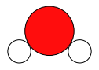
[code] 
    print('pure liquid from approximate number of atoms and exact density (in g/cm^3), cubic box with auto-determined size')
    out = packmol(water, n_atoms=194, density=1.0)
    printsummary(out)
    out.write('water-1.xyz')
    show(out)
    
[/code]
[code] 
    pure liquid from approximate number of atoms and exact density (in g/cm^3), cubic box with auto-determined size
    195 atoms, density = 1.000 g/cm^3, box = 12.482, 12.482, 12.482, formula = H130O65
    
[/code]

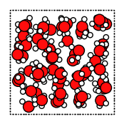
[code] 
    print('pure liquid from approximate density (in g/cm^3) and an orthorhombic box')
    out = packmol(water, density=1.0, box_bounds=[0., 0., 0., 8., 12., 14.])
    printsummary(out)
    out.write('water-2.xyz')
    show(out)
    
[/code]
[code] 
    pure liquid from approximate density (in g/cm^3) and an orthorhombic box
    135 atoms, density = 1.002 g/cm^3, box = 8.000, 12.000, 14.000, formula = H90O45
    
[/code]

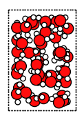
[code] 
    print('pure liquid with explicit number of molecules and exact density')
    out = packmol(water, n_molecules=64, density=1.0)
    printsummary(out)
    out.write('water-3.xyz')
    show(out)
    
[/code]
[code] 
    pure liquid with explicit number of molecules and exact density
    192 atoms, density = 1.000 g/cm^3, box = 12.417, 12.417, 12.417, formula = H128O64
    
[/code]

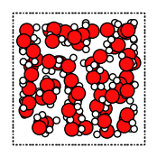
[code] 
    print('pure liquid with explicit number of molecules and box')
    out = packmol(water, n_molecules=64, box_bounds=[0., 0., 0., 12., 13., 14.])
    printsummary(out)
    out.write('water-4.xyz')
    show(out)
    
[/code]
[code] 
    pure liquid with explicit number of molecules and box
    192 atoms, density = 0.877 g/cm^3, box = 12.000, 13.000, 14.000, formula = H128O64
    
[/code]

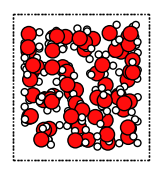
[code] 
    print('water-5.xyz: pure liquid in non-orthorhombic box (requires AMS2022 or later)')
    # first place the molecules in a cuboid surrounding the desired lattice
    # then gradually change into the desired lattice using refine_lattice()
    # note that the molecules may become distorted by this procedure
    lattice = [[10., 2., -1.], [-5., 8., 0.], [0., -2., 11.]]
    temp_out = packmol(water, n_molecules=32, box_bounds=[
        0, 0, 0,
        max(lattice[i][0] for i in range(3))-min(lattice[i][0] for i in range(3)),
        max(lattice[i][1] for i in range(3))-min(lattice[i][1] for i in range(3)),
        max(lattice[i][2] for i in range(3))-min(lattice[i][2] for i in range(3))
    ])
    out = refine_lattice(temp_out, lattice=lattice)
    if out is not None:
        out.write('water-5.xyz')
        print('Top: system in surrounding orthorhombic box before calling refine_lattice(). Bottom: System in non-orthorhombic box after calling refine_lattice()')
        show(temp_out)
        show(out)
    
[/code]
[code] 
    water-5.xyz: pure liquid in non-orthorhombic box (requires AMS2022 or later)
    PLAMS working folder: PackMolExample/plams_workdir
    Top: system in surrounding orthorhombic box before calling refine_lattice(). Bottom: System in non-orthorhombic box after calling refine_lattice()
    
[/code]

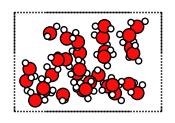 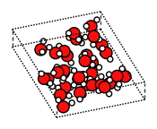

## Water-acetonitrile mixture (fluid with 2 or more components)¶

Let’s also create a single acetonitrile molecule:
[code] 
    acetonitrile = from_smiles('CC#N')
    show(acetonitrile)
    
[/code]

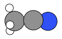

Set the desired mole fractions and density. Here, the density is calculated as the weighted average of water (1.0 g/cm^3) and acetonitrile (0.76 g/cm^3) densities, but you could use any other density.
[code] 
    # MIXTURES
    x_water = 0.666                # mole fraction
    x_acetonitrile = 1-x_water     # mole fraction
    density = (x_water*1.0 + x_acetonitrile*0.76) / (x_water + x_acetonitrile)  # weighted average of pure component densities
    
    print(f'\nMIXTURES. x_water = {x_water:.3f}, x_acetonitrile = {x_acetonitrile:.3f}, target density = {density:.3f} g/cm^3\n')
    
[/code]
[code] 
    MIXTURES. x_water = 0.666, x_acetonitrile = 0.334, target density = 0.920 g/cm^3
    
[/code]

By setting `return_details=True`, you can get information about the mole fractions of the returned system. They may not exactly match the mole fractions you put in.
[code] 
    print('2-1 water-acetonitrile from approximate number of atoms and exact density (in g/cm^3), cubic box with auto-determined size')
    out, details = packmol(molecules=[water, acetonitrile], mole_fractions=[x_water, x_acetonitrile], n_atoms=200, density=density, return_details=True)
    printsummary(out, details)
    out.write('water-acetonitrile-1.xyz')
    show(out)
    
[/code]
[code] 
    2-1 water-acetonitrile from approximate number of atoms and exact density (in g/cm^3), cubic box with auto-determined size
    201 atoms, density = 0.920 g/cm^3, box = 13.263, 13.263, 13.263, formula = C34H117N17O33
    #added molecules per species: [33, 17], mole fractions: [0.66, 0.34]
    
[/code]

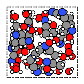

The `details` is a dictionary as follows:
[code] 
    for k, v in details.items():
        print(f'{k}: {v}')
    
[/code]
[code] 
    n_molecules: [33, 17]
    mole_fractions: [0.66, 0.34]
    n_atoms: 201
    molecule_type_indices: [0, 0, 0, 0, 0, 0, 0, 0, 0, 0, 0, 0, 0, 0, 0, 0, 0, 0, 0, 0, 0, 0, 0, 0, 0, 0, 0, 0, 0, 0, 0, 0, 0, 0, 0, 0, 0, 0, 0, 0, 0, 0, 0, 0, 0, 0, 0, 0, 0, 0, 0, 0, 0, 0, 0, 0, 0, 0, 0, 0, 0, 0, 0, 0, 0, 0, 0, 0, 0, 0, 0, 0, 0, 0, 0, 0, 0, 0, 0, 0, 0, 0, 0, 0, 0, 0, 0, 0, 0, 0, 0, 0, 0, 0, 0, 0, 0, 0, 0, 1, 1, 1, 1, 1, 1, 1, 1, 1, 1, 1, 1, 1, 1, 1, 1, 1, 1, 1, 1, 1, 1, 1, 1, 1, 1, 1, 1, 1, 1, 1, 1, 1, 1, 1, 1, 1, 1, 1, 1, 1, 1, 1, 1, 1, 1, 1, 1, 1, 1, 1, 1, 1, 1, 1, 1, 1, 1, 1, 1, 1, 1, 1, 1, 1, 1, 1, 1, 1, 1, 1, 1, 1, 1, 1, 1, 1, 1, 1, 1, 1, 1, 1, 1, 1, 1, 1, 1, 1, 1, 1, 1, 1, 1, 1, 1, 1, 1, 1, 1, 1, 1]
    molecule_indices: [0, 0, 0, 1, 1, 1, 2, 2, 2, 3, 3, 3, 4, 4, 4, 5, 5, 5, 6, 6, 6, 7, 7, 7, 8, 8, 8, 9, 9, 9, 10, 10, 10, 11, 11, 11, 12, 12, 12, 13, 13, 13, 14, 14, 14, 15, 15, 15, 16, 16, 16, 17, 17, 17, 18, 18, 18, 19, 19, 19, 20, 20, 20, 21, 21, 21, 22, 22, 22, 23, 23, 23, 24, 24, 24, 25, 25, 25, 26, 26, 26, 27, 27, 27, 28, 28, 28, 29, 29, 29, 30, 30, 30, 31, 31, 31, 32, 32, 32, 33, 33, 33, 33, 33, 33, 34, 34, 34, 34, 34, 34, 35, 35, 35, 35, 35, 35, 36, 36, 36, 36, 36, 36, 37, 37, 37, 37, 37, 37, 38, 38, 38, 38, 38, 38, 39, 39, 39, 39, 39, 39, 40, 40, 40, 40, 40, 40, 41, 41, 41, 41, 41, 41, 42, 42, 42, 42, 42, 42, 43, 43, 43, 43, 43, 43, 44, 44, 44, 44, 44, 44, 45, 45, 45, 45, 45, 45, 46, 46, 46, 46, 46, 46, 47, 47, 47, 47, 47, 47, 48, 48, 48, 48, 48, 48, 49, 49, 49, 49, 49, 49]
    atom_indices_in_molecule: [0, 1, 2, 0, 1, 2, 0, 1, 2, 0, 1, 2, 0, 1, 2, 0, 1, 2, 0, 1, 2, 0, 1, 2, 0, 1, 2, 0, 1, 2, 0, 1, 2, 0, 1, 2, 0, 1, 2, 0, 1, 2, 0, 1, 2, 0, 1, 2, 0, 1, 2, 0, 1, 2, 0, 1, 2, 0, 1, 2, 0, 1, 2, 0, 1, 2, 0, 1, 2, 0, 1, 2, 0, 1, 2, 0, 1, 2, 0, 1, 2, 0, 1, 2, 0, 1, 2, 0, 1, 2, 0, 1, 2, 0, 1, 2, 0, 1, 2, 0, 1, 2, 3, 4, 5, 0, 1, 2, 3, 4, 5, 0, 1, 2, 3, 4, 5, 0, 1, 2, 3, 4, 5, 0, 1, 2, 3, 4, 5, 0, 1, 2, 3, 4, 5, 0, 1, 2, 3, 4, 5, 0, 1, 2, 3, 4, 5, 0, 1, 2, 3, 4, 5, 0, 1, 2, 3, 4, 5, 0, 1, 2, 3, 4, 5, 0, 1, 2, 3, 4, 5, 0, 1, 2, 3, 4, 5, 0, 1, 2, 3, 4, 5, 0, 1, 2, 3, 4, 5, 0, 1, 2, 3, 4, 5, 0, 1, 2, 3, 4, 5]
    density: 0.9198400000000004
    
[/code]
[code] 
    print('2-1 water-acetonitrile from approximate density (in g/cm^3) and box bounds')
    out, details = packmol(molecules=[water, acetonitrile], mole_fractions=[x_water, x_acetonitrile], box_bounds=[0, 0, 0, 13.2, 13.2, 13.2], density=density, return_details=True)
    printsummary(out, details)
    out.write('water-acetonitrile-2.xyz')
    show(out)
    
[/code]
[code] 
    2-1 water-acetonitrile from approximate density (in g/cm^3) and box bounds
    201 atoms, density = 0.933 g/cm^3, box = 13.200, 13.200, 13.200, formula = C34H117N17O33
    #added molecules per species: [33, 17], mole fractions: [0.66, 0.34]
    
[/code]

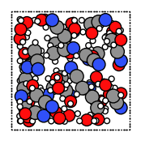
[code] 
    print('2-1 water-acetonitrile from explicit number of molecules and density, cubic box with auto-determined size')
    out, details = packmol(molecules=[water, acetonitrile], n_molecules=[32, 16], density=density, return_details=True)
    printsummary(out, details)
    out.write('water-acetonitrile-3.xyz')
    show(out)
    
[/code]
[code] 
    2-1 water-acetonitrile from explicit number of molecules and density, cubic box with auto-determined size
    192 atoms, density = 0.920 g/cm^3, box = 13.058, 13.058, 13.058, formula = C32H112N16O32
    #added molecules per species: [32, 16], mole fractions: [0.6666666666666666, 0.3333333333333333]
    
[/code]

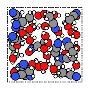
[code] 
    print('2-1 water-acetonitrile from explicit number of molecules and box')
    out = packmol(molecules=[water, acetonitrile], n_molecules=[32, 16], box_bounds=[0, 0, 0, 13.2, 13.2, 13.2])
    printsummary(out)
    out.write('water-acetonitrile-4.xyz')
    show(out)
    
[/code]
[code] 
    2-1 water-acetonitrile from explicit number of molecules and box
    192 atoms, density = 0.890 g/cm^3, box = 13.200, 13.200, 13.200, formula = C32H112N16O32
    
[/code]

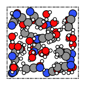

## Solid-liquid or solid-gas interfaces¶

First, create a slab using the ASE `fcc111` function
[code] 
    rotation = ('90x,0y,0z')  # sideview of slab
    figsize = (3,3)
    slab = fromASE(fcc111('Al', size=(4,6,3), vacuum=15.0, orthogonal=True, periodic=True))
    show(slab, figsize=figsize, rotation=rotation)
    
[/code]

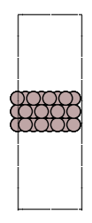
[code] 
    print('water surrounding an Al slab, from an approximate density')
    out = packmol_on_slab(slab, water, density=1.0)
    printsummary(out)
    out.write('al-water-pure.xyz')
    show(out, figsize=figsize, rotation=rotation)
    
[/code]
[code] 
    water surrounding an Al slab, from an approximate density
    534 atoms, density = 1.325 g/cm^3, box = 11.455, 14.881, 34.677, formula = Al72H308O154
    
[/code]

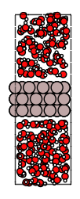
[code] 
    print('2-1 water-acetonitrile mixture surrounding an Al slab, from mole fractions and an approximate density')
    out = packmol_on_slab(slab, [water, acetonitrile], mole_fractions=[x_water, x_acetonitrile], density=density)
    printsummary(out)
    out.write('al-water-acetonitrile.xyz')
    show(out, figsize=figsize, rotation=rotation)
    
[/code]
[code] 
    2-1 water-acetonitrile mixture surrounding an Al slab, from mole fractions and an approximate density
    468 atoms, density = 1.260 g/cm^3, box = 11.455, 14.881, 34.677, formula = C66H231Al72N33O66
    
[/code]

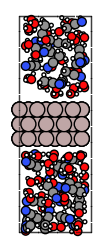

## Microsolvation¶

`packmol_microsolvation` can create a microsolvation sphere around a solute.
[code] 
    out = packmol_microsolvation(solute=acetonitrile, solvent=water, density=1.5, threshold=4.0)
    # for microsolvation it's a good idea to have a higher density than normal to get enough solvent molecules
    print(f"Microsolvated structure: {len(out)} atoms.")
    out.write('acetonitrile-microsolvated.xyz')
    show(out, figsize=figsize)
    
[/code]
[code] 
    Microsolvated structure: 81 atoms.
    
[/code]

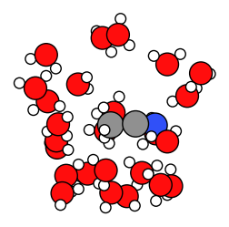

## Bonds, atom properties (force field types, regions, …)¶

The `packmol()` function accepts the arguments `keep_bonds` and `keep_atom_properties`. These options will keep the bonds defined for the constitutent molecules, as well as any atomic properties.

The bonds and atom properties are easiest to see by printing the System block for an AMS job:
[code] 
    water = from_smiles('O')
    n2 = from_smiles('N#N')
    
    # delete properties coming from from_smiles
    for at in water:
        at.properties = Settings()
    for at in n2:
        at.properties = Settings()
    
    water[1].properties.region = "oxygen_atom"
    water[2].properties.mass = 2.014   # deuterium
    water.delete_bond(water[1, 2]) # delete bond between atoms 1 and 2 (O and H)
    
[/code]
[code] 
    out = packmol([water, n2], n_molecules=[2, 1], density=0.5)
    print(AMSJob(molecule=out).get_input())
    
[/code]
[code] 
    system
      Atoms
                  O       3.0728760000       3.9143770000       1.9903040000 region=mol0,oxygen_atom
                  H       3.9160850000       3.5184940000       1.6850930000 mass=2.014 region=mol0
                  H       2.7876040000       4.6565520000       1.4140990000 region=mol0
                  O       4.9258210000       3.8909400000       3.9982150000 region=mol0,oxygen_atom
                  H       4.9810380000       3.6502800000       4.9468530000 mass=2.014 region=mol0
                  H       5.0008460000       4.8604790000       3.8619060000 region=mol0
                  N       1.1338120000       1.0294860000       0.9890770000 region=mol1
                  N       0.9243670000       1.6667980000       1.8734330000 region=mol1
      End
      BondOrders
         1 3 1.0
         4 6 1.0
         7 8 3.0
      End
      Lattice
             5.9692549746     0.0000000000     0.0000000000
             0.0000000000     5.9692549746     0.0000000000
             0.0000000000     0.0000000000     5.9692549746
      End
    End
    
[/code]

By default, the `packmol()` function assigns regions called `mol0`, `mol1`, etc. to the different added molecules. The `region_names` option lets you set custom names.
[code] 
    out = packmol(
        [water, n2], n_molecules=[2, 1], density=0.5,
        region_names=["water", "nitrogen_molecule"]
    )
    print(AMSJob(molecule=out).get_input())
    
[/code]
[code] 
    system
      Atoms
                  O       3.0728760000       3.9143770000       1.9903040000 region=oxygen_atom,water
                  H       3.9160850000       3.5184940000       1.6850930000 mass=2.014 region=water
                  H       2.7876040000       4.6565520000       1.4140990000 region=water
                  O       4.9258210000       3.8909400000       3.9982150000 region=oxygen_atom,water
                  H       4.9810380000       3.6502800000       4.9468530000 mass=2.014 region=water
                  H       5.0008460000       4.8604790000       3.8619060000 region=water
                  N       1.1338120000       1.0294860000       0.9890770000 region=nitrogen_molecule
                  N       0.9243670000       1.6667980000       1.8734330000 region=nitrogen_molecule
      End
      BondOrders
         1 3 1.0
         4 6 1.0
         7 8 3.0
      End
      Lattice
             5.9692549746     0.0000000000     0.0000000000
             0.0000000000     5.9692549746     0.0000000000
             0.0000000000     0.0000000000     5.9692549746
      End
    End
    
[/code]

Below, we also set `keep_atom_properties=False`, this will remove the previous regions (in this example “oxygen_atom”) and mass.
[code] 
    out = packmol(
        [water, n2], n_molecules=[2, 1], density=0.5,
        keep_atom_properties=False
    )
    print(AMSJob(molecule=out).get_input())
    
[/code]
[code] 
    system
      Atoms
                  O       3.0728760000       3.9143770000       1.9903040000 region=mol0
                  H       3.9160850000       3.5184940000       1.6850930000 region=mol0
                  H       2.7876040000       4.6565520000       1.4140990000 region=mol0
                  O       4.9258210000       3.8909400000       3.9982150000 region=mol0
                  H       4.9810380000       3.6502800000       4.9468530000 region=mol0
                  H       5.0008460000       4.8604790000       3.8619060000 region=mol0
                  N       1.1338120000       1.0294860000       0.9890770000 region=mol1
                  N       0.9243670000       1.6667980000       1.8734330000 region=mol1
      End
      BondOrders
         1 3 1.0
         4 6 1.0
         7 8 3.0
      End
      Lattice
             5.9692549746     0.0000000000     0.0000000000
             0.0000000000     5.9692549746     0.0000000000
             0.0000000000     0.0000000000     5.9692549746
      End
    End
    
[/code]

`keep_bonds=False` will additionally ignore any defined bonds:
[code] 
    out = packmol(
        [water, n2], n_molecules=[2, 1], density=0.5,
        region_names=["water", "nitrogen_molecule"],
        keep_bonds=False, keep_atom_properties=False
    )
    print(AMSJob(molecule=out).get_input())
    
[/code]
[code] 
    system
      Atoms
                  O       3.0728760000       3.9143770000       1.9903040000 region=water
                  H       3.9160850000       3.5184940000       1.6850930000 region=water
                  H       2.7876040000       4.6565520000       1.4140990000 region=water
                  O       4.9258210000       3.8909400000       3.9982150000 region=water
                  H       4.9810380000       3.6502800000       4.9468530000 region=water
                  H       5.0008460000       4.8604790000       3.8619060000 region=water
                  N       1.1338120000       1.0294860000       0.9890770000 region=nitrogen_molecule
                  N       0.9243670000       1.6667980000       1.8734330000 region=nitrogen_molecule
      End
      Lattice
             5.9692549746     0.0000000000     0.0000000000
             0.0000000000     5.9692549746     0.0000000000
             0.0000000000     0.0000000000     5.9692549746
      End
    End
    
[/code]

## Complete Python code¶
[code] 
    #!/usr/bin/env amspython
    # coding: utf-8
    
    # ## Initial imports
    
    from scm.plams import *
    from ase.optimize import BFGS
    from ase.build import molecule as ase_build_molecule
    from ase.visualize.plot import plot_atoms
    from ase.build import fcc111
    import matplotlib.pyplot as plt
    
    # ## Helper functions
    
    def printsummary(mol, details=None):
        s = f'{len(mol)} atoms, density = {mol.get_density()*1e-3:.3f} g/cm^3, box = {mol.lattice[0][0]:.3f}, {mol.lattice[1][1]:.3f}, {mol.lattice[2][2]:.3f}, formula = {mol.get_formula()}'
        if details:
            s+= f'\n#added molecules per species: {details["n_molecules"]}, mole fractions: {details["mole_fractions"]}'
        print(s)
        
    def show(mol, figsize=None, **kwargs):
        """ Show a molecule in a Jupyter notebook """
        plt.figure(figsize=figsize or (2,2))
        plt.axis('off')
        plot_atoms(toASE(mol), **kwargs)
    
    # ## Liquid water (fluid with 1 component)
    # First, create the gasphase molecule:
    
    water = from_smiles('O')
    show(water)
    
    print('pure liquid from approximate number of atoms and exact density (in g/cm^3), cubic box with auto-determined size')
    out = packmol(water, n_atoms=194, density=1.0)
    printsummary(out)
    out.write('water-1.xyz')
    show(out)
    
    print('pure liquid from approximate density (in g/cm^3) and an orthorhombic box')
    out = packmol(water, density=1.0, box_bounds=[0., 0., 0., 8., 12., 14.])
    printsummary(out)
    out.write('water-2.xyz')
    show(out)
    
    print('pure liquid with explicit number of molecules and exact density')
    out = packmol(water, n_molecules=64, density=1.0)
    printsummary(out)
    out.write('water-3.xyz')
    show(out)
    
    print('pure liquid with explicit number of molecules and box')
    out = packmol(water, n_molecules=64, box_bounds=[0., 0., 0., 12., 13., 14.])
    printsummary(out)
    out.write('water-4.xyz')
    show(out)
    
    print('water-5.xyz: pure liquid in non-orthorhombic box (requires AMS2022 or later)')
    # first place the molecules in a cuboid surrounding the desired lattice
    # then gradually change into the desired lattice using refine_lattice()
    # note that the molecules may become distorted by this procedure
    lattice = [[10., 2., -1.], [-5., 8., 0.], [0., -2., 11.]]
    temp_out = packmol(water, n_molecules=32, box_bounds=[
        0, 0, 0,
        max(lattice[i][0] for i in range(3))-min(lattice[i][0] for i in range(3)),
        max(lattice[i][1] for i in range(3))-min(lattice[i][1] for i in range(3)),
        max(lattice[i][2] for i in range(3))-min(lattice[i][2] for i in range(3))
    ])
    out = refine_lattice(temp_out, lattice=lattice)
    if out is not None:
        out.write('water-5.xyz')
        print('Top: system in surrounding orthorhombic box before calling refine_lattice(). Bottom: System in non-orthorhombic box after calling refine_lattice()')
        show(temp_out)
        show(out)
    
    # ## Water-acetonitrile mixture (fluid with 2 or more components)
    # Let's also create a single acetonitrile molecule:
    
    acetonitrile = from_smiles('CC#N')
    show(acetonitrile)
    
    # Set the desired mole fractions and density. Here, the density is calculated as the weighted average of water (1.0 g/cm^3) and acetonitrile (0.76 g/cm^3) densities, but you could use any other density.
    
    # MIXTURES
    x_water = 0.666                # mole fraction
    x_acetonitrile = 1-x_water     # mole fraction
    density = (x_water*1.0 + x_acetonitrile*0.76) / (x_water + x_acetonitrile)  # weighted average of pure component densities
    
    print(f'\nMIXTURES. x_water = {x_water:.3f}, x_acetonitrile = {x_acetonitrile:.3f}, target density = {density:.3f} g/cm^3\n')
    
    # By setting ``return_details=True``, you can get information about the mole fractions of the returned system. They may not exactly match the mole fractions you put in.
    
    print('2-1 water-acetonitrile from approximate number of atoms and exact density (in g/cm^3), cubic box with auto-determined size')
    out, details = packmol(molecules=[water, acetonitrile], mole_fractions=[x_water, x_acetonitrile], n_atoms=200, density=density, return_details=True)
    printsummary(out, details)
    out.write('water-acetonitrile-1.xyz')
    show(out)
    
    # The ``details`` is a dictionary as follows:
    
    for k, v in details.items():
        print(f'{k}: {v}')
    
    print('2-1 water-acetonitrile from approximate density (in g/cm^3) and box bounds')
    out, details = packmol(molecules=[water, acetonitrile], mole_fractions=[x_water, x_acetonitrile], box_bounds=[0, 0, 0, 13.2, 13.2, 13.2], density=density, return_details=True)
    printsummary(out, details)
    out.write('water-acetonitrile-2.xyz')
    show(out)
    
    print('2-1 water-acetonitrile from explicit number of molecules and density, cubic box with auto-determined size')
    out, details = packmol(molecules=[water, acetonitrile], n_molecules=[32, 16], density=density, return_details=True)
    printsummary(out, details)
    out.write('water-acetonitrile-3.xyz')
    show(out)
    
    print('2-1 water-acetonitrile from explicit number of molecules and box')
    out = packmol(molecules=[water, acetonitrile], n_molecules=[32, 16], box_bounds=[0, 0, 0, 13.2, 13.2, 13.2])
    printsummary(out)
    out.write('water-acetonitrile-4.xyz')
    show(out)
    
    # ## Solid-liquid or solid-gas interfaces
    # First, create a slab using the ASE ``fcc111`` function
    
    rotation = ('90x,0y,0z')  # sideview of slab
    figsize = (3,3)
    slab = fromASE(fcc111('Al', size=(4,6,3), vacuum=15.0, orthogonal=True, periodic=True))
    show(slab, figsize=figsize, rotation=rotation)
    
    print('water surrounding an Al slab, from an approximate density')
    out = packmol_on_slab(slab, water, density=1.0)
    printsummary(out)
    out.write('al-water-pure.xyz')
    show(out, figsize=figsize, rotation=rotation)
    
    print('2-1 water-acetonitrile mixture surrounding an Al slab, from mole fractions and an approximate density')
    out = packmol_on_slab(slab, [water, acetonitrile], mole_fractions=[x_water, x_acetonitrile], density=density)
    printsummary(out)
    out.write('al-water-acetonitrile.xyz')
    show(out, figsize=figsize, rotation=rotation)
    
    # ## Microsolvation
    # ``packmol_microsolvation`` can create a microsolvation sphere around a solute.
    
    out = packmol_microsolvation(solute=acetonitrile, solvent=water, density=1.5, threshold=4.0)
    # for microsolvation it's a good idea to have a higher density than normal to get enough solvent molecules
    print(f"Microsolvated structure: {len(out)} atoms.")
    out.write('acetonitrile-microsolvated.xyz')
    show(out, figsize=figsize)
    
    # ## Bonds, atom properties (force field types, regions, ...)
    # 
    # The ``packmol()`` function accepts the arguments ``keep_bonds`` and ``keep_atom_properties``. These options will keep the bonds defined for the constitutent molecules, as well as any atomic properties.
    # 
    # The bonds and atom properties are easiest to see by printing the System block for an AMS job:
    
    water = from_smiles('O')
    n2 = from_smiles('N#N')
    
    # delete properties coming from from_smiles
    for at in water:
        at.properties = Settings()
    for at in n2:
        at.properties = Settings()
        
    water[1].properties.region = "oxygen_atom"
    water[2].properties.mass = 2.014   # deuterium
    water.delete_bond(water[1, 2]) # delete bond between atoms 1 and 2 (O and H)
    
    out = packmol([water, n2], n_molecules=[2, 1], density=0.5)
    print(AMSJob(molecule=out).get_input())
    
    # By default, the ``packmol()`` function assigns regions called ``mol0``, ``mol1``, etc. to the different added molecules. The ``region_names`` option lets you set custom names. 
    
    out = packmol(
        [water, n2], n_molecules=[2, 1], density=0.5, 
        region_names=["water", "nitrogen_molecule"]
    )
    print(AMSJob(molecule=out).get_input())
    
    # Below, we also set ``keep_atom_properties=False``, this will remove the previous regions (in this example "oxygen_atom") and mass. 
    
    out = packmol(
        [water, n2], n_molecules=[2, 1], density=0.5, 
        keep_atom_properties=False
    )
    print(AMSJob(molecule=out).get_input())
    
    # ``keep_bonds=False`` will additionally ignore any defined bonds:
    
    out = packmol(
        [water, n2], n_molecules=[2, 1], density=0.5, 
        region_names=["water", "nitrogen_molecule"], 
        keep_bonds=False, keep_atom_properties=False
    )
    print(AMSJob(molecule=out).get_input())
    
[/code]

[Next ](../CustomASECalculator.html "Engine ASE: AMS geometry optimizer with forces from any ASE calculator") [ Previous](../ams_crs.html "ADF and COSMO-RS workflow")

* * *

  * ### Application Areas

    * [Batteries & PVs](https://www.scm.com/applications/batteries/)
    * [Bonding Analysis](https://www.scm.com/applications/chemical-bonding-analysis/)
    * [Catalysis](https://www.scm.com/applications/catalysis/)
    * [Heavy Elements](https://www.scm.com/applications/heavy-elements/)
    * [Inorganic Chemistry](https://www.scm.com/applications/inorganic-chemistry/)
    * [Life Sciences](https://www.scm.com/applications/pharma/)
    * [Materials Science](https://www.scm.com/applications/materials-science/)
    * [Nanotechnology](https://www.scm.com/applications/nanotechnology/)
    * [Oil and Gas](https://www.scm.com/applications/oil-and-gas/)
    * [Organic Electronics](https://www.scm.com/applications/organic-electronics/)
    * [Polymers](https://www.scm.com/applications/polymers/)
    * [Spectroscopy](https://www.scm.com/applications/spectroscopy/)
    * [Supercomputer / HPC](https://www.scm.com/applications/a-computing-center/)
    * [Teaching Computational Chemistry with AMS](https://www.scm.com/applications/teaching/)

  * ### Products

    * [AMS Driver](https://www.scm.com/product/ams/)
    * [ADF](https://www.scm.com/product/adf/)
    * [BAND](https://www.scm.com/product/band_periodicdft/)
    * [COSMO-RS](https://www.scm.com/product/cosmo-rs/)
    * [DFTB](https://www.scm.com/product/dftb/)
    * [GUI](https://www.scm.com/product/gui/)
    * [ML Potentials & FF](https://www.scm.com/product/machine-learning-potentials/)
    * [MOPAC](https://www.scm.com/product/mopac/)
    * [ParAMS](https://www.scm.com/product/params/)
    * [PLAMS](https://www.scm.com/product/plams/)
    * [Quantum ESPRESSO](https://www.scm.com/product/quantum-espresso/)
    * [ReaxFF](https://www.scm.com/product/reaxff/)
    * [Workflows](https://www.scm.com/product/advanced-workflows/)

  * ### Support

    * [Brochure](https://www.scm.com/amsterdam-modeling-suite/brochures/)
    * [Consulting & Contract Research](https://www.scm.com/amsterdam-modeling-suite/consulting/)
    * [Discussion List](https://www.scm.com/adf-discussion-list/)
    * [Documentation](https://www.scm.com/support/ams-tutorials-and-manuals/)
    * [Downloads](https://www.scm.com/support/downloads/)
    * [FAQs](https://www.scm.com/faq/)
    * [GUI Tutorials](https://www.scm.com/doc/Tutorials/GUI_overview/GUI_overview_tutorials.html)
    * [Installation](https://www.scm.com/support/ams-installation-videos/)
    * [Literature Highlights](https://www.scm.com/category/highlights/)
    * [Papers Citing ADF](https://www.scm.com/amsterdam-modeling-suite/research-papers-citing-adf/)
    * [Release Notes](https://www.scm.com/support/documentation-previous-versions/release-notes/)
    * [Support Overview](https://www.scm.com/support/)
    * [Teaching Materials](https://www.scm.com/support/background/amsterdam-modeling-suite-teaching-materials/)
    * [Videos](https://www.scm.com/amsterdam-modeling-suite/videos-tutorials-and-web-presentations/)
    * [Webinars](https://www.scm.com/about-us/news-agenda/web-presentations-by-adf-experts/)
    * [Workshops](https://www.scm.com/about-us/news-agenda/adf-hands-on-workshops/)

  * ### About Us

    * [Careers](https://www.scm.com/about-us/careers/)
    * [Collaborations](https://www.scm.com/about-us/collaborations/)
    * [Contact Us](https://www.scm.com/about-us/contact-us/)
    * [Contributors](https://www.scm.com/about-us/our-authors/)
    * [EU Projects](https://www.scm.com/about-us/eu-projects/)
    * [Events](https://www.scm.com/about-us/news-agenda/)
    * [Mission & Vision](https://www.scm.com/about-us/mission-vision/)
    * [News](https://www.scm.com/category/news/)
    * [Newsletters](https://www.scm.com/newsletters/)
    * [The SCM Team](https://www.scm.com/about-us/our-people/)

  * ### Pricing & Licensing

    * [License Terms](https://www.scm.com/amsterdam-modeling-suite/pricing-licensing/scm-license-terms/)
    * [Ordering](https://www.scm.com/amsterdam-modeling-suite/pricing-licensing/ordering-procedure/)
    * [Price Calculator](https://www.scm.com/amsterdam-modeling-suite/pricing-licensing/price-quote/calculate-your-price/)
    * [Price Quote](https://www.scm.com/amsterdam-modeling-suite/pricing-licensing/price-quote/)
    * [Pricing & Licensing](https://www.scm.com/amsterdam-modeling-suite/pricing-licensing/)
    * [Resellers](https://www.scm.com/amsterdam-modeling-suite/pricing-licensing/adf-resellers/)

  * [Copyright](https://www.scm.com/copyright/)
  * [Terms of Use](https://www.scm.com/terms-of-use/)
  * [Privacy Policy](https://www.scm.com/privacy-policy/)
