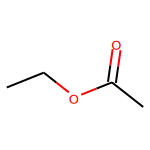
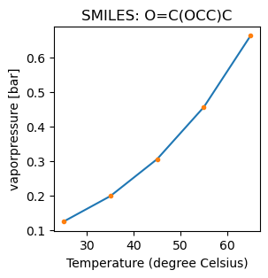
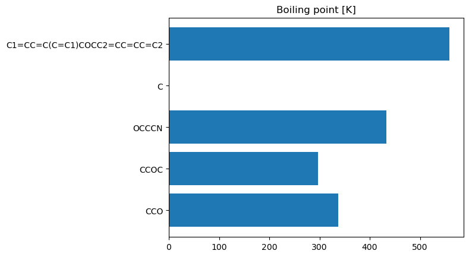

[Free trial](https://www.scm.com/free-trial/)

  * [Applications](https://www.scm.com/applications/ "Applications")
  * [Products](https://www.scm.com/amsterdam-modeling-suite/ "Products")
  * [Support](https://www.scm.com/support/ "Support")
  * [About us](https://www.scm.com/about-us/ "About us")

Search

  * 

Table of contents

  * [General](../../general.html)
  * [Introduction](../../intro.html)
  * [Getting started](../../started.html)
  * [Components overview](../../components/components.html)
  * [Interfaces](../../interfaces/interfaces.html)
  * [Examples](../examples.html)
    * [Getting Started](../examples.html#getting-started)
    * [Molecule analysis](../examples.html#molecule-analysis)
    * [Benchmarks](../examples.html#benchmarks)
    * [Workflows](../examples.html#workflows)
    * [COSMO-RS and property prediction](../examples.html#cosmo-rs-and-property-prediction)
      * Property Prediction
        * Initial imports
        * Property prediction from SMILES (ethyl acetate)
        * Create .csv for multiple compounds
        * Complete Python code
      * [ADF and COSMO-RS workflow](../ams_crs.html)
    * [Packmol and AMS-ASE interfaces](../examples.html#packmol-and-ams-ase-interfaces)
    * [ParAMS and pyZacros](../examples.html#params-and-pyzacros)
    * [Other AMS calculations](../examples.html#other-ams-calculations)
    * [Pymatgen](../examples.html#pymatgen)
    * [Pre-made recipes](../examples.html#pre-made-recipes)
  * [Cookbook](../../cookbook/cookbook.html)
  * [Citations](../../citations.html)

  * [FAQ](../../FAQ.html)

__[PLAMS](../../index.html)

  * [Documentation](../../PLAMS.html/../../Documentation/index.html)/
  * [PLAMS](../../index.html)/
  * [Examples](../examples.html)/
  * Property Prediction

# Property Prediction¶

This example shows how to quickly estimate properties of pure compounds in Python.

**Note** : This example requires AMS2023 or later.

See also

[Pure compounds property prediction documentation](../../../COSMO-RS/Property_Prediction.html)

To follow along, either

  * Download [`property_prediction.py`](../../_downloads/fa9dc930d452195b90ae2b7cbb65bcf3/property_prediction.py) (run as `$AMSBIN/amspython property_prediction.py`).

  * Download [`property_prediction.ipynb`](../../_downloads/c1af5d5e4957b9de347459d02cb8b6af/property_prediction.ipynb) (see also: how to install [Jupyterlab](../../../Scripting/Python_Stack/Python_Stack.html#install-and-run-jupyter-lab-jupyter-notebooks) in AMS)

## Initial imports¶
[code] 
    import pyCRS
    import matplotlib.pyplot as plt
    from rdkit import Chem
    from rdkit.Chem.Draw import IPythonConsole
    IPythonConsole.ipython_useSVG = True
    IPythonConsole.molSize = 150, 150
    
[/code]

## Property prediction from SMILES (ethyl acetate)¶
[code] 
    #smiles = 'CCO' # ethanol
    smiles = 'O=C(OCC)C' # ethyl acetate
    rdkit_mol = Chem.MolFromSmiles(smiles)
    rdkit_mol   # show the molecule in a Jupyter notebook
    
[/code]

### Temperature-independent properties¶
[code] 
    print(f"SMILES: {smiles}\n")
    mol = pyCRS.Input.read_smiles(smiles)
    
    temperatures = [298.15, 308.15, 318.15, 328.15, 338.15]
    pyCRS.PropPred.estimate(mol, temperatures=temperatures)
    
    for prop, value in mol.properties.items():
        unit = pyCRS.PropPred.units[prop]
        print(f'{prop:<20s}: {value:.3f} {unit}')
    
[/code]
[code] 
    SMILES: O=C(OCC)C
    
    boilingpoint        : 339.131 K
    criticalpressure    : 38.243 bar
    criticaltemp        : 544.189 K
    criticalvol         : 0.271 L/mol
    density             : 0.894 kg/L (298.15 K)
    dielectricconstant  : 6.834
    entropygas          : 382.780 J/(mol K)
    flashpoint          : 265.005 K
    gidealgas           : -323.540 kJ/mol
    hcombust            : -2075.882 kJ/mol
    hformstd            : -462.595 kJ/mol
    hfusion             : 11.717 kJ/mol
    hidealgas           : -437.815 kJ/mol
    hsublimation        : 55.394 kJ/mol
    meltingpoint        : 179.420 K
    molarvol            : 0.098 L/mol
    parachor            : 215.764
    solubilityparam     : 9.069 √(cal/cm^3)
    synacc              : 1.756
    tpt                 : 178.434 K
    vdwarea             : 129.168 Ų
    vdwvol              : 89.171 ų
    
[/code]

### Temperature-dependent properties (vapor pressure)¶
[code] 
    prop = 'vaporpressure'
    unit = pyCRS.PropPred.units[prop]
    temperatures_K, vaporpressures = mol.get_tdep_values(prop)
    temperatures_C = [t - 273.15 for t in temperatures_K]  # convert to Celsius
    
    plt.figure(figsize=(3,3))
    plt.plot(temperatures_C, vaporpressures)
    plt.plot(temperatures_C, vaporpressures, '.')
    plt.xlabel("Temperature (degree Celsius)")
    plt.title(f'SMILES: {smiles}')
    plt.ylabel(f"{prop} [{unit}]");
    
[/code]

## Create .csv for multiple compounds¶

Define a list of compounds by their SMILES strings. This example also shows how to only calculate a subset of all properties.

Note: The SMILES string ‘C’ corresponds to methane which is too small to be used with the property prediction tool, so the results are given as ‘nan’ (not a number).
[code] 
    smiles_list = [
        'CCO',
        'CCOC',
        'OCCCN',
        'C', # methane is too small to be used with property prediction and will return "nan"
        'C1=CC=C(C=C1)COCC2=CC=CC=C2'
    ]
    temperatures = list(range(280,340,10))
    
    mols = [pyCRS.Input.read_smiles(s) for s in smiles_list]
    
    properties = ["boilingpoint", "criticaltemp", "hformstd"]
    
    for mol in mols:
        pyCRS.PropPred.estimate(mol, properties, temperatures=temperatures)
    
[/code]
[code] 
    def get_csv(mols, properties):
        header = "SMILES"
        for prop in properties:
            unit = pyCRS.PropPred.units[prop]
            if unit:
                unit = f' [{unit}]'
            else:
                unit = ''
    
            header += f',{prop}{unit}'
        ret = header + '\n'
    
        for mol in mols:
            s = f'{mol.smiles}'
            for prop in properties:
                value = mol.properties.get(prop, '')
                try:
                    s += f',{value:.4f}'
                except TypeError:
                    s += f',{value}'
            s += '\n'
            ret += s
        return ret
    
[/code]
[code] 
    csv = get_csv(mols, properties)
    print(csv)
    
    # To write to a .csv file:
    #with open('outputfile.csv', 'w') as f:
    #    f.write(csv)
    
[/code]
[code] 
    SMILES,boilingpoint [K],criticaltemp [K],hformstd [kJ/mol]
    CCO,337.6259,442.0008,-271.9478
    CCOC,296.4144,425.7282,-213.6494
    OCCCN,432.7489,541.4748,-290.7921
    C,nan,nan,nan
    C1=CC=C(C=C1)COCC2=CC=CC=C2,558.7903,661.7012,-167.0454
    
[/code]

### Bar chart for multiple compounds¶

Continuing from the previous example, you can also create e.g. a bar chart with the boiling points:
[code] 
    prop = 'boilingpoint'
    values = [mol.properties.get(prop, None) for mol in mols]
    plt.barh(smiles_list, values)
    plt.title('Boiling point [K]');
    
[/code]

## Complete Python code¶
[code] 
    #!/usr/bin/env amspython
    # coding: utf-8
    
    # ## Initial imports
    
    import pyCRS
    import matplotlib.pyplot as plt
    from rdkit import Chem
    from rdkit.Chem.Draw import IPythonConsole
    IPythonConsole.ipython_useSVG = True
    IPythonConsole.molSize = 150, 150
    
    # ## Property prediction from SMILES (ethyl acetate)
    
    #smiles = 'CCO' # ethanol
    smiles = 'O=C(OCC)C' # ethyl acetate
    rdkit_mol = Chem.MolFromSmiles(smiles)
    rdkit_mol   # show the molecule in a Jupyter notebook
    
    # ### Temperature-independent properties
    
    print(f"SMILES: {smiles}\n")
    mol = pyCRS.Input.read_smiles(smiles)
    
    temperatures = [298.15, 308.15, 318.15, 328.15, 338.15]
    pyCRS.PropPred.estimate(mol, temperatures=temperatures) 
    
    for prop, value in mol.properties.items():
        unit = pyCRS.PropPred.units[prop]
        print(f'{prop:<20s}: {value:.3f} {unit}')
    
    # ### Temperature-dependent properties (vapor pressure)
    
    prop = 'vaporpressure'
    unit = pyCRS.PropPred.units[prop]
    temperatures_K, vaporpressures = mol.get_tdep_values(prop)
    temperatures_C = [t - 273.15 for t in temperatures_K]  # convert to Celsius
    
    plt.figure(figsize=(3,3))
    plt.plot(temperatures_C, vaporpressures)
    plt.plot(temperatures_C, vaporpressures, '.')
    plt.xlabel("Temperature (degree Celsius)")
    plt.title(f'SMILES: {smiles}')
    plt.ylabel(f"{prop} [{unit}]");
    
    # ## Create .csv for multiple compounds
    # 
    # Define a list of compounds by their SMILES strings. This example also shows how to only calculate a subset of all properties.
    # 
    # Note: The SMILES string 'C' corresponds to methane which is too small to be used with the property prediction tool, so the results are given as 'nan' (not a number).
    
    smiles_list = [
        'CCO', 
        'CCOC', 
        'OCCCN', 
        'C', # methane is too small to be used with property prediction and will return "nan"
        'C1=CC=C(C=C1)COCC2=CC=CC=C2'
    ]
    temperatures = list(range(280,340,10))
    
    mols = [pyCRS.Input.read_smiles(s) for s in smiles_list]
    
    properties = ["boilingpoint", "criticaltemp", "hformstd"]
    
    for mol in mols:
        pyCRS.PropPred.estimate(mol, properties, temperatures=temperatures) 
    
    def get_csv(mols, properties):
        header = "SMILES"
        for prop in properties:
            unit = pyCRS.PropPred.units[prop]
            if unit:
                unit = f' [{unit}]'
            else:
                unit = ''
                
            header += f',{prop}{unit}'
        ret = header + '\n'
        
        for mol in mols:
            s = f'{mol.smiles}'
            for prop in properties:
                value = mol.properties.get(prop, '')
                try:
                    s += f',{value:.4f}'
                except TypeError:
                    s += f',{value}'
            s += '\n'
            ret += s
        return ret
    
    csv = get_csv(mols, properties)
    print(csv)
    
    # To write to a .csv file:
    #with open('outputfile.csv', 'w') as f: 
    #    f.write(csv)
    
    # ### Bar chart for multiple compounds
    # 
    # Continuing from the previous example, you can also create e.g. a bar chart with the boiling points:
    
    prop = 'boilingpoint'
    values = [mol.properties.get(prop, None) for mol in mols]
    plt.barh(smiles_list, values)
    plt.title('Boiling point [K]');
    
[/code]

[Next ](../ams_crs.html "ADF and COSMO-RS workflow") [ Previous](../ConformersGeneration/ConformersGeneration.html "Conformers Generation")

* * *

  * ### Application Areas

    * [Batteries & PVs](https://www.scm.com/applications/batteries/)
    * [Bonding Analysis](https://www.scm.com/applications/chemical-bonding-analysis/)
    * [Catalysis](https://www.scm.com/applications/catalysis/)
    * [Heavy Elements](https://www.scm.com/applications/heavy-elements/)
    * [Inorganic Chemistry](https://www.scm.com/applications/inorganic-chemistry/)
    * [Life Sciences](https://www.scm.com/applications/pharma/)
    * [Materials Science](https://www.scm.com/applications/materials-science/)
    * [Nanotechnology](https://www.scm.com/applications/nanotechnology/)
    * [Oil and Gas](https://www.scm.com/applications/oil-and-gas/)
    * [Organic Electronics](https://www.scm.com/applications/organic-electronics/)
    * [Polymers](https://www.scm.com/applications/polymers/)
    * [Spectroscopy](https://www.scm.com/applications/spectroscopy/)
    * [Supercomputer / HPC](https://www.scm.com/applications/a-computing-center/)
    * [Teaching Computational Chemistry with AMS](https://www.scm.com/applications/teaching/)

  * ### Products

    * [AMS Driver](https://www.scm.com/product/ams/)
    * [ADF](https://www.scm.com/product/adf/)
    * [BAND](https://www.scm.com/product/band_periodicdft/)
    * [COSMO-RS](https://www.scm.com/product/cosmo-rs/)
    * [DFTB](https://www.scm.com/product/dftb/)
    * [GUI](https://www.scm.com/product/gui/)
    * [ML Potentials & FF](https://www.scm.com/product/machine-learning-potentials/)
    * [MOPAC](https://www.scm.com/product/mopac/)
    * [ParAMS](https://www.scm.com/product/params/)
    * [PLAMS](https://www.scm.com/product/plams/)
    * [Quantum ESPRESSO](https://www.scm.com/product/quantum-espresso/)
    * [ReaxFF](https://www.scm.com/product/reaxff/)
    * [Workflows](https://www.scm.com/product/advanced-workflows/)

  * ### Support

    * [Brochure](https://www.scm.com/amsterdam-modeling-suite/brochures/)
    * [Consulting & Contract Research](https://www.scm.com/amsterdam-modeling-suite/consulting/)
    * [Discussion List](https://www.scm.com/adf-discussion-list/)
    * [Documentation](https://www.scm.com/support/ams-tutorials-and-manuals/)
    * [Downloads](https://www.scm.com/support/downloads/)
    * [FAQs](https://www.scm.com/faq/)
    * [GUI Tutorials](https://www.scm.com/doc/Tutorials/GUI_overview/GUI_overview_tutorials.html)
    * [Installation](https://www.scm.com/support/ams-installation-videos/)
    * [Literature Highlights](https://www.scm.com/category/highlights/)
    * [Papers Citing ADF](https://www.scm.com/amsterdam-modeling-suite/research-papers-citing-adf/)
    * [Release Notes](https://www.scm.com/support/documentation-previous-versions/release-notes/)
    * [Support Overview](https://www.scm.com/support/)
    * [Teaching Materials](https://www.scm.com/support/background/amsterdam-modeling-suite-teaching-materials/)
    * [Videos](https://www.scm.com/amsterdam-modeling-suite/videos-tutorials-and-web-presentations/)
    * [Webinars](https://www.scm.com/about-us/news-agenda/web-presentations-by-adf-experts/)
    * [Workshops](https://www.scm.com/about-us/news-agenda/adf-hands-on-workshops/)

  * ### About Us

    * [Careers](https://www.scm.com/about-us/careers/)
    * [Collaborations](https://www.scm.com/about-us/collaborations/)
    * [Contact Us](https://www.scm.com/about-us/contact-us/)
    * [Contributors](https://www.scm.com/about-us/our-authors/)
    * [EU Projects](https://www.scm.com/about-us/eu-projects/)
    * [Events](https://www.scm.com/about-us/news-agenda/)
    * [Mission & Vision](https://www.scm.com/about-us/mission-vision/)
    * [News](https://www.scm.com/category/news/)
    * [Newsletters](https://www.scm.com/newsletters/)
    * [The SCM Team](https://www.scm.com/about-us/our-people/)

  * ### Pricing & Licensing

    * [License Terms](https://www.scm.com/amsterdam-modeling-suite/pricing-licensing/scm-license-terms/)
    * [Ordering](https://www.scm.com/amsterdam-modeling-suite/pricing-licensing/ordering-procedure/)
    * [Price Calculator](https://www.scm.com/amsterdam-modeling-suite/pricing-licensing/price-quote/calculate-your-price/)
    * [Price Quote](https://www.scm.com/amsterdam-modeling-suite/pricing-licensing/price-quote/)
    * [Pricing & Licensing](https://www.scm.com/amsterdam-modeling-suite/pricing-licensing/)
    * [Resellers](https://www.scm.com/amsterdam-modeling-suite/pricing-licensing/adf-resellers/)

  * [Copyright](https://www.scm.com/copyright/)
  * [Terms of Use](https://www.scm.com/terms-of-use/)
  * [Privacy Policy](https://www.scm.com/privacy-policy/)
