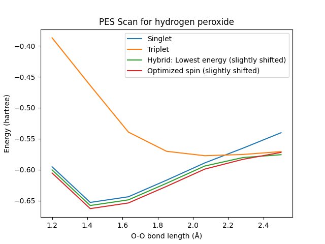

[Free trial](https://www.scm.com/free-trial/)

  * [Applications](https://www.scm.com/applications/ "Applications")
  * [Products](https://www.scm.com/amsterdam-modeling-suite/ "Products")
  * [Support](https://www.scm.com/support/ "Support")
  * [About us](https://www.scm.com/about-us/ "About us")

Search

  * 

Table of contents

  * [General](../general.html)
  * [Introduction](../intro.html)
  * [Getting started](../started.html)
  * [Components overview](../components/components.html)
  * [Interfaces](../interfaces/interfaces.html)
  * [Examples](examples.html)
    * [Getting Started](examples.html#getting-started)
    * [Molecule analysis](examples.html#molecule-analysis)
    * [Benchmarks](examples.html#benchmarks)
    * [Workflows](examples.html#workflows)
    * [COSMO-RS and property prediction](examples.html#cosmo-rs-and-property-prediction)
    * [Packmol and AMS-ASE interfaces](examples.html#packmol-and-ams-ase-interfaces)
    * [ParAMS and pyZacros](examples.html#params-and-pyzacros)
    * [Other AMS calculations](examples.html#other-ams-calculations)
      * [BAND: NiO with DFT+U](BAND_NiO_HubbardU.html)
      * [Band structure](BandStructure/BandStructure.html)
      * [AMS biased MD / PLUMED](AMSPlumedMD/AMSPlumedMD.html)
      * [Quantum ESPRESSO as an AMS engine: Antiferromagnetic FeO](QE_AMS_AFM_HubbardU.html)
      * [Basic molecular dynamics analysis](BasicMDPostanalysis.html)
      * Hybrid engine: Use lowest energy
      * [Universal Potential: M3GNet-UP-2022](M3GNet.html)
    * [Pymatgen](examples.html#pymatgen)
    * [Pre-made recipes](examples.html#pre-made-recipes)
  * [Cookbook](../cookbook/cookbook.html)
  * [Citations](../citations.html)

  * [FAQ](../FAQ.html)

__[PLAMS](../index.html)

  * [Documentation](../PLAMS.html/../../Documentation/index.html)/
  * [PLAMS](../index.html)/
  * [Examples](examples.html)/
  * Hybrid engine: Use lowest energy

# Hybrid engine: Use lowest energy¶

**Note** : This example requires AMS2023 or later.

If you are unsure of the lowest energy spin state for a structure, the safest way is to try multiple different possibilities. Starting from AMS2023, this can be done with the [AMS Hybrid engine](../../Hybrid/EngineOptions.html) together with the option DynamicFactors=UseLowestEnergy.

In this example, the hybrid engine is used to replay a PES Scan of a dissociating hydrogen peroxide molecule. For each bond length, both singlet and triplet states are evaluated. The resulting energy-vs-bond-length curve will only give the lowest energy for each bond length. This can be useful if you want to import such a bond scan into for example ParAMS for parametrization.

You may also try to optimize the spin using the OptimizeSpinRound feature of the ADF engine. This can be done in combination with an ElectronicTemperature. The energies are then not as accurate.

**Example usage:** ([`Download UseLowestEnergy.py`](../_downloads/38c96aa49c3fff453fe2175099374beb/UseLowestEnergy.py))

[code] 
    #!/usr/bin/env plams
    import matplotlib.pyplot as plt
    
    """
    Example showing the UseLowestEnergy feature of the Hybrid engine and the OptimizeSpinRound feature of the ADF engine.
    
    A bond scan is performed on hydrogen peroxide with UFF. The resulting
    structures are then recalculated with DFT using four different setups. In
    particular, one setup uses the Hybrid engine with DynamicFactors=UseLowestEnergy.
    Another uses the ADF engine with OptimizeSpinRound in combination with an ElectronicTemperature.
    
    In the end, the results of energy vs. bond length are plotted.
    
    To run this example:
    $AMSBIN/plams UseLowestEnergy.py
    """
    
    def main():
        #config.job.runscript.nproc = 1 # uncomment to run all jobs in serial
    
        pesscan_job = initial_pesscan()
        rkf = pesscan_job.results.rkfpath()
        singlet_job = replay_job(rkf, 'singlet')
        triplet_job = replay_job(rkf, 'triplet')
        hybrid_job  = replay_job(rkf, 'hybrid')
        optimizespin_job = replay_job(rkf, 'optimizespin')
    
        # or load the finished jobs from disk:
        #pesscan_job = AMSJob.load_external('plams_workdir.002/initial_pesscan/ams.rkf')
        #rkf = pesscan_job.results.rkfpath()
        #singlet_job = AMSJob.load_external('plams_workdir.002/singlet/ams.rkf')
        #triplet_job = AMSJob.load_external('plams_workdir.002/triplet/ams.rkf')
        #hybrid_job = AMSJob.load_external('plams_workdir.002/hybrid/ams.rkf')
        #optimizespin_job = AMSJob.load_external('plams_workdir.002/optimizespin/ams.rkf')
    
        plot_results(singlet_job, triplet_job, hybrid_job, optimizespin_job)
    
    def initial_pesscan():
        """ Run a bond scan for hydrogen peroxide with UFF. Returns the finished job """
        mol = from_smiles('OO') # hydrogen peroxide
        s = Settings()
        s.input.ams.Task = 'PESScan'
        s.input.ams.PESScan.ScanCoordinate.nPoints = 7
        # Scan O-O bond length (atoms 1 and 2) between 1.2 and 2.5 Å
        s.input.ams.PESScan.ScanCoordinate.Distance = '2 1 1.2 2.5'
        s.input.ForceField.Type = 'UFF'
        job = AMSJob(settings=s, molecule=mol, name='initial_pesscan')
        job.run()
        return job
    
    def singlet_settings(header=''):
        s = Settings()
        s.Unrestricted = 'No'
        s.XC.GGA = 'PBE'
        s.Basis.Type = 'DZP'
        s.SCF.Iterations = 100
        s._h = header
        return s
    
    def triplet_settings(header=''):
        s = Settings()
        s.Unrestricted = 'Yes'
        s.SpinPolarization = 2
        s.XC.GGA = 'PBE'
        s.Basis.Type = 'DZP'
        s.SCF.Iterations = 100
        s._h = header
        return s
    
    def hybrid_settings():
        """ Look at the file plams_workdir/hybrid/hybrid.in to see how the below is translated into text input for the hybrid engine """
        s = Settings()
        s.input.Hybrid.Energy.DynamicFactors = 'UseLowestEnergy'
    
        s.input.Hybrid.Energy.Term = [ 'Region=* EngineID=Singlet', 
                                       'Region=* EngineID=Triplet' ]
    
        s.input.Hybrid.Engine = [ singlet_settings('ADF Singlet'), 
                                  triplet_settings('ADF Triplet') ]
        return s
    
    def replay_job(rkf, engine='hybrid'):
        """ Replay the structures from the UFF pesscan with ADF. Use three different engines:
            Hybrid: This will run all structures with both Singlet and Triplet and pick the lowest energy
            Singlet: This runs all structures using the Singlet settings
            Triplet: This runs all structures using the Triplet settings
    
            Returns the finished job
        """
        s = Settings()
        if engine == 'hybrid':
            s = hybrid_settings()
        elif engine == 'singlet':
            s.input.adf = singlet_settings()
        elif engine == 'triplet':
            s.input.adf = triplet_settings()
        elif engine == 'optimizespin':
            s.input.adf = triplet_settings()
            s.input.adf.Occupations = 'ElectronicTemperature=300 OptimizeSpinRound=0.05'
    
        s.input.ams.Task = 'Replay'
        s.input.ams.Replay.File = rkf
    
        job = AMSJob(settings=s, name=engine)
        job.run()
        return job
    
    def plot_results(singlet_job, triplet_job, hybrid_job, optimizespin_job):
        """
            Generate a plot of the energy vs. bond length for the three different jobs.  Saves a plot to pesplot.png.
        """
        bondlengths = singlet_job.results.get_pesscan_results()['RaveledPESCoords'][0]
        bondlengths = Units.convert(bondlengths, 'bohr', 'angstrom')
    
        singlet_pes = singlet_job.results.get_pesscan_results()['PES']
        triplet_pes = triplet_job.results.get_pesscan_results()['PES']
        hybrid_pes  = hybrid_job.results.get_pesscan_results()['PES']
        hybrid_pes = [x-0.005 for x in hybrid_pes] # slightly downshift for visual clarity when plotting
        optimizespin_pes = optimizespin_job.results.get_pesscan_results()['PES']
        optimizespin_pes = [x-0.010 for x in optimizespin_pes] # slightly downshift for visual clarity when plotting
    
        plt.plot(bondlengths, singlet_pes)
        plt.plot(bondlengths, triplet_pes)
        plt.plot(bondlengths, hybrid_pes)
        plt.plot(bondlengths, optimizespin_pes)
        plt.title("PES Scan for hydrogen peroxide")
        plt.xlabel("O-O bond length (Å)")
        plt.ylabel("Energy (hartree)")
        plt.legend(["Singlet", "Triplet", "Hybrid: Lowest energy (slightly shifted)", "Optimized spin (slightly shifted)"])
        plt.savefig("pesplot.png")
        plt.show()
    
    if __name__ == '__main__':
        main()
    
[/code]

[Next ](M3GNet.html "Universal Potential: M3GNet-UP-2022") [ Previous](BasicMDPostanalysis.html "Basic molecular dynamics analysis")

* * *

  * ### Application Areas

    * [Batteries & PVs](https://www.scm.com/applications/batteries/)
    * [Bonding Analysis](https://www.scm.com/applications/chemical-bonding-analysis/)
    * [Catalysis](https://www.scm.com/applications/catalysis/)
    * [Heavy Elements](https://www.scm.com/applications/heavy-elements/)
    * [Inorganic Chemistry](https://www.scm.com/applications/inorganic-chemistry/)
    * [Life Sciences](https://www.scm.com/applications/pharma/)
    * [Materials Science](https://www.scm.com/applications/materials-science/)
    * [Nanotechnology](https://www.scm.com/applications/nanotechnology/)
    * [Oil and Gas](https://www.scm.com/applications/oil-and-gas/)
    * [Organic Electronics](https://www.scm.com/applications/organic-electronics/)
    * [Polymers](https://www.scm.com/applications/polymers/)
    * [Spectroscopy](https://www.scm.com/applications/spectroscopy/)
    * [Supercomputer / HPC](https://www.scm.com/applications/a-computing-center/)
    * [Teaching Computational Chemistry with AMS](https://www.scm.com/applications/teaching/)

  * ### Products

    * [AMS Driver](https://www.scm.com/product/ams/)
    * [ADF](https://www.scm.com/product/adf/)
    * [BAND](https://www.scm.com/product/band_periodicdft/)
    * [COSMO-RS](https://www.scm.com/product/cosmo-rs/)
    * [DFTB](https://www.scm.com/product/dftb/)
    * [GUI](https://www.scm.com/product/gui/)
    * [ML Potentials & FF](https://www.scm.com/product/machine-learning-potentials/)
    * [MOPAC](https://www.scm.com/product/mopac/)
    * [ParAMS](https://www.scm.com/product/params/)
    * [PLAMS](https://www.scm.com/product/plams/)
    * [Quantum ESPRESSO](https://www.scm.com/product/quantum-espresso/)
    * [ReaxFF](https://www.scm.com/product/reaxff/)
    * [Workflows](https://www.scm.com/product/advanced-workflows/)

  * ### Support

    * [Brochure](https://www.scm.com/amsterdam-modeling-suite/brochures/)
    * [Consulting & Contract Research](https://www.scm.com/amsterdam-modeling-suite/consulting/)
    * [Discussion List](https://www.scm.com/adf-discussion-list/)
    * [Documentation](https://www.scm.com/support/ams-tutorials-and-manuals/)
    * [Downloads](https://www.scm.com/support/downloads/)
    * [FAQs](https://www.scm.com/faq/)
    * [GUI Tutorials](https://www.scm.com/doc/Tutorials/GUI_overview/GUI_overview_tutorials.html)
    * [Installation](https://www.scm.com/support/ams-installation-videos/)
    * [Literature Highlights](https://www.scm.com/category/highlights/)
    * [Papers Citing ADF](https://www.scm.com/amsterdam-modeling-suite/research-papers-citing-adf/)
    * [Release Notes](https://www.scm.com/support/documentation-previous-versions/release-notes/)
    * [Support Overview](https://www.scm.com/support/)
    * [Teaching Materials](https://www.scm.com/support/background/amsterdam-modeling-suite-teaching-materials/)
    * [Videos](https://www.scm.com/amsterdam-modeling-suite/videos-tutorials-and-web-presentations/)
    * [Webinars](https://www.scm.com/about-us/news-agenda/web-presentations-by-adf-experts/)
    * [Workshops](https://www.scm.com/about-us/news-agenda/adf-hands-on-workshops/)

  * ### About Us

    * [Careers](https://www.scm.com/about-us/careers/)
    * [Collaborations](https://www.scm.com/about-us/collaborations/)
    * [Contact Us](https://www.scm.com/about-us/contact-us/)
    * [Contributors](https://www.scm.com/about-us/our-authors/)
    * [EU Projects](https://www.scm.com/about-us/eu-projects/)
    * [Events](https://www.scm.com/about-us/news-agenda/)
    * [Mission & Vision](https://www.scm.com/about-us/mission-vision/)
    * [News](https://www.scm.com/category/news/)
    * [Newsletters](https://www.scm.com/newsletters/)
    * [The SCM Team](https://www.scm.com/about-us/our-people/)

  * ### Pricing & Licensing

    * [License Terms](https://www.scm.com/amsterdam-modeling-suite/pricing-licensing/scm-license-terms/)
    * [Ordering](https://www.scm.com/amsterdam-modeling-suite/pricing-licensing/ordering-procedure/)
    * [Price Calculator](https://www.scm.com/amsterdam-modeling-suite/pricing-licensing/price-quote/calculate-your-price/)
    * [Price Quote](https://www.scm.com/amsterdam-modeling-suite/pricing-licensing/price-quote/)
    * [Pricing & Licensing](https://www.scm.com/amsterdam-modeling-suite/pricing-licensing/)
    * [Resellers](https://www.scm.com/amsterdam-modeling-suite/pricing-licensing/adf-resellers/)

  * [Copyright](https://www.scm.com/copyright/)
  * [Terms of Use](https://www.scm.com/terms-of-use/)
  * [Privacy Policy](https://www.scm.com/privacy-policy/)
