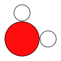
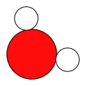

[Free trial](https://www.scm.com/free-trial/)

  * [Applications](https://www.scm.com/applications/ "Applications")
  * [Products](https://www.scm.com/amsterdam-modeling-suite/ "Products")
  * [Support](https://www.scm.com/support/ "Support")
  * [About us](https://www.scm.com/about-us/ "About us")

Search

  * 

Table of contents

  * [General](../general.html)
  * [Introduction](../intro.html)
  * [Getting started](../started.html)
  * [Components overview](../components/components.html)
  * [Interfaces](../interfaces/interfaces.html)
  * [Examples](examples.html)
    * [Getting Started](examples.html#getting-started)
      * Geometry optimization of water
        * Initial imports
        * Initial structure
        * Calculation settings
        * Create an AMSJob
        * Run the job
        * Main results files: ams.rkf and dftb.rkf
        * Optimized coordinates
        * Optimized bond lengths and angle
        * Calculation timing
        * Energy
        * Vibrational frequencies
        * Dipole moment
        * HOMO, LUMO, and HOMO-LUMO gap
        * Read results directly from binary .rkf files
        * Finish PLAMS
      * [AMS Settings: Chemical System (Molecule)](Settings/AMSSettingsSystem.html)
      * [Helium dimer dissociation curve](He2DissociationCurve.html)
      * [Many jobs in parallel](ManyJobsInParallel.html)
    * [Molecule analysis](examples.html#molecule-analysis)
    * [Benchmarks](examples.html#benchmarks)
    * [Workflows](examples.html#workflows)
    * [COSMO-RS and property prediction](examples.html#cosmo-rs-and-property-prediction)
    * [Packmol and AMS-ASE interfaces](examples.html#packmol-and-ams-ase-interfaces)
    * [ParAMS and pyZacros](examples.html#params-and-pyzacros)
    * [Other AMS calculations](examples.html#other-ams-calculations)
    * [Pymatgen](examples.html#pymatgen)
    * [Pre-made recipes](examples.html#pre-made-recipes)
  * [Cookbook](../cookbook/cookbook.html)
  * [Citations](../citations.html)

  * [FAQ](../FAQ.html)

__[PLAMS](../index.html)

  * [Documentation](../PLAMS.html/../../Documentation/index.html)/
  * [PLAMS](../index.html)/
  * [Examples](examples.html)/
  * Geometry optimization of water

# Geometry optimization of water¶

If you’re a first-time PLAMS user, also check out the [Getting started PLAMS tutorial](../../Tutorials/WorkflowsAndAutomation/PythonScriptingWithPLAMS.html)!

Note

To execute this PLAMS script:

  * [`Download water_optimization.py`](../_downloads/a0ae74f5763748d50214ff78311bf22e/water_optimization.py)

  * `$AMSBIN/plams water_optimization.py`

This example shows how to perform a geometry optimization of a water molecule and compute the vibrational normal modes using GFN1-xTB.

If you do not have a DFTB license, remove the line with DFTB settings and instead set `settings.input.ForceField.Type = 'UFF'`

## Initial imports¶

These two lines are not needed if you run PLAMS using the `$AMSBIN/plams` program. They are only needed if you use `$AMSBIN/amspython`.
[code] 
    from scm.plams import *
    init()
    
[/code]
[code] 
    PLAMS working folder: plams_workdir
    
[/code]

## Initial structure¶
[code] 
    # You could also load the geometry from an xyz file:
    # molecule = Molecule('path/my_molecule.xyz')
    # or generate a molecule from SMILES:
    # molecule = from_smiles('O')
    molecule = Molecule()
    molecule.add_atom(Atom(symbol='O', coords=(0,0,0)))
    molecule.add_atom(Atom(symbol='H', coords=(1,0,0)))
    molecule.add_atom(Atom(symbol='H', coords=(0,1,0)))
    
[/code]
[code] 
    try: plot_molecule(molecule) # plot molecule in a Jupyter Notebook in AMS2023+
    except NameError: pass
    
[/code]

## Calculation settings¶

The calculation settings are stored in a `Settings` object, which is a type of nested dictionary.
[code] 
    settings = Settings()
    settings.input.ams.Task = 'GeometryOptimization'
    settings.input.ams.Properties.NormalModes = 'Yes'
    settings.input.DFTB.Model = 'GFN1-xTB'
    #settings.input.ForceField.Type = 'UFF' # set this instead of DFTB if you do not have a DFTB license. You will then not be able to extract the HOMO and LUMO energies.
    
[/code]

## Create an AMSJob¶
[code] 
    job = AMSJob(molecule=molecule, settings=settings, name='water_optimization')
    
[/code]

You can check the input to AMS by calling the `get_input()` method:
[code] 
    print("-- input to the job --")
    print(job.get_input())
    print("-- end of input --")
    
[/code]
[code] 
    -- input to the job --
    Properties
      NormalModes Yes
    End
    
    Task GeometryOptimization
    
    system
      Atoms
                  O       0.0000000000       0.0000000000       0.0000000000
                  H       1.0000000000       0.0000000000       0.0000000000
                  H       0.0000000000       1.0000000000       0.0000000000
      End
    End
    
    Engine DFTB
      Model GFN1-xTB
    EndEngine
    
    -- end of input --
    
[/code]

## Run the job¶
[code] 
    job.run();
    
[/code]
[code] 
    [23.01|18:55:53] JOB water_optimization STARTED
    [23.01|18:55:53] JOB water_optimization RUNNING
    [23.01|18:55:55] JOB water_optimization FINISHED
    [23.01|18:55:55] JOB water_optimization SUCCESSFUL
    
[/code]

## Main results files: ams.rkf and dftb.rkf¶

The paths to the main binary results files `ams.rkf` and `dftb.rkf` can be retrieved as follows:
[code] 
    print(job.results.rkfpath(file='ams'))
    print(job.results.rkfpath(file='engine'))
    
[/code]
[code] 
    plams_workdir/water_optimization/ams.rkf
    plams_workdir/water_optimization/dftb.rkf
    
[/code]

## Optimized coordinates¶
[code] 
    optimized_molecule = job.results.get_main_molecule()
    
    print("Optimized coordinates")
    print("---------------------")
    print(optimized_molecule)
    print("---------------------")
    
[/code]
[code] 
    Optimized coordinates
    ---------------------
      Atoms:
        1         O       0.066921       0.066921       0.000000
        2         H       1.012042      -0.078963       0.000000
        3         H      -0.078963       1.012042       0.000000
    
    ---------------------
    
[/code]
[code] 
    try: plot_molecule(optimized_molecule) # plot molecule in a Jupyter Notebook in AMS2023+
    except NameError: pass
    
[/code]

## Optimized bond lengths and angle¶

Unlike python lists, where the index of the first element is 0, the index of the first atom in the molecule object is 1.
[code] 
    bond_length = optimized_molecule[1].distance_to(optimized_molecule[2])
    print('O-H bond length: {:.3f} angstrom'.format(bond_length))
    
[/code]
[code] 
    O-H bond length: 0.956 angstrom
    
[/code]
[code] 
    bond_angle = optimized_molecule[1].angle(optimized_molecule[2], optimized_molecule[3])
    print('Bond angle  : {:.1f} degrees'.format(Units.convert(bond_angle, 'rad', 'degree')))
    
[/code]
[code] 
    Bond angle  : 107.5 degrees
    
[/code]

## Calculation timing¶
[code] 
    timings = job.results.get_timings()
    
    print("Timings")
    print("-------")
    for key, value in timings.items():
        print(f'{key:<20s}: {value:.3f} seconds')
    print("-------")
    
[/code]
[code] 
    Timings
    -------
    elapsed             : 0.953 seconds
    system              : 0.045 seconds
    cpu                 : 0.712 seconds
    -------
    
[/code]

## Energy¶
[code] 
    energy = job.results.get_energy(unit='kcal/mol')
    
    print('Energy      : {:.3f} kcal/mol'.format(energy))
    
[/code]
[code] 
    Energy      : -3618.400 kcal/mol
    
[/code]

## Vibrational frequencies¶
[code] 
    frequencies = job.results.get_frequencies(unit='cm^-1')
    
    print("Frequencies")
    print("-----------")
    for freq in frequencies:
        print(f'{freq:.3f} cm^-1')
    print("-----------")
    
[/code]
[code] 
    Frequencies
    -----------
    1427.924 cm^-1
    3674.507 cm^-1
    3785.960 cm^-1
    -----------
    
[/code]

## Dipole moment¶
[code] 
    import numpy as np
    try:
        dipole_moment = np.linalg.norm(np.array(job.results.get_dipolemoment()))
        dipole_moment *= Units.convert(1.0, 'au', 'debye')
        print('Dipole moment: {:.3f} debye'.format(dipole_moment))
    except KeyError:
        print("Couldn't extract the dipole moment")
    
[/code]
[code] 
    Dipole moment: 1.830 debye
    
[/code]

## HOMO, LUMO, and HOMO-LUMO gap¶

Note: The methods for extracting HOMO, LUMO, and HOMO-LUMO gap only exist in AMS2023 and later.
[code] 
    try:
        homo = job.results.get_homo_energies(unit='eV')[0]
        lumo = job.results.get_lumo_energies(unit='eV')[0]
        homo_lumo_gap = job.results.get_smallest_homo_lumo_gap(unit='eV')
    
        print('HOMO        : {:.3f} eV'.format(homo))
        print('LUMO        : {:.3f} eV'.format(lumo))
        print('HOMO-LUMO gap : {:.3f} eV'.format(homo_lumo_gap))
    except AttributeError:
        print("Methods to extract HOMO and LUMO require AMS2023 or later")
    except KeyError:
        print("Couldn't extract the HOMO and LUMO.")
    
[/code]
[code] 
    HOMO        : -13.593 eV
    LUMO        : -4.206 eV
    HOMO-LUMO gap : 9.387 eV
    
[/code]

## Read results directly from binary .rkf files¶

You can also read results directly from the binary .rkf files. Use the “expert mode” of the KFbrowser program that comes with AMS to find out which section and variable to read.

Below, we show how to extract the `AMSResults%Energy` variable from the dftb.rkf file. This is the same number that was extracted previously using the `job.results.get_energy()` method.
[code] 
    energy = job.results.readrkf('AMSResults', 'Energy', file='engine')
    print(f"Energy from the engine .rkf file (in hartree): {energy}")
    
[/code]
[code] 
    Energy from the engine .rkf file (in hartree): -5.766288141072482
    
[/code]

## Finish PLAMS¶

The `finish()` method is called automatically if you run the script with `$AMSBIN/plams`. You should only call it if you use `$AMSBIN/amspython` to run the script.
[code] 
    finish()
    
[/code]
[code] 
    [23.01|18:55:55] PLAMS run finished. Goodbye
    
[/code]

[Next ](Settings/AMSSettingsSystem.html "AMS Settings: Chemical System \(Molecule\)") [ Previous](examples.html "Examples")

* * *

  * ### Application Areas

    * [Batteries & PVs](https://www.scm.com/applications/batteries/)
    * [Bonding Analysis](https://www.scm.com/applications/chemical-bonding-analysis/)
    * [Catalysis](https://www.scm.com/applications/catalysis/)
    * [Heavy Elements](https://www.scm.com/applications/heavy-elements/)
    * [Inorganic Chemistry](https://www.scm.com/applications/inorganic-chemistry/)
    * [Life Sciences](https://www.scm.com/applications/pharma/)
    * [Materials Science](https://www.scm.com/applications/materials-science/)
    * [Nanotechnology](https://www.scm.com/applications/nanotechnology/)
    * [Oil and Gas](https://www.scm.com/applications/oil-and-gas/)
    * [Organic Electronics](https://www.scm.com/applications/organic-electronics/)
    * [Polymers](https://www.scm.com/applications/polymers/)
    * [Spectroscopy](https://www.scm.com/applications/spectroscopy/)
    * [Supercomputer / HPC](https://www.scm.com/applications/a-computing-center/)
    * [Teaching Computational Chemistry with AMS](https://www.scm.com/applications/teaching/)

  * ### Products

    * [AMS Driver](https://www.scm.com/product/ams/)
    * [ADF](https://www.scm.com/product/adf/)
    * [BAND](https://www.scm.com/product/band_periodicdft/)
    * [COSMO-RS](https://www.scm.com/product/cosmo-rs/)
    * [DFTB](https://www.scm.com/product/dftb/)
    * [GUI](https://www.scm.com/product/gui/)
    * [ML Potentials & FF](https://www.scm.com/product/machine-learning-potentials/)
    * [MOPAC](https://www.scm.com/product/mopac/)
    * [ParAMS](https://www.scm.com/product/params/)
    * [PLAMS](https://www.scm.com/product/plams/)
    * [Quantum ESPRESSO](https://www.scm.com/product/quantum-espresso/)
    * [ReaxFF](https://www.scm.com/product/reaxff/)
    * [Workflows](https://www.scm.com/product/advanced-workflows/)

  * ### Support

    * [Brochure](https://www.scm.com/amsterdam-modeling-suite/brochures/)
    * [Consulting & Contract Research](https://www.scm.com/amsterdam-modeling-suite/consulting/)
    * [Discussion List](https://www.scm.com/adf-discussion-list/)
    * [Documentation](https://www.scm.com/support/ams-tutorials-and-manuals/)
    * [Downloads](https://www.scm.com/support/downloads/)
    * [FAQs](https://www.scm.com/faq/)
    * [GUI Tutorials](https://www.scm.com/doc/Tutorials/GUI_overview/GUI_overview_tutorials.html)
    * [Installation](https://www.scm.com/support/ams-installation-videos/)
    * [Literature Highlights](https://www.scm.com/category/highlights/)
    * [Papers Citing ADF](https://www.scm.com/amsterdam-modeling-suite/research-papers-citing-adf/)
    * [Release Notes](https://www.scm.com/support/documentation-previous-versions/release-notes/)
    * [Support Overview](https://www.scm.com/support/)
    * [Teaching Materials](https://www.scm.com/support/background/amsterdam-modeling-suite-teaching-materials/)
    * [Videos](https://www.scm.com/amsterdam-modeling-suite/videos-tutorials-and-web-presentations/)
    * [Webinars](https://www.scm.com/about-us/news-agenda/web-presentations-by-adf-experts/)
    * [Workshops](https://www.scm.com/about-us/news-agenda/adf-hands-on-workshops/)

  * ### About Us

    * [Careers](https://www.scm.com/about-us/careers/)
    * [Collaborations](https://www.scm.com/about-us/collaborations/)
    * [Contact Us](https://www.scm.com/about-us/contact-us/)
    * [Contributors](https://www.scm.com/about-us/our-authors/)
    * [EU Projects](https://www.scm.com/about-us/eu-projects/)
    * [Events](https://www.scm.com/about-us/news-agenda/)
    * [Mission & Vision](https://www.scm.com/about-us/mission-vision/)
    * [News](https://www.scm.com/category/news/)
    * [Newsletters](https://www.scm.com/newsletters/)
    * [The SCM Team](https://www.scm.com/about-us/our-people/)

  * ### Pricing & Licensing

    * [License Terms](https://www.scm.com/amsterdam-modeling-suite/pricing-licensing/scm-license-terms/)
    * [Ordering](https://www.scm.com/amsterdam-modeling-suite/pricing-licensing/ordering-procedure/)
    * [Price Calculator](https://www.scm.com/amsterdam-modeling-suite/pricing-licensing/price-quote/calculate-your-price/)
    * [Price Quote](https://www.scm.com/amsterdam-modeling-suite/pricing-licensing/price-quote/)
    * [Pricing & Licensing](https://www.scm.com/amsterdam-modeling-suite/pricing-licensing/)
    * [Resellers](https://www.scm.com/amsterdam-modeling-suite/pricing-licensing/adf-resellers/)

  * [Copyright](https://www.scm.com/copyright/)
  * [Terms of Use](https://www.scm.com/terms-of-use/)
  * [Privacy Policy](https://www.scm.com/privacy-policy/)
