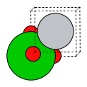
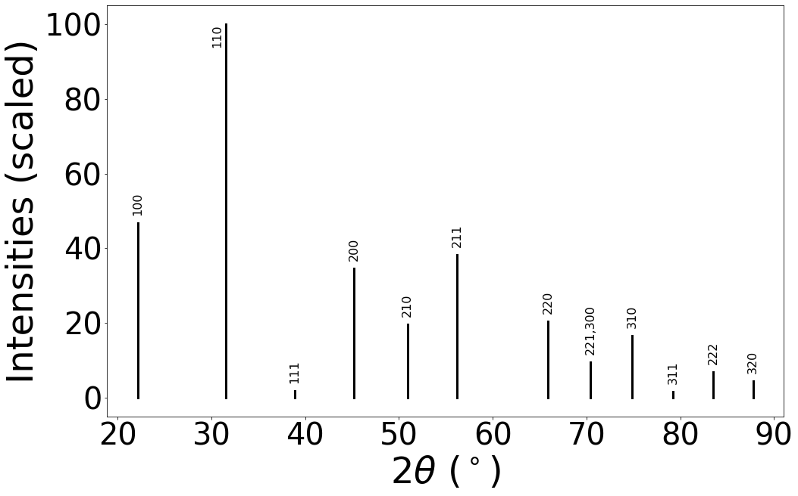

[Free trial](https://www.scm.com/free-trial/)

  * [Applications](https://www.scm.com/applications/ "Applications")
  * [Products](https://www.scm.com/amsterdam-modeling-suite/ "Products")
  * [Support](https://www.scm.com/support/ "Support")
  * [About us](https://www.scm.com/about-us/ "About us")

Search

  * 

Table of contents

  * [General](../../general.html)
  * [Introduction](../../intro.html)
  * [Getting started](../../started.html)
  * [Components overview](../../components/components.html)
  * [Interfaces](../../interfaces/interfaces.html)
  * [Examples](../examples.html)
    * [Getting Started](../examples.html#getting-started)
    * [Molecule analysis](../examples.html#molecule-analysis)
    * [Benchmarks](../examples.html#benchmarks)
    * [Workflows](../examples.html#workflows)
    * [COSMO-RS and property prediction](../examples.html#cosmo-rs-and-property-prediction)
    * [Packmol and AMS-ASE interfaces](../examples.html#packmol-and-ams-ase-interfaces)
    * [ParAMS and pyZacros](../examples.html#params-and-pyzacros)
    * [Other AMS calculations](../examples.html#other-ams-calculations)
    * [Pymatgen](../examples.html#pymatgen)
      * X-Ray Diffraction (XRD)
        * Initial imports
        * Create ASE atoms object for BaTiO3
        * Save ASE Atoms to .cif format
        * Load .cif in pymatgen and calculate XRD
        * Complete Python code
    * [Pre-made recipes](../examples.html#pre-made-recipes)
  * [Cookbook](../../cookbook/cookbook.html)
  * [Citations](../../citations.html)

  * [FAQ](../../FAQ.html)

__[PLAMS](../../index.html)

  * [Documentation](../../PLAMS.html/../../Documentation/index.html)/
  * [PLAMS](../../index.html)/
  * [Examples](../examples.html)/
  * X-Ray Diffraction (XRD)

# X-Ray Diffraction (XRD)¶

This example shows how to use pymatgen to quickly estimate a powder diffractogram.

Note

You can install pymatgen into the AMS Python environment by installing the m3gnet package in AMS2023 or later.

To follow along, either

  * Download [`xrd.py`](../../_downloads/9683732cfd2b11399e129712ae4f8cd8/xrd.py) (run as `$AMSBIN/amspython xrd.py`).

  * Download [`xrd.ipynb`](../../_downloads/1acf54dca9d50e944961e389fce04a26/xrd.ipynb) (see also: how to install [Jupyterlab](../../../Scripting/Python_Stack/Python_Stack.html#install-and-run-jupyter-lab-jupyter-notebooks) in AMS)

## Initial imports¶
[code] 
    from scm.plams import *
    try:
        from ase import Atoms
        from pymatgen.core.structure import Structure
        from pymatgen.analysis.diffraction.xrd import XRDCalculator
    except ImportError as e:
        print("You need ASE and pymatgen installed in the AMS python environment to run this example. Install the package for m3gnet to do this.")
        print(e)
        exit(1)
    
[/code]

## Create ASE atoms object for BaTiO3¶
[code] 
    at = Atoms(
        symbols=['Ba', 'Ti', 'O', 'O', 'O',],
        scaled_positions=[
            [0., 0., 0.,],
            [0.5, 0.5, 0.5],
            [0.0, 0.0, 0.5],
            [0.0, 0.5, 0.0],
            [0.5, 0.0, 0.0]
        ],
        cell=[4.01, 4.01, 4.01],
        pbc=(True, True, True),
    )
    plot_molecule(at, rotation='-5x,5y,0z') # show in Jupyter notebook
    
[/code]

## Save ASE Atoms to .cif format¶
[code] 
    fname = "batio3.cif"
    at.write(fname)
    
[/code]

## Load .cif in pymatgen and calculate XRD¶
[code] 
    structure = Structure.from_file(fname)
    xrd_calc = XRDCalculator()
    xrd_calc.show_plot(structure)
    
[/code]

[code] 
    pattern = xrd_calc.get_pattern(structure)
    print("2*Theta Intensity hkl d_hkl(angstrom)")
    for two_theta, intensity, hkls, d_hkl in zip(pattern.x, pattern.y, pattern.hkls, pattern.d_hkls):
        hkl_tuples = [hkl["hkl"] for hkl in hkls]
        for hkl in hkl_tuples:
            label = ", ".join(map(str, hkl))
            print(f'{two_theta:.2f} {intensity:.2f} {hkl} {d_hkl:.3f}')
    
[/code]
[code] 
    2*Theta Intensity hkl d_hkl(angstrom)
    22.17 46.84 (1, 0, 0) 4.010
    31.55 100.00 (1, 1, 0) 2.835
    38.90 1.83 (1, 1, 1) 2.315
    45.23 34.58 (2, 0, 0) 2.005
    50.92 19.69 (2, 1, 0) 1.793
    56.19 38.27 (2, 1, 1) 1.637
    65.88 20.48 (2, 2, 0) 1.418
    70.44 9.47 (2, 2, 1) 1.337
    70.44 9.47 (3, 0, 0) 1.337
    74.88 16.60 (3, 1, 0) 1.268
    79.23 1.68 (3, 1, 1) 1.209
    83.51 6.82 (2, 2, 2) 1.158
    87.76 4.44 (3, 2, 0) 1.112
    
[/code]

## Complete Python code¶
[code] 
    #!/usr/bin/env amspython
    # coding: utf-8
    
    # ## Initial imports
    
    from scm.plams import *
    try:
        from ase import Atoms
        from pymatgen.core.structure import Structure
        from pymatgen.analysis.diffraction.xrd import XRDCalculator
    except ImportError as e:
        print("You need ASE and pymatgen installed in the AMS python environment to run this example. Install the package for m3gnet to do this.")
        print(e)
        exit(1)
    
    # ## Create ASE atoms object for BaTiO3
    
    at = Atoms(
        symbols=['Ba', 'Ti', 'O', 'O', 'O',], 
        scaled_positions=[
            [0., 0., 0.,], 
            [0.5, 0.5, 0.5], 
            [0.0, 0.0, 0.5], 
            [0.0, 0.5, 0.0], 
            [0.5, 0.0, 0.0]
        ], 
        cell=[4.01, 4.01, 4.01],
        pbc=(True, True, True),
    )
    plot_molecule(at, rotation='-5x,5y,0z') # show in Jupyter notebook
    
    # ## Save ASE Atoms to .cif format
    
    fname = "batio3.cif"
    at.write(fname)
    
    # ## Load .cif in pymatgen and calculate XRD
    
    structure = Structure.from_file(fname)
    xrd_calc = XRDCalculator()
    xrd_calc.show_plot(structure)
    
    pattern = xrd_calc.get_pattern(structure)
    print("2*Theta Intensity hkl d_hkl(angstrom)")
    for two_theta, intensity, hkls, d_hkl in zip(pattern.x, pattern.y, pattern.hkls, pattern.d_hkls):
        hkl_tuples = [hkl["hkl"] for hkl in hkls]
        for hkl in hkl_tuples:
            label = ", ".join(map(str, hkl))  
            print(f'{two_theta:.2f} {intensity:.2f} {hkl} {d_hkl:.3f}')
    
[/code]

[Next ](../ADFCOSMORSCompound.html "ADF: Task COSMO-RS Compound") [ Previous](../M3GNet.html "Universal Potential: M3GNet-UP-2022")

* * *

  * ### Application Areas

    * [Batteries & PVs](https://www.scm.com/applications/batteries/)
    * [Bonding Analysis](https://www.scm.com/applications/chemical-bonding-analysis/)
    * [Catalysis](https://www.scm.com/applications/catalysis/)
    * [Heavy Elements](https://www.scm.com/applications/heavy-elements/)
    * [Inorganic Chemistry](https://www.scm.com/applications/inorganic-chemistry/)
    * [Life Sciences](https://www.scm.com/applications/pharma/)
    * [Materials Science](https://www.scm.com/applications/materials-science/)
    * [Nanotechnology](https://www.scm.com/applications/nanotechnology/)
    * [Oil and Gas](https://www.scm.com/applications/oil-and-gas/)
    * [Organic Electronics](https://www.scm.com/applications/organic-electronics/)
    * [Polymers](https://www.scm.com/applications/polymers/)
    * [Spectroscopy](https://www.scm.com/applications/spectroscopy/)
    * [Supercomputer / HPC](https://www.scm.com/applications/a-computing-center/)
    * [Teaching Computational Chemistry with AMS](https://www.scm.com/applications/teaching/)

  * ### Products

    * [AMS Driver](https://www.scm.com/product/ams/)
    * [ADF](https://www.scm.com/product/adf/)
    * [BAND](https://www.scm.com/product/band_periodicdft/)
    * [COSMO-RS](https://www.scm.com/product/cosmo-rs/)
    * [DFTB](https://www.scm.com/product/dftb/)
    * [GUI](https://www.scm.com/product/gui/)
    * [ML Potentials & FF](https://www.scm.com/product/machine-learning-potentials/)
    * [MOPAC](https://www.scm.com/product/mopac/)
    * [ParAMS](https://www.scm.com/product/params/)
    * [PLAMS](https://www.scm.com/product/plams/)
    * [Quantum ESPRESSO](https://www.scm.com/product/quantum-espresso/)
    * [ReaxFF](https://www.scm.com/product/reaxff/)
    * [Workflows](https://www.scm.com/product/advanced-workflows/)

  * ### Support

    * [Brochure](https://www.scm.com/amsterdam-modeling-suite/brochures/)
    * [Consulting & Contract Research](https://www.scm.com/amsterdam-modeling-suite/consulting/)
    * [Discussion List](https://www.scm.com/adf-discussion-list/)
    * [Documentation](https://www.scm.com/support/ams-tutorials-and-manuals/)
    * [Downloads](https://www.scm.com/support/downloads/)
    * [FAQs](https://www.scm.com/faq/)
    * [GUI Tutorials](https://www.scm.com/doc/Tutorials/GUI_overview/GUI_overview_tutorials.html)
    * [Installation](https://www.scm.com/support/ams-installation-videos/)
    * [Literature Highlights](https://www.scm.com/category/highlights/)
    * [Papers Citing ADF](https://www.scm.com/amsterdam-modeling-suite/research-papers-citing-adf/)
    * [Release Notes](https://www.scm.com/support/documentation-previous-versions/release-notes/)
    * [Support Overview](https://www.scm.com/support/)
    * [Teaching Materials](https://www.scm.com/support/background/amsterdam-modeling-suite-teaching-materials/)
    * [Videos](https://www.scm.com/amsterdam-modeling-suite/videos-tutorials-and-web-presentations/)
    * [Webinars](https://www.scm.com/about-us/news-agenda/web-presentations-by-adf-experts/)
    * [Workshops](https://www.scm.com/about-us/news-agenda/adf-hands-on-workshops/)

  * ### About Us

    * [Careers](https://www.scm.com/about-us/careers/)
    * [Collaborations](https://www.scm.com/about-us/collaborations/)
    * [Contact Us](https://www.scm.com/about-us/contact-us/)
    * [Contributors](https://www.scm.com/about-us/our-authors/)
    * [EU Projects](https://www.scm.com/about-us/eu-projects/)
    * [Events](https://www.scm.com/about-us/news-agenda/)
    * [Mission & Vision](https://www.scm.com/about-us/mission-vision/)
    * [News](https://www.scm.com/category/news/)
    * [Newsletters](https://www.scm.com/newsletters/)
    * [The SCM Team](https://www.scm.com/about-us/our-people/)

  * ### Pricing & Licensing

    * [License Terms](https://www.scm.com/amsterdam-modeling-suite/pricing-licensing/scm-license-terms/)
    * [Ordering](https://www.scm.com/amsterdam-modeling-suite/pricing-licensing/ordering-procedure/)
    * [Price Calculator](https://www.scm.com/amsterdam-modeling-suite/pricing-licensing/price-quote/calculate-your-price/)
    * [Price Quote](https://www.scm.com/amsterdam-modeling-suite/pricing-licensing/price-quote/)
    * [Pricing & Licensing](https://www.scm.com/amsterdam-modeling-suite/pricing-licensing/)
    * [Resellers](https://www.scm.com/amsterdam-modeling-suite/pricing-licensing/adf-resellers/)

  * [Copyright](https://www.scm.com/copyright/)
  * [Terms of Use](https://www.scm.com/terms-of-use/)
  * [Privacy Policy](https://www.scm.com/privacy-policy/)
