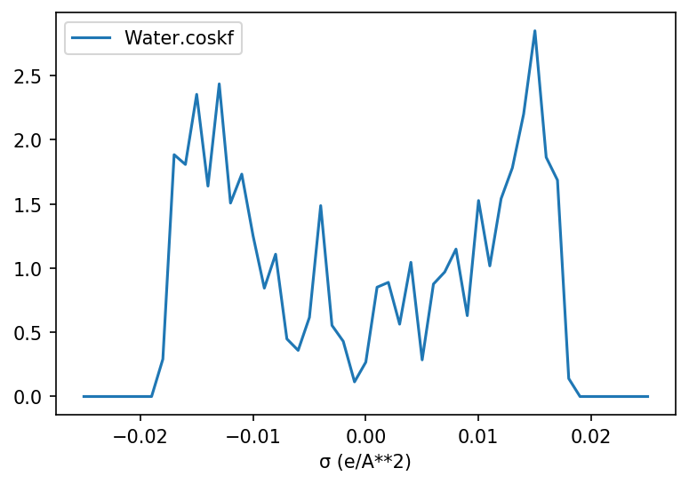

[Free trial](https://www.scm.com/free-trial/)

  * [Applications](https://www.scm.com/applications/ "Applications")
  * [Products](https://www.scm.com/amsterdam-modeling-suite/ "Products")
  * [Support](https://www.scm.com/support/ "Support")
  * [About us](https://www.scm.com/about-us/ "About us")

Search

  * 

Table of contents

  * [General](../general.html)
  * [Introduction](../intro.html)
  * [Getting started](../started.html)
  * [Components overview](../components/components.html)
  * [Interfaces](interfaces.html)
    * [Amsterdam Modeling Suite](amssuite.html)
      * [AMS driver and engines](ams.html)
      * [AMS worker](amsworker.html)
      * [ASE Calculator for AMS](amscalculator.html)
      * [Quick jobs](quickjobs.html)
      * [Analysis tools: Densf, FCF, analysis](postadf.html)
      * [KF files](kffiles.html)
      * COSMO-RS
        * Settings
        * Settings with multiple compound
        * ADF and CRSJob
        * COSMO-RS Parameters
        * Data analyses and plotting
        * API
      * [ParAMS](params.html)
      * [Conformers](conformers.html)
      * [Zacros](zacros.html)
      * [ADF (pre-2020 version)](adf.html)
      * [ReaxFF (pre-2019 version)](reaxff.html)
    * [Other programs](thirdparty.html)
  * [Examples](../examples/examples.html)
  * [Cookbook](../cookbook/cookbook.html)
  * [Citations](../citations.html)

  * [FAQ](../FAQ.html)

__[PLAMS](../index.html)

  * [Documentation](../PLAMS.html/../../Documentation/index.html)/
  * [PLAMS](../index.html)/
  * [Interfaces](interfaces.html)/
  * [Amsterdam Modeling Suite](amssuite.html)/
  * COSMO-RS

# COSMO-RS¶

(_contributed by_ [Bas van Beek](https://www.researchgate.net/profile/Bas_van_Beek))

COSMO-RS can be run from PLAMS using the `CRSJob` class and the corresponding `CRSResults`, both respectivelly being subclasses of [`SCMJob`](adf.html#scm.plams.interfaces.adfsuite.scmjob.SCMJob "scm.plams.interfaces.adfsuite.scmjob.SCMJob") and [`SCMResults`](adf.html#scm.plams.interfaces.adfsuite.scmjob.SCMResults "scm.plams.interfaces.adfsuite.scmjob.SCMResults").

Note

There is also [a tutorial showing full code examples](../../COSMO-RS/PLAMS_COSMO-RS_scripting.html) available in the COSMO-RS documentation. There are several templates available that can easily be customized for other problem types, workflows, etc.

## Settings¶

For example, considering the following input file for a COSMO-RS sigma-profile calculation [[1](../../COSMO-RS/Analysis.html#sigma-profile)]:
[code] 
    compound /path/to/file.t21
        frac1 1.0
    end
    
    property puresigmaprofile
        nprofile 50
        pure
        sigmamax 0.025
    end
    
    temperature 298.15
    
[/code]

The input file displayed above corresponds to the following settings:
[code] 
    >>> from scm.plams import Settings, CRSJob
    
    >>> s = Settings()
    
    >>> s.input.compound._h = '/path/to/file.t21'
    >>> s.input.compound.frac1 = 1.0
    >>> s.input.property._h = 'puresigmaprofile'
    >>> s.input.property.nprofile = 50
    >>> s.input.property.sigmamax = 0.025
    >>> s.input.property.pure = ''
    >>> s.input.temperature = 298.15
    
    >>> my_job = CRSJob(settings=s)
    >>> my_results = my_job.run()
    
[/code]

Alternatively one can create a `CRSJob` instance from a runscript created by, for example, the ADF GUI (`File -> Save as`).
[code] 
    >>> from scm.plams import CRSJob
    
    >>> filename = 'path/to/my/crs/inputfile.run'
    >>> my_job = CRSJob.from_inputfile(filename)
    >>> my_results = my_job.run()
    
[/code]

## Settings with multiple compound¶

More often than not one is interested in the properties of multi-component mixtures (_e.g._ a dissolved solute). In such cases one has to pass multiple `compound` blocks to the input file, which is somewhat problematic as Python dictionaries (including [`Settings`](../components/settings.html#scm.plams.core.settings.Settings "scm.plams.core.settings.Settings")) can only contain a set of unique keys.

This problem can be resolved by changing the value of `compound` from a [`Settings`](../components/settings.html#scm.plams.core.settings.Settings "scm.plams.core.settings.Settings") instance into a list of multiple [`Settings`](../components/settings.html#scm.plams.core.settings.Settings "scm.plams.core.settings.Settings") instances. Each item within this list is expanded into its own `compound` block once `CRSJob.run()` creates the actual input file.

Example [`Settings`](../components/settings.html#scm.plams.core.settings.Settings "scm.plams.core.settings.Settings") with three compounds:
[code] 
    >>> from scm.plams import Settings, CRSJob
    
    >>> compound1, compound2, compound3 = Settings(), Settings(), Settings()
    
    >>> compound1._h = '/path/to/coumpound1.t21'
    >>> compound1.frac1 = 0.33
    >>> compound2._h = '/path/to/coumpound2.t21'
    >>> compound2.frac1 = 0.33
    >>> compound3._h = '/path/to/coumpound3.t21'
    >>> compound3.frac1 = 0.33
    
    >>> s = Settings()
    >>> s.input.compound = [compound1, compound2, compound3]
    
    >>> my_job = CRSJob(settings=s)
    >>> my_results = my_job.run()
    
[/code]

Which yields the following input:
[code] 
    compound /path/to/coumpound1.t21
        frac1 0.33
    end
    
    compound /path/to/coumpound2.t21
        frac1 0.33
    end
    
    compound /path/to/coumpound3.t21
        frac1 0.33
    end
    
[/code]

## ADF and CRSJob¶

A workflow is presented in the PLAMS [cookbook](../examples/ams_crs.html#ams-crs-workflow). In this workflow, we follow the usual procedure of generating the inputs required to run COSMO-RS and COSMO-SAC calculations.

## COSMO-RS Parameters¶

A large number of configurable [parameters](../../COSMO-RS/COSMO-RS_and_COSMO-SAC_parameters.html) is available for COSMO-RS. If one is interested in running multiple jobs it can be usefull to store the paramaters in seperate dictionary / [`Settings`](../components/settings.html#scm.plams.core.settings.Settings "scm.plams.core.settings.Settings") instance and update the Job settings as needed, double so if one wants to use multiple different paramater sets.

An example is provided below with the default COSMO-RS paramaters (_i.e._ ADF Combi2005):
[code] 
    >>> from scm.plams import Settings
    
    # ADF Combi2005 COSMO-RS parameters
    >>> adf_combi2005 = {
    ...     'crsparameters': {
    ...         '_1': 'HB_HNOF',
    ...         '_2': 'HB_TEMP',
    ...         '_3': 'FAST',
    ...         '_4': 'COMBI2005',
    ...         'rav': 0.400,
    ...         'aprime': 1510.0,
    ...         'fcorr': 2.802,
    ...         'chb': 8850.0,
    ...         'sigmahbond': 0.00854,
    ...         'aeff': 6.94,
    ...         'lambda': 0.130,
    ...         'omega': -0.212,
    ...         'eta': -9.65,
    ...         'chortf': 0.816
    ...     },
    ...     'dispersion': {
    ...         'H': -0.0340,
    ...         'C': -0.0356,
    ...         'N': -0.0224,
    ...         'O': -0.0333,
    ...         'F': -0.026,
    ...         'Si': -0.04,
    ...         'P': -0.045,
    ...         'S': -0.052,
    ...         'Cl': -0.0485,
    ...         'Br': -0.055,
    ...         'I': -0.062
    ...     }
    ... }
    
    >>> s_list = [Settings(), Settings(), Settings()]
    >>> for s in s_list:
    ...     s.input.update(adf_combi2005)
    
    >>> print([s.input == adf_combi2005 for s in s_list])
    [True, True, True]
    
[/code]

## Data analyses and plotting¶

As COSMO-RS can produce a large variety of data series, a number of specialized methods are available in the `CRSResults` for their extraction and analysis. The resulting data is stored in either a dictionary of Numpy arrays or (optionally) a [Pandas DataFrame](https://pandas.pydata.org/pandas-docs/stable/reference/api/pandas.DataFrame.html).

The extracted data can be further customized by altering the `subsection` argument. For example, by default `CRSResults.get_solubility()` will extract the solubility in mol solute per liter solvent (`"subsection=mol_per_L_solvent"`). This can be changed in, for example, gram per liter solvent (`"subsection=m_per_L_solvent"`) or the solute mass fraction (`"massfrac"`).

A complete overview of all available sections and subsections can be acquired by calling the [`KFFile.get_skeleton()`](kffiles.html#scm.plams.tools.kftools.KFFile.get_skeleton "scm.plams.tools.kftools.KFFile.get_skeleton") method of the KF binary file (_e.g._ `print(my_results._kf.get_skeleton())`).

Quantity | Method for data extraction  
---|---  
[Sigma profile](../../COSMO-RS/Analysis.html#sigma-profile) | `CRSResults.get_sigma_profile()`  
[Sigma potential](../../COSMO-RS/Analysis.html#sigma-potential) | `CRSResults.get_sigma_potential()`  
[Vapor pressure](../../COSMO-RS/Properties.html#vapor-pressure) | `CRSResults.get_vapor_pressure()`  
[Boiling point](../../COSMO-RS/Properties.html#boiling-point) | `CRSResults.get_boiling_point()`  
[Solubility](../../COSMO-RS/Properties.html#solubility) | `CRSResults.get_solubility()`  
[Binary mixture](../../COSMO-RS/Properties.html#binary-mixture-vle-lle) | `CRSResults.get_bi_mixture()`  
[Ternary mixtures](../../COSMO-RS/Properties.html#ternary-mixture-vle-lle) | `CRSResults.get_tri_mixture()`  
[Solvents composition line](../../COSMO-RS/Properties.html#solvents-s1-s2-composition-line) | `CRSResults.get_composition_line()`  
  
If the [Matplotlib](https://matplotlib.org/) package is installed than the resulting data can easily plotted by passing it to the `CRSResults.plot()` method (_e.g._ `CRSResults.plot(my_sigma_profile)`):
[code] 
    >>> from scm.plams import Settings, CRSJob
    >>> import numpy as np
    
    >>> s = Settings()
    
    >>> s.input.compound._h = '/path/to/Water.coskf'
    >>> s.input.compound.frac1 = 1.0
    >>> s.input.property._h = 'puresigmaprofile'
    >>> s.input.property.nprofile = 50
    >>> s.input.property.sigmamax = 0.025
    >>> s.input.property.pure = ''
    >>> s.input.temperature = 298.15
    
    >>> my_job = CRSJob(settings=s)
    >>> my_results = my_job.run()
    
    >>> my_sigma_profile = my_results.get_sigma_profile()
    >>> with np.printoptions(threshold=0, edgeitems=5):
    ...     print(sigma_profile)
    {'Water.coskf': array([0., 0., 0., 0., 0., ..., 0., 0., 0., 0., 0.]),
     'σ (e/A**2)': array([-0.25, -0.24, -0.23, -0.22, -0.21, ...,  0.21,  0.22,  0.23,  0.24, 0.25])}
    
    >>> my_results.plot(my_sigma_profile)
    
[/code]

## API¶

_class _`CRSJob`(_** kwargs_)[[source]](../_modules/scm/plams/interfaces/adfsuite/crs.html#CRSJob)¶
    
A [`SCMJob`](adf.html#scm.plams.interfaces.adfsuite.scmjob.SCMJob "scm.plams.interfaces.adfsuite.scmjob.SCMJob") subclass intended for running COSMO-RS jobs.

`_result_type`¶
    
alias of `scm.plams.interfaces.adfsuite.crs.CRSResults`

`__init__`(_** kwargs_)[[source]](../_modules/scm/plams/interfaces/adfsuite/crs.html#CRSJob.__init__)¶
    
Initialize a `CRSJob` instance.

_static _`cos_to_coskf`(_filename_)[[source]](../_modules/scm/plams/interfaces/adfsuite/crs.html#CRSJob.cos_to_coskf)¶
    
Convert a .cos file into a .coskf file with the `$AMSBIN/cosmo2kf` command.

Returns the filename of the new .coskf file.

_class _`CRSResults`(_job_)[[source]](../_modules/scm/plams/interfaces/adfsuite/crs.html#CRSResults)¶
    
A [`SCMResults`](adf.html#scm.plams.interfaces.adfsuite.scmjob.SCMResults "scm.plams.interfaces.adfsuite.scmjob.SCMResults") subclass for accessing results of `CRSJob`.

`get_energy`(_energy_type ='deltag'_, _compound_idx =0_, _unit ='kcal/mol'_)[[source]](../_modules/scm/plams/interfaces/adfsuite/crs.html#CRSResults.get_energy)¶
    
Returns the solute solvation energy from an Activity Coefficients calculation.

`get_activity_coefficient`(_compound_idx =0_)[[source]](../_modules/scm/plams/interfaces/adfsuite/crs.html#CRSResults.get_activity_coefficient)¶
    
Return the solute activity coefficient from an Activity Coefficients calculation.

`get_sigma_profile`(_subsection ='profil'_, _as_df =False_)[[source]](../_modules/scm/plams/interfaces/adfsuite/crs.html#CRSResults.get_sigma_profile)¶
    
Grab all sigma profiles, returning a dictionary of Numpy Arrays.

Values of \\(\sigma\\) are stored under the `"σ (e/A**2)"` key.

Results can be returned as a Pandas DataFrame by settings _as_df_ to `True`.

The returned results can be plotted by passing them to the `CRSResults.plot()` method.

Note

_as_df_ = `True` requires the [Pandas](https://pandas.pydata.org/) package. Plotting requires the [matplotlib](https://matplotlib.org/index.html) package.

`get_sigma_potential`(_subsection ='mu'_, _unit ='kcal/mol'_, _as_df =False_)[[source]](../_modules/scm/plams/interfaces/adfsuite/crs.html#CRSResults.get_sigma_potential)¶
    
Grab all sigma profiles, expressed in _unit_ , and return a dictionary of Numpy Arrays.

Values of \\(\sigma\\) are stored under the `"σ (e/A**2)"` key.

Results can be returned as a Pandas DataFrame by settings _as_df_ to `True`.

The returned results can be plotted by passing them to the `CRSResults.plot()` method.

Note

_as_df_ = `True` requires the [Pandas](https://pandas.pydata.org/) package. Plotting requires the [matplotlib](https://matplotlib.org/index.html) package.

`get_prop_names`(_section =None_)[[source]](../_modules/scm/plams/interfaces/adfsuite/crs.html#CRSResults.get_prop_names)¶
    
Read the section of the .crskf file and return a list of the properties that were calculated. The section argument can be supplied to look at previously-calculated results. If no section name is supplied, the function defaults to using the most recent property that was calculated.

`get_results`(_section =None_)[[source]](../_modules/scm/plams/interfaces/adfsuite/crs.html#CRSResults.get_results)¶
    
Read the section from the most recent calculation type and return the result as a dictionary.

`get_multispecies_dist`()[[source]](../_modules/scm/plams/interfaces/adfsuite/crs.html#CRSResults.get_multispecies_dist)¶
    
This function returns multispecies distribution for each (compound,structure) pair. The format is a list with indices corresponding to compound indices. Each item in the list is a dictionary with a structure name : list pair, where the structure name corresponds to a structure the compound can be exist as and the list is the distribution of that compound in that structure over the number of points (mole fractions, temperatures, pressures).

`plot`(_* arrays_, _x_axis =None_, _plot_fig =True_, _x_label =None_, _y_label =None_)[[source]](../_modules/scm/plams/interfaces/adfsuite/crs.html#CRSResults.plot)¶
    
Plot, show and return a series of COSMO-RS results as a matplotlib Figure instance.

Accepts the output of, _e.g._ , `CRSResults.get_sigma_profile()`: A dictionary of Numpy arrays or a Pandas DataFrame.

Returns a matplotlib [Figure](https://matplotlib.org/api/_as_gen/matplotlib.figure.Figure.html#matplotlib.figure.Figure) instance which can be further modified to the users liking. Automatic plotting of the resulting figure can be disabled with the _plot_fig_ argument.

Note

This method requires the [matplotlib](https://matplotlib.org/index.html) package.

Note

The name of the dictionary/DataFrame key containing the index (_i.e._ the x-axis) can, and should, be manually specified in _x_axis_ if a custom _x_axis_ is passed to `CRSResults._get_array_dict()`. This argument can be ignored otherwise.

`_get_array_dict`(_section_ , _subsection_ , _x_axis_ , _index_subsection_ , _unit ='kcal/mol'_, _as_df =False_)[[source]](../_modules/scm/plams/interfaces/adfsuite/crs.html#CRSResults._get_array_dict)¶
    
Create dictionary or DataFrame containing all values in _section_ /_subsection_.

Takes the following arguments:
    
  * The _section_ /_subsection_ of the desired quantity.

  * The desired name of the index (_x_axis_).

  * The name of subsection containing the index (_index_subsection_).

  * The _unit_ of the output quanty (ignore this keyword if not applicable).

  * If the result should be returned as Pandas DataFrame (_as_df_).

`_construct_array_dict`(_section_ , _subsection_ , _unit ='kcal/mol'_)[[source]](../_modules/scm/plams/interfaces/adfsuite/crs.html#CRSResults._construct_array_dict)¶
    
Construct dictionary containing all values in _section_ /_subsection_.

_static _`_dict_to_df`(_array_dict_ , _section_ , _x_axis_)[[source]](../_modules/scm/plams/interfaces/adfsuite/crs.html#CRSResults._dict_to_df)¶
    
Attempt to convert a dictionary into a DataFrame.

[Next ](params.html "ParAMS") [ Previous](kffiles.html "KF files")

* * *

  * ### Application Areas

    * [Batteries & PVs](https://www.scm.com/applications/batteries/)
    * [Bonding Analysis](https://www.scm.com/applications/chemical-bonding-analysis/)
    * [Catalysis](https://www.scm.com/applications/catalysis/)
    * [Heavy Elements](https://www.scm.com/applications/heavy-elements/)
    * [Inorganic Chemistry](https://www.scm.com/applications/inorganic-chemistry/)
    * [Life Sciences](https://www.scm.com/applications/pharma/)
    * [Materials Science](https://www.scm.com/applications/materials-science/)
    * [Nanotechnology](https://www.scm.com/applications/nanotechnology/)
    * [Oil and Gas](https://www.scm.com/applications/oil-and-gas/)
    * [Organic Electronics](https://www.scm.com/applications/organic-electronics/)
    * [Polymers](https://www.scm.com/applications/polymers/)
    * [Spectroscopy](https://www.scm.com/applications/spectroscopy/)
    * [Supercomputer / HPC](https://www.scm.com/applications/a-computing-center/)
    * [Teaching Computational Chemistry with AMS](https://www.scm.com/applications/teaching/)

  * ### Products

    * [AMS Driver](https://www.scm.com/product/ams/)
    * [ADF](https://www.scm.com/product/adf/)
    * [BAND](https://www.scm.com/product/band_periodicdft/)
    * [COSMO-RS](https://www.scm.com/product/cosmo-rs/)
    * [DFTB](https://www.scm.com/product/dftb/)
    * [GUI](https://www.scm.com/product/gui/)
    * [ML Potentials & FF](https://www.scm.com/product/machine-learning-potentials/)
    * [MOPAC](https://www.scm.com/product/mopac/)
    * [ParAMS](https://www.scm.com/product/params/)
    * [PLAMS](https://www.scm.com/product/plams/)
    * [Quantum ESPRESSO](https://www.scm.com/product/quantum-espresso/)
    * [ReaxFF](https://www.scm.com/product/reaxff/)
    * [Workflows](https://www.scm.com/product/advanced-workflows/)

  * ### Support

    * [Brochure](https://www.scm.com/amsterdam-modeling-suite/brochures/)
    * [Consulting & Contract Research](https://www.scm.com/amsterdam-modeling-suite/consulting/)
    * [Discussion List](https://www.scm.com/adf-discussion-list/)
    * [Documentation](https://www.scm.com/support/ams-tutorials-and-manuals/)
    * [Downloads](https://www.scm.com/support/downloads/)
    * [FAQs](https://www.scm.com/faq/)
    * [GUI Tutorials](https://www.scm.com/doc/Tutorials/GUI_overview/GUI_overview_tutorials.html)
    * [Installation](https://www.scm.com/support/ams-installation-videos/)
    * [Literature Highlights](https://www.scm.com/category/highlights/)
    * [Papers Citing ADF](https://www.scm.com/amsterdam-modeling-suite/research-papers-citing-adf/)
    * [Release Notes](https://www.scm.com/support/documentation-previous-versions/release-notes/)
    * [Support Overview](https://www.scm.com/support/)
    * [Teaching Materials](https://www.scm.com/support/background/amsterdam-modeling-suite-teaching-materials/)
    * [Videos](https://www.scm.com/amsterdam-modeling-suite/videos-tutorials-and-web-presentations/)
    * [Webinars](https://www.scm.com/about-us/news-agenda/web-presentations-by-adf-experts/)
    * [Workshops](https://www.scm.com/about-us/news-agenda/adf-hands-on-workshops/)

  * ### About Us

    * [Careers](https://www.scm.com/about-us/careers/)
    * [Collaborations](https://www.scm.com/about-us/collaborations/)
    * [Contact Us](https://www.scm.com/about-us/contact-us/)
    * [Contributors](https://www.scm.com/about-us/our-authors/)
    * [EU Projects](https://www.scm.com/about-us/eu-projects/)
    * [Events](https://www.scm.com/about-us/news-agenda/)
    * [Mission & Vision](https://www.scm.com/about-us/mission-vision/)
    * [News](https://www.scm.com/category/news/)
    * [Newsletters](https://www.scm.com/newsletters/)
    * [The SCM Team](https://www.scm.com/about-us/our-people/)

  * ### Pricing & Licensing

    * [License Terms](https://www.scm.com/amsterdam-modeling-suite/pricing-licensing/scm-license-terms/)
    * [Ordering](https://www.scm.com/amsterdam-modeling-suite/pricing-licensing/ordering-procedure/)
    * [Price Calculator](https://www.scm.com/amsterdam-modeling-suite/pricing-licensing/price-quote/calculate-your-price/)
    * [Price Quote](https://www.scm.com/amsterdam-modeling-suite/pricing-licensing/price-quote/)
    * [Pricing & Licensing](https://www.scm.com/amsterdam-modeling-suite/pricing-licensing/)
    * [Resellers](https://www.scm.com/amsterdam-modeling-suite/pricing-licensing/adf-resellers/)

  * [Copyright](https://www.scm.com/copyright/)
  * [Terms of Use](https://www.scm.com/terms-of-use/)
  * [Privacy Policy](https://www.scm.com/privacy-policy/)
